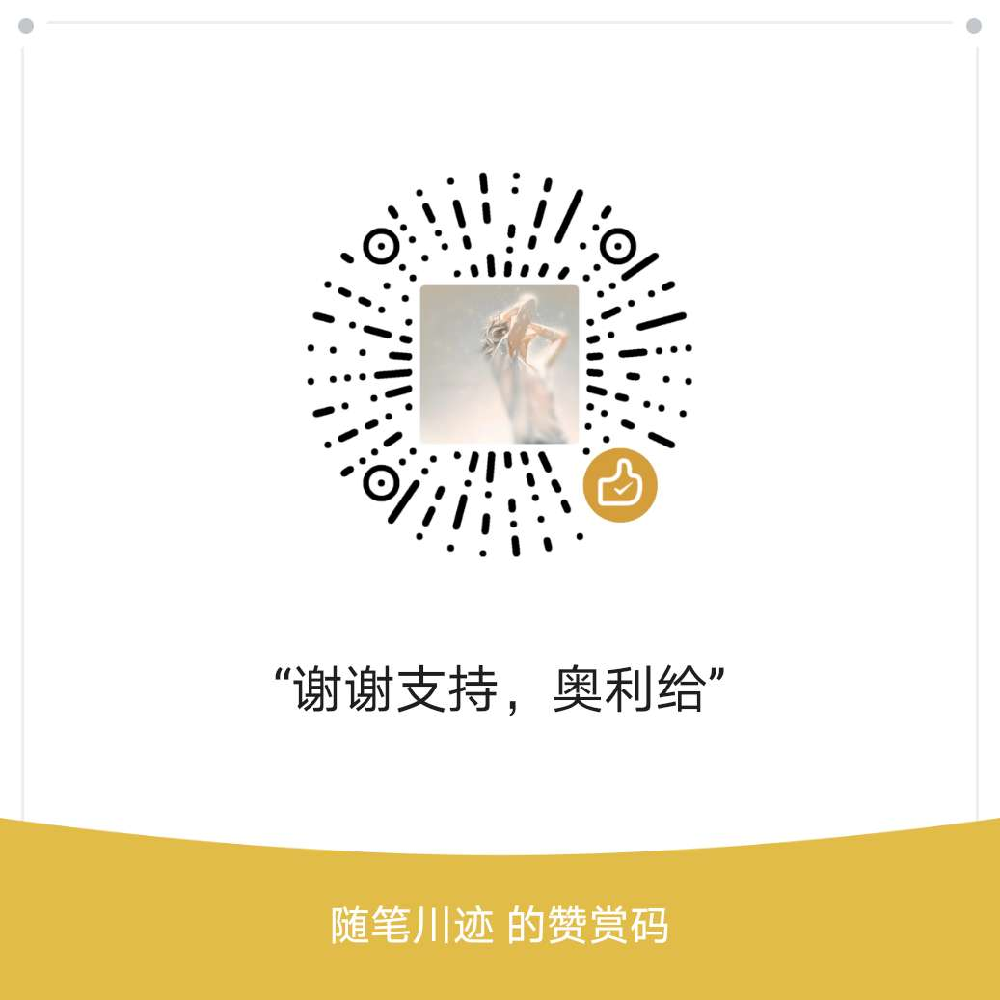

# itclanCoderBlogCode

### itclanCoder 博客介绍

- 本博客主要分享前端技术,不限于`CSS`,`JavaScript`,`React`,`Vue`,`微信小程序`,`云开发`:eagle:等为主
- 本博客主要分享实际开发中遇到的一些问题,并非搬运工,旨在有效的记录与分享,会一直维护下去
- 本博客会不定期更新面试题分享,算法等,凡是不经过检视,测试的面试题都是不合格的

### 如有问题请提 issue

- 本博客若有对小伙伴们有帮助,谢谢不要吝啬您的`star`,欢迎随时灵魂拷问
- 线上地止:[itclanCoder-线上预览](http://doc.itclan.cn)
- 您也可关注**官方微信公众号:itclanCoder**
- 

### 如何支持作者

- 间接支持:
  - 给该项目`star`,可以`clone`,但是谢谢注明下来源,写作不易,请您尊重下他人劳动成果
  - [视频录制](https://space.bilibili.com/267957620),如有收获,三连击(点赞,关注,投币:whale:)
- 直接支持

  - 如果您觉得博客中的文章对你有帮助,可赞助一杯咖啡的钱,小额捐助来表示您的谢意.更好的鼓励我深夜打码,创作
      

  * 小额赞助后,您可以获得额外的回报,您可以告诉我,您的名字,它将会出现在`itclanCoder` 的`GitHub`仓库中,再比如您公司 `logo`,或相关产品会出现在[itclanCoder 官网](http://doc.itclan.cn)上.

### 如何参与贡献

- 如果您有对本项目中有任何建议或发现文中内容有误(不限于标点符号,错别字:shirt:)，欢迎提交 issues 进行指正
- 如本博客中有未涉及到知识点,欢迎提交 PR
- 如果您有好的文章推荐,建议您以`markdown` 格式发送到邮箱`itclancode@163.com`,无论是否被录用,都会一一给您回复,至于如何写好文档,请参照[中文技术文档的写作规范指南](https://github.com/ruanyf/document-style-guide)
