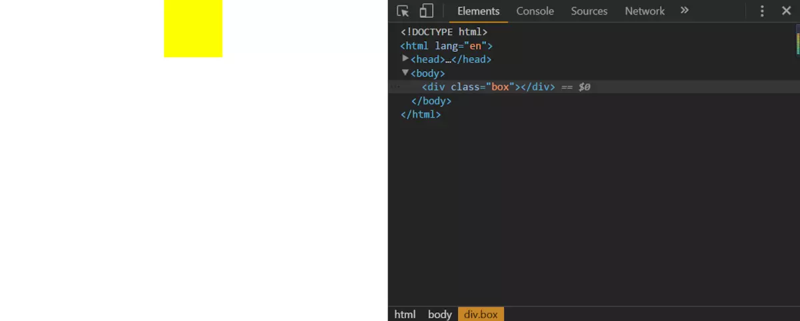
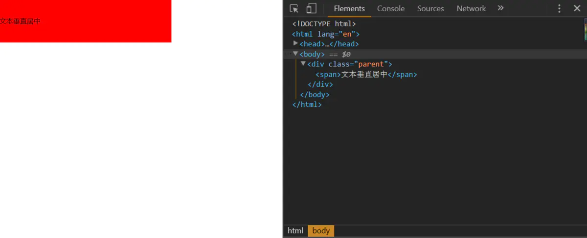
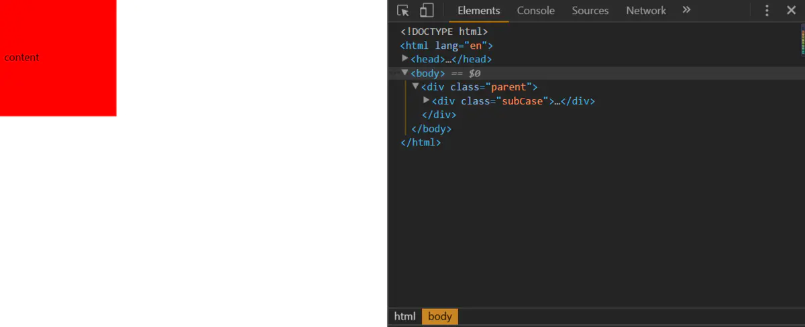
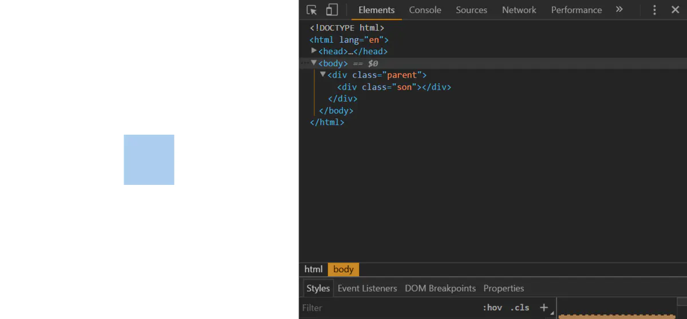
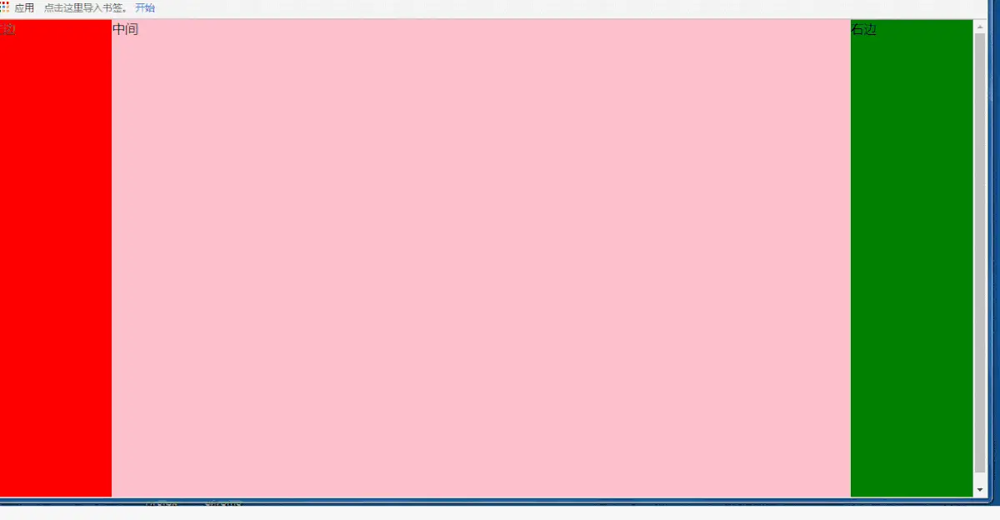

# 元素水平垂直居中

## 快速导航

<!-- :include-level="[2, 3] -->
<TOC  />

## 前言

关于网页中元素的水平垂直居中的问题,对于前端的小伙伴来说,非常常见,也很重要,同时也是令人非常苦恼的,无论是面试还是笔试都是一个常见的话题,有时候,当别人问到如何让一个元素不定宽高和高,让它居中,或者有哪些水平垂直居中手段时,脑子里却想到的也就一两种,一团糟,非常尴尬,唏嘘不已,今天,我就平时的学习和使用,稍稍做了一下总结,也是对以往知识的一种回顾,跟大家分享一下使用心得,让元素在网页中水平垂直居中不在怕怕

## 元素水平居中 :100: :rocket:

实现元素的水平居中,分为**行间元素**与**块级元素**

- 对于行间元素
  - 特点:
    - 自身不具备宽度,高度,即使给行间元素设置宽高,都不会起作用,由自身内容撑大)
    - 高度能够通过`line-height`来指定
    - 能够给它设置`padding`,但仅仅有`padding-left`和`padding-right`会有效果，没有`padding-top`和`padding-bottom`,即使设置了`padding-top`,`padding-bottom`,也不会生效滴
    - 同理:给元素设置`margin`属性同`padding`属性一样，对行内元素左右有效。上下无效
  - 比如：
    `a(链接)`,`b(加粗)`,`strong(强调)`,`i`,`span`, `img`,`input`,`select` 等
  * 实现方式: `text-align: center`

::: tip
您能列举一下常见的行间元素?区分行间元素与块级元素很重要,html 内容结构就是依赖它来承载内容的
无论是在实际开发中,还是面试中,这都是一个很常见的知识,元素水平居中很重要
:::

::: details 点击可查看常见行间元素

```js
<a>, <b>, <br>, <button>, <del>, <em>, <i>, <iframe>, , <input>, <label>, <strong>
```

:::

### 方法-1-行间元素水平居中 <Badge text="很重要" type="error"/>

html 内容结构代码

```
 <div class="spanParent">
           <span>span等行内元素水平居中</span>
  </div>
  <div class="imgParent">
           
  </div>
```

css 层叠样式代码

```js{3}
.spanParent,.imgParent{
     width:100%;
     text-align:center;   /*文本水平居中,给父级元素设定*/
}
```

对于行间元素,给父级元素设置`text-align: center`属性,就会让子元素在水平方向上居中显示

### 方法-2-块级元素水平居中

- 对于块级元素
  - 特点:
    - 独自占一行,支持宽度和高度,不设置宽度,默认 100%
    * 元素设置 `padding`,`margin`,上下左右,都会生效,注意父子级元素外边距的合并叠加问题
  * 比如(`div`,`p`,`ul`,`li`,`ol`,`h1-h6`,`dl`,`dt`,`dd`,`address`,`article`,`figure`,`audio`,`video`,`section`,`table`,`canvas`,`header`,`table`,`footer`)
  * 实现方式: `margin: 0 auto`

::: warning 温馨提示
您能列出常见的块级元素? 想想平日里常用的块级元素,虽然纯 div+css 一把梭,但是一些新增的 H5 特性,语义化标签,利于搜索引擎优化,是有必要去了解学习下的
:::

::: details 点击可查看常见块级元素

```js
<address>, <button>, <caption>, <dd>, <del>, <div>, <dl>, <dt>, <form>, <h1>--<h6>, <iframe>, <li>
<object>, <ol>, <p>, <table>, <tbody>, <td>, <th>, <thead>, <tr>, <ul> <section>,<table>,<canvas>,<header>,<table>,<footer>
```

:::

示例代码如下:

html 内容结构代码

```
<div class="box"></div>
```

css 层叠样式代码

```js{5}
.box{
        width:100px;
        height:100px;
        background:yellow;
        margin:0 auto;    /*水平居中,上下外边距为0,左右居中*/
}
```

实现效果图,如下所示


### 方法-3-浮动元素居中显示

当一个元素设置浮动后,无论它是行间元素还是块级元素,让该元素水平居中,无论您是使用`text-align: center`还是`margin: 0 auto`,都是无法让该元素水平方向居中的

**原因**:浮动元素破坏了页面的文档流,优先级要高于未设置浮动的元素,设置上面两个属性都不起作用

**解决办法**: 父级元素宽度设置`fit-content`,并且配合`margin: 0 auto`使用,即可解决

**注意** <Badge text="特别提醒" type="tip"/>

这个属性值`fit-content`配上`margin:0 auto`才会让其水平居中,目前只有`chrome`,`firfox`,`Opera`浏览器支持该属性值,并且`只能实现水平居中,无法实现垂直居中`,也`没有height:fit-content该属性`,即使设置了也不生效

示例代码如下所示

```
<ul class="parent">
  <li>随笔川迹</li>
  <li>itclanCoder</li>
  <li>个人简介</li>
  <li>联系地止</li>
</ul>
```

css 层叠样式代码

```js{12,13,14,16}
ul,li {
  list-style: none;
}

li {
  float: left;/*子元素设置了浮动*/
  padding: 0 10px;
}

.parent js{5} {
  /*父元素宽度设置fit-content,高度是没有这样的写法的*/
  width:-moz-fit-content;  // 兼容火狐写法
  width:-webkit-fit-content; // 兼容chrome
  width: fit-content;        // 标准写法
  /*注意只设置得了水平居中,此方法,垂直居中不生效*/
  margin: 0 auto;
}

```

查看属性在各个浏览器的兼容性:[can I use](https://caniuse.com/)

实现效果如下所示


::: tip 温馨提示 :cold_sweat
让一个浮动元素水平居中,在您不知道 width: fit-content,结合 margin: 0 auto 使用之前,是不是令人很头痛呢,浮动解决不了的,就定位

:::

### 方法-4-使用旧的-flex-布局

让一个元素居中,使用 flex 布局方式

- 老版本:设置父元素`display:box`;(声明弹性盒模型),
- `box-orient:horizontal`;(父元素设置,用来确定子元素的方向,是横着的还是竖着的,`horizontal`是横着(水平),`vertical`表示竖着,垂直,)
- `box-pack:center;`(决定盒子内部剩余空间的对齐表现,这里是居中,均等地分割多余空间)

html 结构代码示例代码如下

```
<div class="parent">
       <div class="son"></div>
</div>
```

css 层叠样式代码

```js{21, 23}
.parent{
    /*声明弹性盒子模型*/
    display:-webkit-box;
    /*用来确定子元素的方向,是横着的还是竖着的,horizontal是横着的*/
    -webkit-box-orient:horizontal;
    /*决定盒子剩余空间的利用对齐方式,center表示居中*/
    -webkit-box-pack:center;
    /*firefox*/
    display:-moz-box;
    -moz-box-orient:horizontal;
    -moz-box-pack:center;
    /*opera*/
    display:-o-box;
    -o-box-orient:horizontal;
    -o-box-pack:center;
    /*IE浏览器*/
    display:-ms-box;
    -ms-box-orient:horizontal;
    -ms-box-pack:center;
    /*标准浏览器*/
    display:box;
    box-orient:horizontal;
    box-pack:center;
}
.son{
    width:100px;
    height:100px;
    background:red;
}
```

实现效果图示例:


### 方法-5-使用新的-flex-布局

- 新版本:设置父元素`display:flex`(声明弹性盒模型)
- `flex-direction:row`(设置主轴方向为水平方向)
- `just-content:center`(规定主轴方向富裕空间的管理,所有子元素的居中,对应老版本的`box-pack`)

示例代码所示:

html 内容结构代码

```
<div class="parent">
       <div class="son"></div>
 </div>
```

css 层叠样式代码

```js{5,6,7}
.parent{
    display:-webkit-flex;      /*声明弹性盒模型,定义弹性容器*/
    -webkit-flex-direction:row; /*row设置主轴方向为水平方向*/
    -webkit-justify-content:center; /*定义了在当前行上,弹性项目沿主轴如何排布*/
    display:flex;
    flex-direction:row;
    justify-content:center;  /*相当于老版本的box-pack*/
}
.son{
    width:100px;
    height:100px;
    background:blue;
 }
```

示例效果如下所示


### 方法-6-使用-css3-中新增的-transform

父元素相对定位,子元素设置绝对定位`position: absolute`,同时`left:50%`,利用`transform:translate(-50%, 0)`离 x 轴 50%

html 结构代码

```
<div class="parent">
        <div class="son"></div>
</div>

```

css 结构内容代码

```js{2,8,9,10}
.parent{
    position:relative;  /*相对定位*/
}
.son{
    width:100px;
    height:100px;
    background:pink;
    position:absolute;
    left:50%;
    transform:translate(-50%,0);/*设置子元素transform:translate(-50%,0)*/
}
```

示例效果如下所示


### 方法-7-元素使用绝对定位方式

以及负值的`margin-left`负半值

子元素设置如下

示例代码如下所示:

html 内容结构代码

```
<div class="parent">
    <div class="son"></div>
</div>
```

css 层叠样式结构代码

```js{2,5,6,7}
.parent{
    position:relative;
}
.son{
    width:100px;
    height:100px;
    position:absolute;
    left:50%;
    margin-left:-50px; /*-宽度/2*/
    background:green;
}
```

示例效果如下所示


::: tip 温馨提示
此方法只适合给定指定的固定宽度
:::

### 方法-8-设置-top-left-right-bottom

子元素使用绝对定位方式`position:absolute`以及`top,left:0,right:0;bottom:0`,属性值设置为`0`,`margin:0 auto`;
html 内容结构代码

```
<div class="parent">
    <div class="son"></div>
</div>

```

css 层叠样式

```js{2,6,7,8,9,10}
.son{
    position:absolute;  /*设置绝对定位*/
    width:100px;        /*宽度固定*/
    height:100px;
    background:#abcdef;
    top:0;
    left:0;       /*设置top | left | right | bottom都等于0*/
    right:0;
    bottom:0;
    margin:0 auto;
}
```

实例效果图如下所示


## 元素垂直居中

### 方法-1-设置`line-height`等于父元素的高度

若是单行文本内容,可以设置`line-height`等于父元素的高度

**注意**: 这是定高的,也就是高度是固定不变的,这种方法只适用于单行文本的元素才适用,比如块级元素里面文本,图片
示例代码所示

html 内容结构代码

```
<div class="parent">
     <span>文本垂直居中</span>
</div>
```

css 层叠样式结构代码

```js{5}
.parent{
    width:400px;
    height:100px;
    background:red;
    line-height:100px;/*line-height:属性值==元素的高度值*/
}
```

实例效果演示图


### 方法-2-`vertical-align:middle`结合`display:inline-block`

若是行内块级元素，也就是给它设置了 `display:inline-block`属性,这种方法针对一些`img`等行内元素,比较常用,`vertical-align:middle`和一个伪元素内容块处于容器的中央
**注意**:要给这个伪类高度设置高度 100%，此方法在 IE6 下失效,IE,7,8,9 有用,但是又在 IE10,11 又失效(IEText 测的)
代码实例如下所示
html 结构代码

```
<div class="parent">
      
</div>
```

css 层叠样式代码

```
.parent{
    width:500px;
    height:500px;
    border:1px solid red;
}
.parent::after, .son{        /*父级元素和子元素都设置display:inline-block*/
    display:inline-block;
    vertical-align: middle;   /*设置vertical-align:middle*/
}
.parent::after{   /*父元素添加一个伪类,并且设置高度100%*/
    content:"";
    height:100%;
}
img{
    border:1px solid blue;
    border-left:none;
}
```

### 方法-3-`vertical-align:middle`结合`display:table`

子元素可用`vertical-align:middle`(使元素垂直对齐),和`display:tab-cell`(让元素以表格形式渲染)
父级元素使用`display:table`,让元素以表格的形式渲染
示例代码如下所示

html 内容结构代码

```
<div class="parent">
     <div class="son">contentcontentcontentcontentcontentcontentcontent</div>
 </div>
```

css 层叠样式结构代码

```
.parent{
    display:table; /*让元素以表格形式渲染*/
    border:1px solid red;
    background:red;
    height:200px;
}
.son{
    display:table-cell; /*让元素以表格的单元表格形式渲染*/
    vertical-align:middle;/*使用元素的垂直对齐*/
    background:yellow;
}
```

实例效果如下图所示

**优点：**

这种方法有高度的限制,此方法可以要根据元素内容动态的改变高度,是没有空间的限制,元素的内容不会因为没足够的空间而被切断或者出现滚动条,不定宽和高,可实现元素内容的水平垂直居中
**缺点：**

适合高版本浏览器,在 IE6-7 下无法正常运行,结构比较复杂,常见用法在移动端布局的时候，就会用到,但是为了解决 IE6-7 中兼容性问题,在子元素外在套一个 div,并且使用 hack 技术,注意父级元素得加高度
代码示例如下所示
html 内容结构代码如下所示

```
<div class="parent">
        <div class="subCase">    <!---给子元素外层套一层div-->
            <div class="son">content</div>
        </div>
</div>
```

css 层叠样式代码如下所示

```
.parent {
    height: 200px;/*高度值不能少*/
    width: 200px;/*宽度值不能少*/
    display: table;
    position: relative;
    float:left;
    background:red;
}
.subCase {
    display: table-cell;    /*让元素以表格的形式进行渲染*/
    vertical-align: middle;
    padding: 10px;
    *position: absolute;
    *top: 50%;
    *left: 50%;
}
.son {
    *position:relative;
    *top: -50%;
    *left: -50%;
}
```

实例效果显示如下

`vertical-align`属性对其父级块级元素`td`,或者`th`时,生效,而对于其他块级元素
`div`,`p`,`ul`,`li`等默认情况下是不支持的,子元素使用`vertical-align`,那么父级元素设置 display:table 属性
子元素设置`display:table-cell;vertical-align:middle`

### 方法-4-使用-Flex-布局旧版

- `display:box(声明弹性盒模型)`
- `box-orient:vertical`;(父元素设置,用来确定子元素的方向,垂直方向向的,竖着的,horizontal 是横着的)
- `box-pack:center`;(决定盒子内部剩余空间的对齐表现,这里居中)
  示例代码如下
  html 内容结构代码

```
<div class="parent">
        <div class="son">1</div>
</div>
```

css 层叠样式代码

```
.parent{
    height:400px;
    display:-webkit-box;
    -webkit-box-align:center;
    display:box;
    box-align:center;
    border:1px solid red;
}
```

实例效果显示如下


### 方法-5-使用-Flex-布局新版

- `display:flex`(声明弹性盒模型)
- `align-items:center`(元素在侧轴中间位置,富裕空间在侧轴两侧)
- `flex-direction:coluumn`(设置主轴方向为垂直方向)
  **优点**：使用`display:flex`布局,内容块的宽高任意,优雅的溢出，可用于复杂的高级布局技术
  **缺点**:IE678 不支持,兼容性处理,火狐，谷歌,欧朋要浏览器前缀
  示例代码所示
  html 内容结构代码

```
<div class="parent">
    <div class="son">1</div>
</div>
```

css 层叠样式代码

```
.parent{
    height:400px;
    display:-webkit-flex;
    display:flex;
    flex-direction: row;/*容器内项目的排列方向(默认横向排列),row表示沿水平主轴由左向右排列,column沿垂直主轴右上到下　*/
    align-items: center;  /*居中*/
    border:1px solid red;
}
.son{
    width:100px;
    height:100px;
    background:orange;
}
```

实例效果如下所示


### 方法-6-margin-负半值

设置父元素相对定位(`position:relative`)子元素设置绝对定位 `position:absolute,top:50%,height`高度固定,利用 `margin` 负半值的方式，让元素垂直居中
html 结构代码示例所示

```
<div class="parent">
      <div class="son"></div>
</div>
```

css 结构代码

```
.parent{
        position:relative;
        width:400px;        /*父元素设置宽度和高度*/
        height:400px;
        border:1px solid red
}
.son{
        width:100px;
        height:100px;
        position:absolute;
        top:50%;
        margin-top:-50px; /*-宽度/2*/
        background:pink;
}
```

实例效果如下所示

**优点**：适用于所有浏览器
**缺点**：父元素空间不够时,子元素可能不可见,当浏览器窗口缩小时,滚动条不出现时,如果子元素设置了`overflow:auto`,则高度不够时会出现滚动条

### 方法-7-设置父元素相对定位(position:relative)

子元素设置绝对定位,`margin:auto 0`,高度固定,`left | top | right | bottom都设置为0`，但是在 IE8 低版本浏览器以下失效
html 内容结构代码

```
<div class="parent">
    <div class="son"></div>
</div>
```

css 层叠样式结构代码

```js{2, 6,7,8,9,10}
.son{
    position:absolute;  /*设置绝对定位*/
    width:100px;        /*宽度固定*/
    height:100px;
    background:blue;
    top:0;
    left:0;             /*设置top | left | right | bottom都等于0*/
    right:0;
    bottom:0;
    margin:auto 0;
}
```

实例效果图如下所示


### 方法-8-给居中元素前面放一个空块级元素

给在居中元素前面放一个空块级元素(比如 div)即可,然后设置这个 div 的高度为 50%,`margin-bottom`为元素高度的一半,而且居中元素需要清除浮动
**注意**:使用这种方法,如果你的居中元素是放在 body 中的话,需要给 html,body 设置一个`height:100%`的属性
html 结构代码如下所示

```
 <div class="box"></div>
 <div class="content">Content</div>
```

css 层叠样式

```
html,body{
 height:100%;
}
.box{
       /*float:left;*/
       height:50%;  /*相对父元素的高度的50%*/
       margin-bottom:-120px;
}
.content{
       clear:both;/*清除浮动*/
       width:240px;
       height:240px;
       position:relative;/*只能用相对定位*/
       background:green;
}
```

实例效果如下所示

**优点**:兼容所有的浏览器,在没有足够的空间下,内容不会被切掉
**缺点**:元素高度被固定死,无法达到内容自适应,如果居中元素加上 overflow,要么元素出现滚动条,要么元素被切掉,另外就是一个就是加上了一个空标签
html 示例代码如下所示

### 方法-9-使用内边距的方式使元素垂直居中

```
<div class="parent">
     <div class="son">content</div>
</div>
```

css 示例代码如下所示

```
.son{
    padding:30px 0 30px 0;
    border:1px solid red;
}
```


**缺点**:使用这种方法不能给容器固定高度,如果加了高度的话,要想要达到效果,那么要减去对应的高度

## 水平+垂直居中

### 方式-1-使用`line-height:高度`-`text-align:center`

若是文本图片,则可以使用`line-height:高度`；`text-align:center`
示例代码如下所示

html 结构代码

```
<div class="wrap">
    文本水平垂直居中显示
</div>
```

css 结构代码

```js{4,5}
.wrap{
        width:400px;
        height:400px;
        text-align:center;  /*文本水平居中显示*/
        line-height:400px;  /*垂直居中显示*/
        font-size:36px;
        border:1px solid red;
}
```

实例效果图如下所示


### 方式-2-margin-负半值进行元素的水平垂直居中显示

若是定宽定高,使用绝对定位`position:absolute,left:50%,top:50%`,使用`margin负半值`进行元素的水平垂直居中显示

代码如下所示:
html 结构内容代码

```
<div class="parent">
      <div class="son"></div>
</div>
```

css 示例代码如下所示

```js{4, 11,12,13,14,15}
.parent{
    width:100%;
    height:500px;
    position:relative;
    background:red;
}
.son{
    width:100px;
    height:100px;
    background:pink;
    position:absolute;
    left:50%;
    top:50%;      /*top50%*/
    margin-left:-50px;/*-(元素宽度/2)*/
    margin-top:-50px; /*-(元素高度/2)*/
}
```

实例效果如下所示


### 方式-3-绝对定位结合-top-left-right-bottom

绝对定位`absolute+margin:auto`,同时,`top:0;left:0;right:0,bottom:0`这种方式使一个元素水平垂直居中也是比较常见的
html 内容结构代码

```
<div class="parent">
    <div class="son"></div>
</div>
```

css 层叠样式代码

```js{2,6,7,8,9,10}
.son{
    position:absolute;  /*设置绝对定位*/
    width:100px;        /*宽度固定*/
    height:100px;
    background:#abcdef;
    top:0;
    left:0;             /*设置top | left | right | bottom都等于0*/
    right:0;
    bottom:0;
    margin: auto;      /*水平垂直居中*/
}
```

实例效果图显示


### 方式-4-使用-js-动态计算使其元素水平垂直居中

- 水平居中元素应设置为绝对定位,获取元素的位置,距离浏览器左边，上边的距离,并且进行赋值
- `left`:(浏览器的宽度-元素的宽度)/2
- `top`:(浏览器的高度-元素的高度)/2

示例代码所示
html 内容结构代码

```
<div id="box"></div>
```

css 示例代码

```
#box{
    width:100px;
    height:100px;
    background:red;
    position:absolute;  /*设置绝对定位*/
}
```

js 代码

```
/*
* @desc 利用js控制一个元素的水平垂直居中显示
*
*/
window.onload = function(){
  var oBox=document.getElementById("box"),
      left=(document.documentElement.clientWidth-oBox.offsetWidth)/2,
      top = (document.documentElement.clientHeight)/2;
      oBox.style.left = left+"px";
      oBox.style.top = top+"px";
  //当屏幕尺寸发生变化时
  window.onresize = function(){
     var top = (document.documentElement.clientHeight-oBox.offsetHeight)/2,
         left = (document.documentElement.clientWidth-oBox.offsetWidth)/2;
         oBox.style.top = top+"px";
         oBox.style.left = left+"px";
  }
}
```

实例效果如下所示


### 方法-5-使用-jQuery-实现元素的水平垂直居中

- 获取元素
- 获取浏览器可视宽度`$(window).width()`;
- 获取浏览器可视高度`$(window).height()`;
- 元素距离浏览器左边的距离`left:($(window).width()-元素.width())/2`
- 元素距离浏览器上边的距离`top:($(window).height()-元素.height())/2`
- `resize`:当调整浏览器窗口的大小时，发生 resize 事件

示例代码

```
<div id="box"></div>
```

css 层叠样式代码

```
#box{
    width:100px;
    height:100px;
    background:blue;
    position:absolute;
}
```

js 代码

```
/*
*  @dec 利用jQuery实现元素水平垂直居中
*  @function getStyle 水平垂直居中元素
*  @event resize
*/
$(function(){
 getStyle();
 function getStyle(){
   var oBox = $("#box"),
       oW = $(window).width(),   //获取浏览器的可视宽度
       oH  = $(window).height(), //获取浏览器的可视高度
       l = (oW-oBox.width())/2,  // 元素距离浏览器左边的距离
       t = (oH-oBox.height())/2; //元素距离浏览器右边的距离
       oBox.css({                    //赋值操作,left,top值
           left:l,
           top:t
        });
 }
//当调整浏览器窗口的大小时,发生 resize 事件
    $(window).resize(function(){
        getStyle();
    })
})
```

实例效果如下所示


## 两种常见布局圣杯布局与双飞翼布局

- ### 圣杯布局

圣杯布局(左中右结构,两边宽度固定,中间自适应)

- 左边与右边,使用绝对定位,左边`left:0,top:0`,右边`right:0,top:0`,中间使用`margin`
- 两栏布局,左边侧边栏固定,右边主体自适应,左边主体自适应,右边侧边栏固定,左侧边栏固定，右主体自适应,左主体自适应,右侧边栏固定都是圣杯布局

**解决办法**:使用绝对定位,如上,还有就是浮动布局,弹性盒模型也可以解决

示例代码如下:

### 方式-1-使用绝对定位实现圣杯布局

html 结构代码

```
<div class="left">左边</div>
<div class="center">中间</div>
<div class="right">右边</div>
```

css 示例代码

```
.left{
    width:200px;        /*两边固定宽度,中间自适应*/
    height:600px;       /*高度可以不可,由内容填充*/
    position:absolute;
    left:0;
    top:0;
    background:red;
}
.center{
    width:100%;        /*宽度不固定*/
    background:orange;
    height:600px;
    margin:0 200px;
}
.right{
   width:200px;       /*两边固定宽度,中间自适应*/
   height:600px;      /*高度可以不可,由内容填充*/
   position:absolute;
   right:0;
   top:0;
   background:green;
}
```

实例效果图所下所示


### 方式-2-使用浮动实现圣杯布局显示效果

- 利用浮动布局
- 要注意位置不同,实现的效果也会不同,设置了浮动,一定要注意清除浮动
  示例代码所示
  html 内容结构代码

```
<div class="left w200">左边</div>
<div class="right w200">右边</div>
<div class="center">中间</div>
```

css 层叠样式代码

```
.w200{
    width:200px;
    height:600px;
}
.left{
    float:left;
    background:pink;
}
.right{
    float:right;
    background:blue;
}
.center{
    height:600px;
    background:red;
    overflow:hidden;  /*清除浮动*/
}
```

实现效果如下所示


### 方式-3-利用弹性盒模型旧版本

老版本`display:box`实现圣杯布局,两边固定,中间自适应

当你缩放到最小值时,中间的内容会被隐藏,你可以给中间的盒子设置一个最小宽度值即可
html 结构内容代码

```
<div class="parent">
   <div class="left w200">左边</div>
   <div class="center">中间</div>
   <div class="right w200">右边</div>
</div>
```

css 层叠样式代码

```js{3,4,5,22}
.parent{
    width:100%;
    display:-webkit-box;
    -webkit-box-orient:horizontal;
    /*决定盒子剩余空间的利用对齐方式,center表示居中*/
    -webkit-box-pack:center;
    /*firefox*/
    display:-moz-box;
    -moz-box-orient:horizontal;
    -moz-box-pack:center;
    /*opera*/
    display:-o-box;
    -o-box-orient:horizontal;
    -o-box-pack:center;
    /*IE浏览器*/
    display:-ms-box;
    -ms-box-orient:horizontal;
    -ms-box-pack:center;
    /*标准浏览器*/
    display:box;
    box-orient:horizontal;
    box-pack:center;
}
.w200{
    width:200px;
    height:600px;
}
.left{
   background:#abcdef;
}
.right{
   background:yellow;
}
.center{
    width:100%;
    background:orange;
    -webkit-box-flex:1;  /*注意的是浏览器前缀一定要加*/
    -moz-box-flex:1;
    -ms-box-flex:1;
    -o-box-flex:1;
    box-flex:1;
}
```

实现效果图如下所示


### 方式-4-利用弹性盒模型新版本

弹性盒模型新版本`display:flex`实现圣杯布局,两边固定,中间自适应

html 内容结构代码

```
<div class="parent">
        <div class="left w200">左边</div>
        <div class="center">中间</div>
        <div class="right w200">右边</div>
</div>
```

css 层叠样式代码

```
.parent{
    width:100%;
    display:-webkit-flex;/*声明弹性盒模型,定义弹性容器*/
    -webkit-flex-direction:row; /*row设置主轴方向为水平方向*/
   /*决定盒子剩余空间的利用对齐方式,center表示居中*/
   -webkit-justify-content:center; /*定义了在当前行上,弹性项目沿主轴如何排布*/
   display:flex;
   flex-direction:row;
   justify-content:center;  /*相当于老版本的flex-pack*/
   /*firefox*/
   display:-moz-flex;
   -moz-direction:row;
   -moz-justify-content:center;
   /*opera*/
   display:-o-flex;
   -o-direction:row;
   -o-justify-content:center;
   /*IE浏览器*/
   display:-ms-flex;
   -ms-direction:row;
   -ms-justify-content:center;
   /*标准浏览器*/
   display:flex;
   flex-direction:row;
   justify-content:center;
}
.w200{
    width:200px;
    height:600px;
 }
.left{
    background:red;
}
.right{
    background:green;
}
.center{
    width:100%;
    background:pink;
    -webkit-flex-flex:1;  /*注意的是浏览器前缀一定要加*/
    -moz-flex-flex:1;
    -ms-flex-flex:1;
    -o-flex-flex:1;
    flex-flex:1;
}
```

实例效果图如下所示

**实例**:手机端的淘宝布局,京东上方的搜索栏,一些后台管理系统,什么两边固定,中间自适应结构,左固定,右自适应或者左自适应,右固定等都是圣杯布局的体现

无论是使用绝对定位还是浮动布局,前两者都会破坏文档流,使用定位元素会脱离文档流,浮动会引起一些困扰的 bug,比如说忘记清除浮动,设置`margin-right,margin:0 auto`值都会失效

在移动端布局上,使用弹性盒模型 flex,无论是老版本还是新版本,对于这种两列,三列或多列自适应,复杂的布局,用 flex 布局方式,都是非常强大的,但是要注意兼容性,加各浏览器前缀,不然的会调试半天也会没有效果的

**css 的书写顺序应是选择渐进增强的方式,从低版本到高版本**
比如说下面常见移动端示例参考,可借助上面的决定定位,浮动,弹性盒模型等实现下面示例上方的搜索导航部分
京东移动端头部搜索栏部分(左中右结构,两边固定,中间自适应)

淘宝移动端头部搜索栏部分(左边固定,右边自适应)


- ### 双飞翼布局(等高布局)

一个盒子的内容变化,同样会影响同级(兄弟)高度变换,实时同步变化
示例代码如下所示
html 内容结构代码

```
<div class="wrap">
    <div class="left">等高布局等高布局等高布局等高布局等高布局</div>
    <div class="right">等高布局等高布局等高布局等高布局等高布局等高布局等高布局等高布局等高布局等高布局等高布局等高布局等高布局等高布局等高布局等高布局等高布局等高布局等高布局等高布局等高布局等高布局等高布局等高布局等高布局等高布局等高布局等高布局等高布局等高布局等高布局等高布局等高布局等高布局等高布局等高布局等高布局等高布局等高布局等高布局等高布局等高布局等高布局等高布局等高布局等高布局等高布局等高布局等高布局等高布局等高布局等高布局等高布局等高布局等高布局等高布局等高布局等高布局等高布局等高布局等高布局等高布局等高布局等高布局等高布局等高布局等高布局等高布局等高布局等高布局等高布局等高布局</div>
</div>

```

css 层叠样式代码

```
.wrap{
    width:1000px;
    margin:0 auto;
    overflow:hidden;
    border:1px solid red
}
.left{
    width:300px;
    background:red;
    float:left;             /*左浮动*/
    padding-bottom:1000px;
    margin-bottom:-10000px;
}
.right{
    width:700px;
    background:blue;
    float:right;             /*右浮动*/
    padding-bottom:1000px;
    margin-bottom:-1000px;
}
```

实例效果如下所示


## 总结

本篇主要是围绕着一个元素在页面中如何水平垂直居中,分别对行内元素和块级元素介绍了 8 种方式元素的水平居中和 9 种垂直方式元素居中

进而又对一个元素用 5 种方式实现水平+垂直居中显示

最终常见两种布局,圣杯布局(使用绝对定位,浮动布局,弹性盒模性 Flex 布局可实现)和双飞翼(等高)布局

其中绝对定位与浮动布局都会破坏元素的文档流,对于一个元素让其水平垂直居中显示很常见,比如说弹框,还有页面上布局,对于块级元素我们往往第一想到的是 margin:0 auto,水平居中显示

但是有时却难以想到其他种方法,对于使用绝对定位方式,设置 left,top,right,bottom 为 0,配合 margin 的使用实现水平垂直居中还是挺巧妙的

同时绝对定位,对于固定宽度高度,用 margin 负半值的方法实现水平垂直居中显示也是一种很好的方式

还有 display:table 的方式实现垂直居中显示,以及 transform 结合绝对定位实现元素水平居中显示

最为强大的是弹性盒模型 Flex 布局,无论是老版本 display:box,还是新版本 display:flex 对父元素设置该属性

同时设置子元素的排列方式,也可以对子元素进行 box-flex 进行设置,能够很好的达到水平垂直居中显示,自适应,但是注意该属性的兼容性,针对不同的浏览器,要加上浏览器的前缀,否则会失效

对于元素水平垂直居中显示可以优先考虑 css 的方式解决(如上方法),对于复杂的实例,也可以考虑同上文中用 js 的方式去实现元素的水平垂直居中显示
