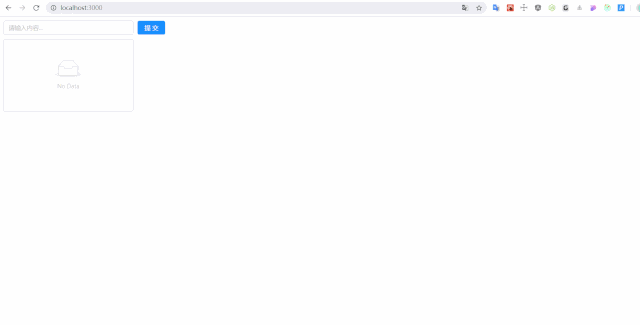

## React 进阶(3)-上手实践 Redux-如何改变 store 中的数据

## 快速导航

<TOC />

## 前言

在前面的一文[React 进阶(2)-上手实践 Redux-如何获取 store 的数据](./advance-getstore-data.md)当中,已经知道组件怎么获取 store 的数据,并渲染到页面上,那么在该节当中揭示怎么更改 store 的数据,实现页面的更新

您将在本文当中学到

- 编写`action`代码,确定具体要做的事情,它只负责创建对象
- 改变`store`数据的唯一方法就是要派发`action`,需要通过调用`store.dispatch`函数
- `reducer`纯函数中实现数据更新等逻辑判断操作
- 触发`store`,注册订阅`subscribe`函数,监听`store`数据的变化,保持页面的状态与`store`的同步
- 重新获取`store`的数据,最终实现页面数据状态的更新
  ......

下面就一起来编写 todolist 的添加,删除等代码的,最终的效果图如下所示

<div align="center">
   
</div>

## 如何改变 store 的数据,实现页面的更新？

在前文的示例代码中已经知道组件怎么从`store`中取数据了,然而现在,如果想要更新`state`的数据?怎么办?

在`reducer`函数接收的第二个参数`action`就是接下来要干的事情了

在`Redux`中为了能够查看`store`中的各个状态,在 chrome 浏览器需先安装一个`redux Devtools`这个调试工具

当然安装这个插件,需要科学上网.如果没有的话,在 qq 浏览器的插件市场里也是能够找得到的

qq 浏览器各种插件也是应有尽有,与在 chrome 控制台里调试是一样的

**方式一:创建 store 的时候,进行 composeEnhancers 构建增强型的应用,在代码里添加配置**

将`window.__REDUX_DEVTOOLS_EXTENSION__ && window.__REDUX_DEVTOOLS_EXTENSION__()`,这行代码配置添加到`createStore()`的第二个参数上

```js
const store = createStore(
  reducer,
  window.__REDUX_DEVTOOLS_EXTENSION__ && window.__REDUX_DEVTOOLS_EXTENSION__()
); // createStore第二个参数添加这个redux-devtools的配置可以开启调试功能
```

<div align="center">
   
   <p>(需要浏览器安装redux-devtools插件)</p>
</div>
<div align="center">
   
   <p>（需要按照文档,对创建的store仓库配置一下）</p>
</div>
<div align="center">
   
   <p>（配置完后,刷新浏览器Redux调试工具就会出现了）</p>
</div>

**方法二:终端下安装 redux-devtools-extension**

```js
npm install --save redux-devtools-extension
```

然后在主页面入口代码里,添加`redux-devtools-extension`拓展,同时引入`applyMiddleware`应用中间件,并在`componseWidthDevTools`中调用,如下所示

```js
import { createStore, applyMiddleware } from 'redux';
import { composeWithDevTools } from 'redux-devtools-extension';

const store = createStore(reducer, composeWithDevTools(applyMiddleware()));
```

以上两种方法都可以开启`Redux`的调试功能,第二种方法比较强大,推荐使用,这种配置完后,在各个浏览器都是可以使用的,至于其他一些额外拓展功能的,在后续的文章中,会不断会讲到

具体更改`store`的实例代码如下所示:

```js
import React from 'react';
import ReactDOM from 'react-dom';
import { Input, Button, List } from 'antd'; // 引入antd组件库
import 'antd/dist/antd.css'; // 引入antd样式

// 1. 创建一个store管理仓库,从redux库中引入一个createStore函数
import { createStore } from 'redux';

// 2. 引入createStore后,store并没有创建,需要调用createStore()后才有store
const store = createStore(
  reducer,
  window.__REDUX_DEVTOOLS_EXTENSION__ && window.__REDUX_DEVTOOLS_EXTENSION__()
); // 创建好reducer后,需要将reducer作为参数传到createStore当中去,这样store才能拿到reducer的state数据

// 3. 创建reducer函数,管理组件共享的数据状态以及一些动作
// reducer是一个纯函数,返回一个新的state给store
// 4. 初始化state值,将原先组件内部的状态的数据,移除到reducer里面去管理
function reducer(
  state = {
    inputValue: 'itclanCoder',
    list: ['itclanCoder', '川川', '学习Redux'],
  },
  action
) {
  console.log(state, action);
  if (action.type === 'handle_Input_Change') {
    // 对原有的上一次的state做一次深拷贝,在Redux中,reducer不允许直接修改state
    // const newState = Object.assign({}, state);这个Object.assign()也是一个非常常用浅拷贝的方法,与下面的方法最终实现的效果是一致的,等价于下面的方法
    // 创建了一个newState完全复制了state,通过对newState的修改避免了对state的修改
    const newState = JSON.parse(JSON.stringify(state));
    newState.inputValue = action.value; // 将新的value值赋值给newState
    return newState;
  }
  return state;
}

// TodoList组件
class TodoList extends React.Component {
  constructor(props) {
    super(props);
    // 5. 在组件内部通过getState()方法就可以拿到store里面的数据
    this.state = store.getState();
    // this环境的绑定
    this.handleInputChange = this.handleInputChange.bind(this);
    this.handleStoreChange = this.handleStoreChange.bind(this);
    // 触发订阅,让store感知到state的变化
    store.subscribe(this.handleStoreChange); // 接收一个函数,重新获取store最新的数据,subscribe里面必须接收一个函数,会自动的调用this.handleStoreChange这个方法,保持store上的状态和this.state的同步,否则是会报错的,这个订阅函数放在componentWillMount或者componentDidMount生命周期函数内监听数据的变化,只要store状态发生了改变,那么就会调用这个handleStoreChange函数
  }
  // componentWillMount(){
  // store.subscribe(this.handleStoreChange);
  // }
  // 组件卸载,移除时调用该函数,一般取消,清理已注册的订阅,定时器的清理,取消网络请求,在这里面操作
  componentWillUnmount() {
    store.unsubscribe(this.handleStoreChange); // 取消订阅,清理已注册的监听
  }

  render() {
    return (
      <div style={{ margin: '10px 0 0 10px' }}>
        <div>
          <Input
            onChange={this.handleInputChange}
            value={this.state.inputValue}
            style={{ width: '300px', marginRight: '10px' }}
            placeholder="请输入内容..."
          />
          <Button type="primary">提交</Button>
        </div>
        <List
          style={{ width: '300px', marginTop: '10px' }}
          bordered
          dataSource={this.state.list}
          renderItem={(item) => <List.Item>{item}</List.Item>}
        />
      </div>
    );
  }

  handleInputChange(e) {
    console.log(e.target.value);
    // 定义action,确定一个操作,动作,注意action必须遵循一定的规范,是一个对象,type字段是确定要做的动作,类型,监听表单输入框的变化,value是输入框的值
    const action = {
      type: 'handle_Input_Change',
      value: e.target.value,
    };
    store.dispatch(action); // 通过store派发dispatch一个action,只有这里接收一个action,Reducer里面才能对新旧数据进行计算等操作,改变store中状态的唯一方法就是派发action
  }

  handleStoreChange() {
    console.log('handleStorechange,触发了');
    this.setState(store.getState()); // 触发setState重新获取store的数据,让input的数据与store保持同步了的
  }
}
const container = document.getElementById('root');

ReactDOM.render(<TodoList />, container);
```

具体的效果如下所示

<div align="center">
   
</div>
通过上面新添加的`action`代码,实现一个更改`store`的数据,并达到了与页面更新的操作

再次来梳理一下更改`store`的数据的一个过程,经历了哪些具体操作

1. 浏览器里添加`redux-devtools`,在创建`store`的`createStore()`的第二个参数中添加`redux-devtools`插件的配置,使浏览器支持`Redux`查看`store`的各种状态

```js
const store = createStore(
  reducer,
  window.__REDUX_DEVTOOLS_EXTENSION__ && window.__REDUX_DEVTOOLS_EXTENSION__()
);
```

2. 给`Input`组件绑定`onChange`事件监听事件处理函数

定义`action`对象,确定动作类型,这个`action`必须遵循一定的规则,得是一个对象,当然在后续当中,怎么支持函数,又是另外的知识了的

3. 通过`store`的`dispatch`方法,接收`action`对象,告知`store`,有`action`这么一个事件动作,改变`store`中的状态的唯一方法就是派发`action`
   如下实例代码所示

```js
<Input onChange={this.handleInputChange}>

handleInputChange(e){
   const action = { // 定义action，action必须是一个对象
       type: 'handle_input_change',
       value: e.target.value
   }
   store.dispatch(action); // 派发dispatch,将action传递给store
}
```

4. 在`Reducer`中会接收到`action`,通过`if`等判断,确定要执行`state`的操作,这个`reducer`必须是个纯函数,要有返回值,返回的结果会返回给`store`,这里的`state`是上一次(原先)组件的状态
   这里需要格外注意的是:

`reducer`可以接收`state`的值,但是不能直接修改`state`的值,当拿到`state`的数据后,需要先拷贝一份原先 state 的数据,在拷贝出新的数据基础上进行操作

创建了一个`newState`完全复制了`state`,通过对`newState`的修改避免了对`state`的修改

```js
function reducer(state, action){
     if(action.type ==== 'handle_input_change'){
          // 对原有的state进行一个深拷贝,在redux中,redux是不允许直接修改state的,但可以接收state,这也是为什么当我们拿到state后,我们需要拷贝一份数据,一个新的state出来
         // const newState = Object.assign({}, state);这个Object.assign()也是一个非常常用浅拷贝的方法,与下面的方法最终实现的效果是一致的
          const newState = JSON.parse(JSON.stringify(state));
          newState.inputValue = action.value;
          return newState; // 返回新的state
     }
     return state;
}
```

其中值得一提的就是拷贝数据对象的方法:

```js
Object.assign({}, state);
// 等价于
JSON.parse(JSON.stringify(state));
```

5. 当执行上述的操作后,当组件想要感知`store`的变化,需要在`constructor`函数内或者`componentWillMount`(在 react17 版本中将会被废弃)或`componentDidMount`生命周期函数内调用`store`的`subscribe`方法

个人推荐放在`constructor`或者`componentDidMount`中

同时它接收一个函数 这个其实是设计模式的订阅者模式,触发`store`的订阅,当`store`发生了变化,会自动的执行该函数

保持`store`上的状态和`this.state`的同步,监听数据的变化,只要`store`状态发生了改变,那么就会调用这个`handleStoreChange`函数

`subscribe(listener)`,用于注册回调,监听`state`的变化

```js
store.subscribe(this.handleStoreChange) // 这里面接收一个listen函数,主要用来获取新的store,这句代码放在constructor或者componentwillMount以及componentDidMount中都是可以的
handleStoreChange(){
    this.setState(store.getState())
}
```

6. 最后在组件移除时,销毁时,在`componentWillUnmount`中取消`store`的订阅事件

```js
// 组件卸载,移除时调用该函数,一般取消,清理已注册的订阅,定时器的清理,取消网络请求,在这里面操作
    componentWillUnmount(){
        store.unsubscribe(this.handleStoreChange);
    }
```

通过以上六个步骤,就完成了一次 store 的更新操作

你可以联想到我们之前举到的那个换房的例子的,租户(组件)怎么获取拿到房源具体信息,首先房产中介经理会从内部的系统(redux)中,引入一个`createStore`的方法,进而创建一个`store`的仓库,随之创建一个实时记录本(`reducer`)

真正的新老房信息的变更操作都是在`reducer`这个函数中完成的,并且它是一个纯函数,必须要有返回值

在`Reducer`函数中,接收两个参数,第一个是上一次组件的状态值,而第二个是组件具体的动作`action`,具体要干的什么事情

在`reducer`中,规定只能读取`state`的数据,并不能直接修改`state`的数据,而且返回的结果是根据`state`与`action`(用户指定的动作)共同决定

其最新的结果返回给房产中介经理手中(store),在 reducer 创建完之后,必须要将 reducer 作为参数,让 createStore 函数接收,这样 store 才真正的拥有了 state 的数据

那么此刻,租户(组件)想要获取房源信息,则引入`store`,在一开始`constructor`函数或者`componentWillMount`函数中,调用`getState()`方法,从而获得了`state`的数据,最终显示到页面上

而如果想要更改 store 的数据,租户想要换携带有沙发,电视等大房子,这个具体的动作就是 action,首先换房子是一个动作,在元素上绑定相应的事件

在该监听事件内,定义一个 action 动作,确定要做的事件类型,这个 action 必须遵循一定的规则,必须是一个对象

定义好`action`动作后,`store`接收到这个`action`动作请求后,`store`想要获取它的具体信息,便会派发一个使者`dispatch`,同时携带上`action`的具体动作信息,作为参数传递给`dispatch`方法

这样的话`store`就真正的知道了具体的动作,而具体的数据变更等操作,需要在 reducer 这个实时记录本中进行变更操作,在 `reducer` 里面进行一些逻辑判断操作

并且在`reducer`中只能读取`state`,并不能修改,如果想要修改,需要拷贝一份`state`出来,在新的 state 基础上进行操作,同时也要将这个新的 state 进行返回.达到一个以新换旧的操作

最后在组件中如何感知到 store 的变化,实现数据的同步更新呢,在 redux 中,需要在组件内的`constructor`或者`componentWillMount`,`componentDidMount`函数中进行触发`subscribe()`函数

同时它必须接收一个函数,触发`store`的订阅,在这个接收的函数当中重新获取一次`store`的数据,保持视图的`this.state`与`store`仓库的`state`数据的同步更新

这样的话,最终就完成了一次`action`的动作,页面也随之更新了

上面的代码进行了一次`action`,`reducer`的编写,下面接着继续的,做得并不完整,那怎么实现一个添加内容的操作呢

输入框表单内添加内容,点击右侧的提交按钮,将 Input 框的内容添加到底下的列表当中 具体效果如下所示

<div align="center">
   
   <p>（添加list操作）</p>
</div>

以下是完整的具体代码

```js
import React from 'react';
import ReactDOM from 'react-dom';
import { Input, Button, List, message } from 'antd'; // 引入antd组件库
import 'antd/dist/antd.css'; // 引入antd样式

// 1. 创建一个store管理仓库,从redux库中引入一个createStore函数
import { createStore } from 'redux';

// 2. 引入createStore后,store并没有创建,需要调用createStore()后才有store
const store = createStore(
  reducer,
  window.__REDUX_DEVTOOLS_EXTENSION__ && window.__REDUX_DEVTOOLS_EXTENSION__()
); // 创建好reducer后,需要将reducer作为参数传到createStore当中去,这样store才能拿到reducer的state数据

// 3. 创建reducer函数,管理组件共享的数据状态以及一些动作
// reducer是一个纯函数,返回一个新的state给store
// 4. 初始化state值,将原先组件内部的状态的数据,移除到reducer里面去管理
function reducer(
  state = {
    inputValue: '',
    list: [],
  },
  action
) {
  console.log(state, action);
  if (action.type === 'handle_Input_Change') {
    // 对原有的上一次的state做一次深拷贝,在Redux中,reducer不允许直接修改state
    // const newState = Object.assign({}, state);这个Object.assign()也是一个非常常用浅拷贝的方法,与下面的方法最终实现的效果是一致的,等价于下面的方法
    const newState = JSON.parse(JSON.stringify(state));
    newState.inputValue = action.value; // 将新的value值赋值给newState
    return newState;
  }
  if (action.type === 'addInputcontent') {
    const newState = JSON.parse(JSON.stringify(state));
    if (newState.inputValue === '') {
      message.error('输入表单内不能为空,请输入内容');
    } else {
      newState.list.push(newState.inputValue); // 往list数组中添加input的内容
      newState.inputValue = '';
      return newState; // 返回newState
    }
  }
  return state;
}

// TodoList组件
class TodoList extends React.Component {
  constructor(props) {
    super(props);
    // 5. 在组件内部通过getState()方法就可以拿到store里面的数据
    this.state = store.getState();
    // this环境的绑定
    this.handleInputChange = this.handleInputChange.bind(this);
    this.handleStoreChange = this.handleStoreChange.bind(this);
    this.handleAddClick = this.handleAddClick.bind(this);
    // 触发订阅,让store感知到state的变化
    store.subscribe(this.handleStoreChange); // 接收一个函数,重新获取store最新的数据,subscribe里面必须接收一个函数,否则是会报错的,这个订阅函数放在componentWillMount生命周期函数内调用操作也是可以的
  }
  // componentWillMount(){
  // store.subscribe(this.handleStoreChange);
  // }
  render() {
    return (
      <div style={{ margin: '10px 0 0 10px' }}>
        <div>
          <Input
            onChange={this.handleInputChange}
            value={this.state.inputValue}
            style={{ width: '300px', marginRight: '10px' }}
            placeholder="请输入内容..."
          />
          <Button type="primary" onClick={this.handleAddClick}>
            提交
          </Button>
        </div>
        <List
          style={{ width: '300px', marginTop: '10px' }}
          bordered
          dataSource={this.state.list}
          renderItem={(item) => <List.Item>{item}</List.Item>}
        />
      </div>
    );
  }

  handleInputChange(e) {
    console.log(e.target.value);
    // 定义action,确定一个操作,动作,注意action必须遵循一定的规范,是一个对象,type字段是确定要做的动作,类型,监听表单输入框的变化,value是输入框的值
    const action = {
      type: 'handle_Input_Change',
      value: e.target.value,
    };
    store.dispatch(action); // 通过store派发dispatch一个action,只有这里接收一个action,Reducer里面才能对新旧数据进行计算等操作,这是改变store数据的唯一的方法,必须要通过派发一个action给store
  }

  handleStoreChange() {
    console.log('handleStorechange,触发了');
    this.setState(store.getState()); // 触发setState重新获取store的数据,让input的数据与store保持同步了的
  }

  // 添加列表的操作
  handleAddClick() {
    console.log('添加按钮执行了');
    // 定义action动作
    const action = {
      type: 'addInputcontent',
    };
    store.dispatch(action); // 还要将action传递给dispatch,这样store才会接收到,这是改变store数据的唯一的方法,必须要通过派发一个action给store,必不可少的一步
  }
}
const container = document.getElementById('root');

ReactDOM.render(<TodoList />, container);
```

上面的代码就完成一个添加列表的功能 在次梳理一下过程

1. 给`JSX`元素,组件`Button`按钮绑定事件

```js
<Button type="primary" onClick={this.handleAddClick}>提交</Button>
// 添加列表的操作
    handleAddClick(){
        console.log("添加按钮执行了");
        // 定义action动作
        const action = {
            type: 'addInputcontent'
        }
        store.dispatch(action); // 还要将action传递给dispatch,这样store才会接收到,这是改变store数据的唯一的方法,必须要通过派发一个action给store,必不可少的一步
    }
```

2. 在`reducer`函数中进行逻辑判断,数据变更等操作

```js
if (action.type === 'addInputcontent') {
  const newState = JSON.parse(JSON.stringify(state));
  if (newState.inputValue === '') {
    message.error('输入表单内不能为空,请输入内容');
  } else {
    newState.list.push(newState.inputValue); // 往list数组中添加input的内容
    newState.inputValue = ''; // 提交表单内容后,让表单内容置空操作
    return newState; // 返回newState
  }
}
```

基于原有的代码,添加这两步就完成了一个添加列表的操作的 那么删除列表的功能怎么实现呢? 以下是实现的效果

<div align="center">
   
   <p>（删除列表）</p>
</div>
以下是具体的实例代码

```js
import React from 'react';
import ReactDOM from 'react-dom';
import { Input, Button, List, message, Modal } from 'antd'; // 引入antd组件库
import 'antd/dist/antd.css'; // 引入antd样式

// 1. 创建一个store管理仓库,从redux库中引入一个createStore函数
import { createStore } from 'redux';

// 2. 引入createStore后,store并没有创建,需要调用createStore()后才有store
const store = createStore(
  reducer,
  window.__REDUX_DEVTOOLS_EXTENSION__ && window.__REDUX_DEVTOOLS_EXTENSION__()
); // 创建好reducer后,需要将reducer作为参数传到createStore当中去,这样store才能拿到reducer的state数据

// 3. 创建reducer函数,管理组件共享的数据状态以及一些动作
// reducer是一个纯函数,返回一个新的state给store
// 4. 初始化state值,将原先组件内部的状态的数据,移除到reducer里面去管理
function reducer(
  state = {
    inputValue: '',
    list: [],
  },
  action
) {
  console.log(state, action);
  if (action.type === 'handle_Input_Change') {
    // 对原有的上一次的state做一次深拷贝,在Redux中,reducer不允许直接修改state
    // const newState = Object.assign({}, state);与下面的是等价的
    const newState = JSON.parse(JSON.stringify(state));
    newState.inputValue = action.value; // 将新的value值赋值给newState
    return newState;
  }
  if (action.type === 'addInputcontent') {
    const newState = JSON.parse(JSON.stringify(state));
    if (Trim(newState.inputValue) === '') {
      message.error('输入表单内不能为空,请输入内容');
    } else {
      newState.list.push(newState.inputValue); // 往list数组中添加input的内容
      newState.inputValue = '';
      return newState; // 返回newState
    }
  }
  if (action.type === 'deletelist') {
    // 下面这个也是拷贝原对象的一种方式与上面等价
    const newState = Object.assign({}, state);
    newState.list.splice(action.index, 1);
    return newState;
  }
  return state;
}

// 去除前后空格
function Trim(str) {
  return str.replace(/(^\s*)|(\s*$)/g, '');
}
const { confirm } = Modal;
// TodoList组件
class TodoList extends React.Component {
  constructor(props) {
    super(props);
    // 5. 在组件内部通过getState()方法就可以拿到store里面的数据
    this.state = store.getState();
    // this环境的绑定
    this.handleInputChange = this.handleInputChange.bind(this);
    this.handleStoreChange = this.handleStoreChange.bind(this);
    this.handleAddClick = this.handleAddClick.bind(this);
    // 触发订阅,让store感知到state的变化
    store.subscribe(this.handleStoreChange); // 接收一个函数,重新获取store最新的数据,subscribe里面必须接收一个函数,否则是会报错的,这个订阅函数放在componentWillMount生命周期函数内调用操作也是可以的
  }
  // componentWillMount(){
  // store.subscribe(this.handleStoreChange);
  // }
  // 组件卸载,移除时调用该函数,一般取消,清理已注册的订阅,定时器的清理,取消网络请求,在这里面操作
  componentWillUnmount() {
    store.unsubscribe(this.handleStoreChange);
  }

  render() {
    return (
      <div style={{ margin: '10px 0 0 10px' }}>
        <div>
          <Input
            onChange={this.handleInputChange}
            value={this.state.inputValue}
            style={{ width: '300px', marginRight: '10px' }}
            placeholder="请输入内容..."
          />
          <Button type="primary" onClick={this.handleAddClick}>
            提交
          </Button>
        </div>
        <List
          style={{ width: '300px', marginTop: '10px' }}
          bordered
          dataSource={this.state.list}
          renderItem={(item, index) => (
            <List.Item onClick={this.handleDelList.bind(this, index, item)}>
              {item}
            </List.Item>
          )}
        />
      </div>
    );
  }

  handleInputChange(e) {
    console.log(e.target.value);
    // 定义action,确定一个操作,动作,注意action必须遵循一定的规范,是一个对象,type字段是确定要做的动作,类型,监听表单输入框的变化,value是输入框的值
    const action = {
      type: 'handle_Input_Change',
      value: e.target.value,
    };
    store.dispatch(action); // 通过store派发dispatch一个action,只有这里接收一个action,Reducer里面才能对新旧数据进行计算等操作
  }

  handleStoreChange() {
    console.log('handleStorechange,触发了');
    this.setState(store.getState()); // 触发setState重新获取store的数据,让input的数据与store保持同步了的
  }

  // 添加列表的操作
  handleAddClick() {
    console.log('添加按钮执行了');
    // 定义action动作
    const action = {
      type: 'addInputcontent',
    };
    store.dispatch(action); // 还要将action传递给dispatch,这样store才会接收到
  }

  // 删除列表操作
  handleDelList(index, item) {
    this.showDeleteConfirm(index, item);
  }

  showDeleteConfirm(index, item) {
    const action = {
      type: 'deletelist',
      index: index,
    };
    confirm({
      title: '确定要删除该列表?',
      content: item,
      okText: '确认',
      okType: 'danger',
      cancelText: '取消',
      onOk() {
        console.log('OK');
        store.dispatch(action); // 想要改变store的数据,必须通过dispatch派发一个action
      },
      onCancel() {
        console.log('Cancel');
      },
    });
  }
}
const container = document.getElementById('root');

ReactDOM.render(<TodoList />, container);
```

实现删除列表的过程与添加列表差不多

1. 给列表绑定事件,添加事件处理函数

```js
<List
      style={{ width: '300px',marginTop:'10px'}}
      bordered
      dataSource={this.state.list}
      renderItem={(item,index) => <List.Item onClick={this.handleDelList.bind(this, index,item)}>{item}</List.Item>}/>

const { confirm } = Modal; // 记得引入这个,不然删除确认模态框不会生效的,底下调用了该确认函数
 // 删除列表操作
    handleDelList(index,item) {
        this.showDeleteConfirm(index, item);
    }

    showDeleteConfirm(index,item) {
        const action = {
            type: 'deletelist',
            index: index
        }
        confirm({
            title: '确定要删除该列表?',
            content: item,
            okText: '确认',
            okType: 'danger',
            cancelText: '取消',
            onOk() {
                console.log('OK');
                 store.dispatch(action); // 想要改变store的数据,必须通过dispatch派发一个action
            },
            onCancel() {
                console.log('Cancel');
            },
        });
    }
```

2. 在`reducer`函数中进行对公共组件数据逻辑的操作

```js
if (action.type === 'deletelist') {
  // 下面这个也是拷贝原对象的一种方式,也很常用
  const newState = Object.assign({}, state);
  newState.list.splice(action.index, 1); // 这是删除当前列表的核心方法,通过数组的splice方法实现,第一个参数代表的是删除哪个,第二个是删除一个
  return newState;
}
```

至于上面添加了一个当删除列表时,模态框的确认操作,至于添加一些组件是放在 reducer 里面还是放在外面,要视具体的业务逻辑而定

比如这里的删除确认模态框的,点击列表时,弹出是否删除的模态框,而具体是否要删除,应当在`onOk`这个函数里面进行派发`action`的, 如果你放到`reducer`里面做处理,那么始终会出现一些问题的,注意逻辑的操作顺序

文章写到这里,一个 todolist 的添加,删除操作就完成了,当然看到这样的代码,这么一个小小的 demo 操作,绕来绕去,估计奔溃了的,这样的代码堆叠在一起肯定是不行的

在后续的学习当中,我们将会把`store`,`reducer`,以及`action`进行分开独立管理的,之所以写在一个文件里,是方便后续怎么样将`store`,`reducer`,以及`action`抽离出去的

如果一上来就拆分,在各个文件之间进行切换,对于初学者,是很容易绕晕的.当然如果你是大神,就另当别论了的

上面的代码是次要的,重要的是理清`Redux`中`store`,`React Component`,`action creators`,`reducer`相互之间的关系,如果不清晰他们之间的关系,在遇到复杂的大型项目时,各个文件切来切去的,绝对是一头雾水,懵逼的,维护起来也是想死的心都有

## 结语

本文并不是什么高大上的内容,主要是对学习 Redux 的一个小小的初探,在真正实际项目中,复杂度远不止像这样的一个例子的,但是作为入门,`todolist`确实能让自己对`Redux`有一定的认识

也许你会觉得这么个简单的例子,竟然这么多代码,使用 vue 的话,几行代码就搞定了,Vue 中也有 vuex 这样的数据流管理框架,使用起来也是大同小异,两个各有优点,都很强

使用 React 编写代码更偏向底层一些的,虽然 Redux 比较绕,但都是有固定的套路流程的,其中理解 Redux 的工作流程是非常重要的

主要开始用`ant-design`这个 UI 组件库对`todolist`做了一个简单的布局,然后如何将组件的数据抽离到 Redux 中去管理

组件如何获取`Redux`中`store`的数据,以及怎么更新`store`的数据的更新,在上文当中都有与之对应的操作和解释

用几句简单话:概括下使用 Redux 的流程

- 安装`redux`,然后从`redux`中引入`createStore`这个方法,并调用它,从而创建`store`
- 紧着在创建`reducer`纯函数,在`reducer`里面进行`state`的逻辑操作,`reducer`的返回值取决于`state`与`action`这个的决定,最终该函数的返回的最新结果会返回给`store`,完成新旧数据的替换
- 而在组件中如何获取 store 的数据,是通过`getState`方法进行获取`store`中的所有状态
- 如何保持页面的组件与 store 数据同步更新,需要注册订阅`subscribe`方法,该方法接收一个函数,在该接收的函数内触发重新获取`store`的数据 更多细枝末节内容,可见上文

<footer-FooterLink :isShareLink="true" :isDaShang="true" />
