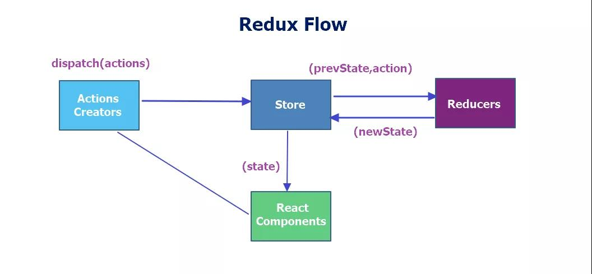

## React 进阶(2)-上手实践 Redux-如何获取 store 的数据

## 快速导航

<TOC />

<div align="center">
   
</div>

## 前言

在前面的一文理解`Redux`中,已经知道了`Redux`的工作流程以及 Redux 的设计基本原则

它就是一个用于管理组件的公共数据状态的数据层框架,包括了`Store`,`Reducer`,`React Component`,`Actions Creators`四个部分
其中核心是`Store`,他们彼此之间的关系对于写`Redux`是非常重要的,宏观上讲:也可以将 Redux=reducer+Flux 的组合,代码就是文字描述的最佳的体现,解释

你将在本文学习到

- 编写`Redux`的的基本流程
- 如何获取 store 中公共的数据,并展示到页面上
- 如何更改 store 的公共数据,实现组件的数据与 store 的同步更新

下面就一起来编写 Redux 代码的,以下是最终实现的效果图,添加,删除列表操作

<div align="center">
   
</div>

## 使用 Ant-design 布局 todolist

对于初学者,一个简单的`todolist`例子对于入门`redux`是一个非常好的实践,这就好比刚写程序时的 Hello-world,虽然麻雀虽小,但是五胀俱全 在 React 中要使用 Redux 时,必须先要在命令行终端下进行安装

- 使用`npm`或者`cnpm`,`yarn`(使用 yarn 时,需要先安装它,然后才可以使用)进行安装

```js
yarn add redux
// 或者
npm install --save redux
```

安装完后,可以在根目录下 package.json 查看到 redux 的版本,如果有,说明已经安装成功了的

`ant-design`的使用可以参考[官方文档](https://ant.design/docs/react/introduce-cn)

同样也是需要先安装,然后在项目中使用

```js
yarn add antd
```

然后在`index.js`中引入样式

```js
import 'antd/dist/antd.css';
```

当然你也可以按需加载组件的方式,具体配置可以参照官方文档

以下是 index.js 代码
::: details 点击即可查看代码

```js
import React from 'react';
import ReactDOM from 'react-dom';
import { Input, Button, List } from 'antd'; // 引入antd组件库
import 'antd/dist/antd.css'; // 引入antd样式

// TodoList组件
class TodoList extends React.Component {
  constructor(props) {
    super(props);
    // 组件内部的初始化状态数据
    this.state = {
      inputValue: 'itclanCoder', // input表单初始值
      list: ['itclanCoder', '川川', '学习Redux'], // 下方列表展示的数据
    };
  }
  render() {
    return (
      <div style={{ margin: '10px 0 0 10px' }}>
        <div>
          <Input
            value={this.state.inputValue}
            style={{ width: '300px', marginRight: '10px' }}
            placeholder="请输入内容..."
          />
          <Button type="primary">提交</Button>
        </div>
        <List
          style={{ width: '300px', marginTop: '10px' }}
          bordered
          dataSource={this.state.list}
          renderItem={(item) => <List.Item>{item}</List.Item>}
        />
      </div>
    );
  }
}
const container = document.getElementById('root');

ReactDOM.render(<TodoList />, container);
```

:::

最终渲染的 UI 效果如下所示

<div align="center">
   
</div>

在控制台中可以多查看组件`state`的各个状态的,有助于理解`React`的

在上面的代码中,我们发现组件内部的状态数据是放在当前组件的 state 进行存储管理的,对于这种小的 demo 例子,杀鸡焉用宰牛刀使用 Redux 未免有些大才小用

但是如果组件非常的业务逻辑非常复杂,状态特别多,那么使用 Redux 的优点就非常明显了的

下面引入 redux,同样能够达到同样的效果,放上上一节的理解 Redux 的工作流程图

<div align="center">
   
</div>

::: details 点击即可查看

```js
import React from 'react';
import ReactDOM from 'react-dom';
import { Input, Button, List } from 'antd'; // 引入antd组件库
import 'antd/dist/antd.css'; // 引入antd样式

// 1. 创建一个store管理仓库,从redux库中引入一个createStore函数
import { createStore } from 'redux';

// 2. 引入createStore后,store并没有创建,需要调用createStore()后才有store
const store = createStore(reducer); // 创建好reducer后,需要将reducer作为参数传到createStore当中去,这样store才能拿到reducer的state数据

// 3. 创建reducer函数,管理组件共享的数据状态以及一些动作
// reducer是一个纯函数,返回一个新的state给store
// 4. 初始化state值,将原先组件内部的状态的数据,移除到reducer里面去管理
function reducer(
  state = {
    inputValue: 'itclanCoder',
    list: ['itclanCoder', '川川', '学习Redux'],
  },
  action
) {
  return state;
}

// TodoList组件
class TodoList extends React.Component {
  constructor(props) {
    super(props);
    // 5. 在组件内部通过getState()方法就可以拿到store里面的数据,该方法能够获取到store上存储的所有状态
    this.state = store.getState();
  }
  render() {
    return (
      <div style={{ margin: '10px 0 0 10px' }}>
        <div>
          <Input
            value={this.state.inputValue}
            style={{ width: '300px', marginRight: '10px' }}
            placeholder="请输入内容..."
          />
          <Button type="primary">提交</Button>
        </div>
        <List
          style={{ width: '300px', marginTop: '10px' }}
          bordered
          dataSource={this.state.list}
          renderItem={(item) => <List.Item>{item}</List.Item>}
        />
      </div>
    );
  }
}
const container = document.getElementById('root');

ReactDOM.render(<TodoList />, container);
```

:::

上面的实例代码中,完成了将原先定义在组件内部的状态数据抽离到 Redux 中的 reducer 去管理,**在当前组件内部通过 getState()方法拿到 state 数据,最终渲染到页面上**

## 梳理一下 Redux 的使用流程

1. 命令行终端下安装 redux 第三方库

```js
yarn add redux
```

2. 在项目中引入`redux`库,同时创建一个`store`仓库,这是通过调用`createStore`函数实现的

```js
import { createStore } from 'redux';
const store = createStore(); // 调用createStore函数才会真正的创建一个store
```

3. 创建`reducer`函数,用于存储公共组件的数据状态,它是一个纯函数,用于返回组件的状态

```js
/*
 reducer是一个纯函数,接收两个参数,state和action其中state存储的就是组件的公共状态的,而action就是组件派发的动作,reducer的最终结果是由state和action共同决定的,后面会接着讲action
*/
function reducer(state, action) {
  return state;
}
```

4. 在`reducer`创建好之后,需要把`reducer`传递给`createStore`函数当中去,这样 store 就拿到了 reducer 里面的数据,这一步是必须要做的,否则就会拿不到`reducer`中 state 的数据

```js
const store = createStore(reducer); // reducer函数必须传递给createStore函数中去,否则页面无法获取store的数据
```

5. 组件内如何获取 store 中数据,通过调用`getState`方法获取`store`中的数据,该方法能够获取到`store`上存储的所有状态,该方法放置的位置是在`constructor`函数里面

```js
this.state = store.getState(); // getState方法能够获取store中的所有状态
```

6. 组件的渲染

```js
<Input value={ this.sate.inputValue }>
<List dataSource={this.state.list} />
```

上面的过程:其实完成的就是 Redux 工作流中的右边的内容

<div align="center">
   
</div>

整个过程总结几句话就是

引入`redux`库,并调用`createStore`函数,从而创建了`store`,紧接着创建`reducer`函数,用于管理组件公共的状态数据,返回组件的最新的状态数据给 store

其结果由`state`和`action`共同决定,然后将创建的`reducer`函数作为参数,让`createStore`函数接收.

进而`store`就获取到了`reducer`函数里面的组件公共存储的数据,当组件外部想要拿 store 的公共数据时

于是引入 store,并通过 getState 这个函数就可以获取 store 中的所有数据,最终可将数据渲染到页面上

## 结语

本文并不是什么高大上的内容,主要是对学习 Redux 的一个小小的初探

用几句简单归纳下:组件如何获取 store 中的数据

- 安装`redux`,然后从`redux`中引入`createStore`这个方法,并调用它,从而创建`store`,
- 紧着在创建`reducer`纯函数,在`reducer`里面进行`state`的逻辑操作,`reducer`的返回值取决于`state`与`action`这个的决定,最终该函数返回最新结果会返回给`store`,完成新旧数据的替换.
- 而在组件中如何获取`store`的数据,是通过`getState`方法进行获取`store`中的所有状态

那么如何保持页面的组件与`store`数据同步更新?添加,删除列表怎么实现呢?

<footer-FooterLink :isShareLink="true" :isDaShang="true" />
<footer-FeedBack />
