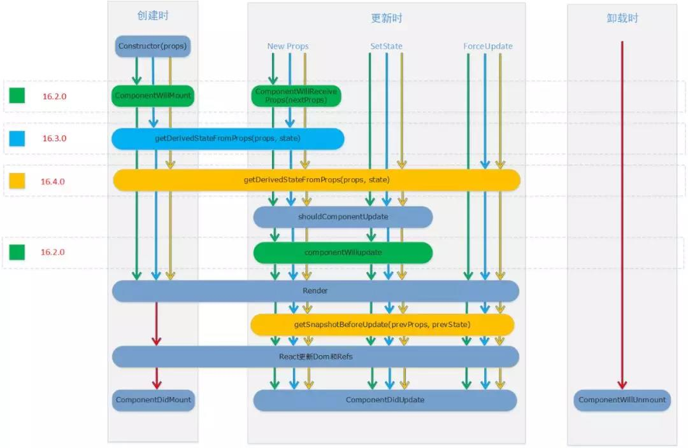

## React 中组件的生命周期

## 快速导航

<TOC />

## 前言

为了进一步了解`React`的工作过程,已经晓得了怎么编写`React`组件,知道了`React`的数据流,那么是时候学习 React 组件的生命周期了,每个组件都包含生命周期方法,生命周期如同四季更替,一个人的生,老,病,死.在每个特殊的年龄阶段,做着不同的事情

在 React 编写组件中,每个组件在网页中都有被创建,更新,删除这么一过程,就像有机的生命体一样

理解生命周期函数对于编写 React 组件代码是非常重要的

<div align="center">
   
</div>

## 生命周期(钩子)函数

**定义**: 在特定的阶段,能够自动执行的函数(方法)

在前面的`JSX`学习中,一个`React`元素渲染到页面当中,本质上是通过底层的`React.CreateElement`的一个方法实现的,它是一个`javascript`对象,将虚拟`DOM`转化为真实的`DOM`,最后通过`ReactDOM.render()`方法将真实的`DOM`渲染挂载到对应的页面位置上

一个组件的渲染,经历了以下几个过程:可以对照这个完整的生命周期图谱的

<div align="center">
   
</div>

- **组件的装载(Mount)**:`React`组件第一次在`DOM`树中渲染的过程
- **componentWillMount**:组件即将被挂载,在`Render`方法之前调用:
  - **应用场景**: 常用于组件的启动工作,例如:`Ajax`数据的获取,定时器的启动,类似`Render`函数的前哨,调用`setState`修改状态也不会引起重新绘制,这个时候没有任何渲染,需要注意的是,它可以在服务器端被调用,也可以在浏览器端调用
- **componentDidMount**:组件被加载完之后调用,也就是`render`函数执行之后调用，相当于`render`函数的后卫,当这个生命周期执行时,render 函数会引发渲染,组件重新挂载到 DOM 树上
  - **注意**:它只能在浏览器端调用,在服务器端使用`React`的时候不会调用,装载是将组件渲染,并且构造`DOM`元素,然后塞入页面的过程,这个状态是不可能在服务器端完成的,服务器端不可能产生`DOM`树的
  - **应用场景**:我们往往在这个生命周期内进行`Ajax`的获取,填充组件的内容,因为在`componentDidMount`被调用时,组件已经挂载到`DOM`树上了,而往往若需要结合第三方库的使用,例如:`JQ`等,也是放到这个生命周期函数中进行处理的
- `getSnapshotBeforeUpdate(prevProps, prevState)`:
  - **使用场景**：该函数在最终`render`结果提交到`DOM`之前被调用,记录 DOM 刷新前的特性，如：滚动位置
  - **注意**：该函数的返回值会作为参数传递给`componentDidUpdate`
- `componentWillUnmount`: 当组件对应的 `DOM` 元素从页面中删除之前调用
- **组件的更新(update)**: 当组件被重新渲染的过程(`state`与`props`发生改变都会引起渲染)
  - `componentWillReceiveProps`
  - `shouldComponentUpdate`
  - `componentWillUpdate`
  - `componentDidUpdate`
- 组件的卸载(`unmount`): 组件从`DOM`中删除的过程

  - `componentWillUnmount`: 组件从页面销毁时,会触发该函数,当需要对数据进行清理时,例如定时器的清理,放到该函数里面去做

三种不同的过程,`React`库会依次调用组件的一些成员函数(生命周期函数)

## 组件装载过程

当组件第一次被渲染的时候,会依次的调用如下生命周期函数

- `constructor`:构造器函数
- `getDerivedStateFromProps(props,state)`:

**使用场景**：当组件内部的`state`变化依赖于`props`时,调用该生命周期函数 注意：不要过度使用该函数,如果你的操作依赖于`props`的更改并有副作用，最好放到`componentDidUpdate`中

- `componentWillMount`:组件挂载开始之前调用,也就是`render`函数之前被自动调用,在`React16.3`版本之后不应该使用,由于该函数在`Render`函数之前调用,因此使用同步的`setState`方法不会触发额外的`render`处理

它也只会在初始化的时候调用一次,所以`this`环境的绑定放在这里面也是可以的,但是最好是放在`constructor`构造器函数里面,如果是处理带有后续异步操作或者有副作用的订阅事件处理,例如：`Ajax`数据获取,则放到`componentDidMount`中

- `render`:组件的渲染,插入到`DOM`元素中
- `componentDidMount`:组件挂载完之后调用,也就是在`render`函数之后调用,`DOM`已经插入到页面中了的,可以在这里使用`refs`

`constructor`:构造器函数

```js
constructor(ptops) {
 super(props); // 一定要调用super,并且接收props参数,否则该组件的实例方法无法获取到外部的props值
}
```

至于`constructor`在上节当中已经提及过,并不是每个组件都需要定义`constructor`构造器函数，函数式(无状态)组件就不需要定义构造函数

一般使用`constructor`构造函数有如下两种情况

- 组件内部初始化`state`,因为生命周期内的任何函数都可能要访问`state`,取它的值,进行相应的逻辑处理,它是该组件一个私有的对象变量
- 在对`JSX`元素上绑定事件监听处理函数时,也就是组件内部成员函数(方法)`this`环境的绑定,因为在`Es6`中类的成员方法在执行时 this 并不会和类的实例化本身自动的绑定,你需要手动`bind`的方式进行绑定

为了方便调用,在构造函数中,`this`就是当前组件的实例,往往在构造函数中将组件实例下的成员方法绑定`this`为当前的实例对象

```js
constructor(props){
  super(props);
}
// 事件监听处理函数，this环境的绑定
this.handleBtnClick = this.handleBtnCLick.bind(this);
this.handleInputChange = this.handleInputChange.bind(this)
```

在执行了`constructor`构造器函数后,执行`componentWillMount`方法,然后在执行`render`方法,执行完`render`方法后,在执行`componentDidMount`方法,整个装载过程就结束了的

当然这其中的一个`componentWillUnmount`方法是在组件销毁前进行触发,也就是删除`DOM`元素之前调用,这个常用于当组件从页面删除销毁时,做一些数据清理的时候能用得上,例如定时器的清理,取消网络请求,在该生命周期函数内,不应该调用`setState`函数,因为该组件销毁后,将不会被重新渲染

具体的实例代码如下所示:

```js
import React, { Fragment, Component } from 'react';
import ReactDOM from 'react-dom';

class LifeCycle extends Component {
  constructor(props) {
    super(props);
    console.log('1-constructor函数被调用执行');
    this.state = {
      isShow: true,
    };

    this.handleBtnClick = this.handleBtnClick.bind(this);
  }

  componentWillMount() {
    console.log(
      '2-componentWillMount函数已执行,组件挂载之前,在render方法之前调用',
      this.state.isShow
    );
  }

  componentDidMount() {
    console.log(
      '4-componentDidMount函数已执行,组件挂载完之后,DOM元素已经插入到页面后调用'
    );
  }

  render() {
    console.log('3-render函数执行');
    return (
      <Fragment>
        <div>
          {this.state.isShow ? <Text /> : ''}
          <button onClick={this.handleBtnClick}>更改</button>
        </div>
      </Fragment>
    );
  }

  handleBtnClick() {
    this.setState({
      isShow: !this.state.isShow,
    });
  }
}

class Text extends Component {
  componentWillUnmount() {
    console.log(
      'componentWillUnmount函数已执行,组件从页面中移除之前调用,Text组件移除'
    );
  }
  render() {
    console.log('Text组件被渲染');
    return <h1>itclanCoder</h1>;
  }
}

const container = document.getElementById('root');

ReactDOM.render(<LifeCycle />, container);
```

效果如下所示:

<div align="center">
   
</div>

大家可以自行将这些生命周期函数放到组件内部当中,进行测试的,看每个生命周期执行的顺序就一目了然了的

说完了组件的装载,那么接下来就是组件的更新了

## 组件的更新

当`props`或者`state`发生改变的时候,就会引起`render`函数的渲染,也就是会引发组件的更新,它与组件的装载一样,会触发一些生命周期函数

更新组件时:生命周期函数执行的顺序

- **`componentWillReceiveProps(nextProps,nextState)`**:只要父组件的`render`函数被调用,在`render`函数里面被渲染的子组件就会经历更新的过程,无论父组件传给子组件的`props`有没有改变,都会触发子组件的`componentWillReceiveProps`函数

你可以理解为,第一次渲染时,父组件的`componentWillReceiveProps`函数不会被执行,如果是第二次渲染时,已经存在于父组件中,则该`componentWillReceiveProps`才会执行

**注意**:在挂载过程中,`React`不会针对初始`props`调用此方法,通过触发`setState`方法更新过程不会调用这个函数,这是因为这个函数适合根据新的`props`值(也就是`nextProps`)来计算出是不是要更新内部状态`state`

**应用场景**:当你希望只有在接收新的`props`时做一些逻辑,`props`改变需要相应改变内部`state`状态时,则使用`componentWillReceiveProps`，比如:根据父组件传入的数据初始化或重置组件内部的某些 state 状态

- **`shouldComponentUpdate`**:它决定一个组件什么时候不需要被渲染,在组件更新过程中,Render 函数之前调用执行,它同`Render`函数一样,要求有返回结果的函数

返回一个`boolean`值,告诉`React`库这个组件在这次更新过程是否要继续,如果该函数返回`true`,那么继续更新,调用`render`函数,反之,若函数返回`false`,那么立刻停止更新过程,便不会执行`render`函数了的

这个函数是提高`React`的性能的,如果发现没必要的渲染,那就干脆不用渲染了的,这个`shouldComponentUpdate`就可以做到

**注意**: `forceUpdate`不会触发该函数,也可以使用`PureComponent`替代该函数,该函数做了内部的优化

```js
// nextProps表示的是接下来我的props值会样,nextState表示的是我的state会变成什么样
shouldComponentUpdate(nextProps, nextState)
  if(nextProps.props属性 !== this.props.props属性 || nextState.state属性 !== this.state.state属性)
  return true;
}else{
  return false
}
```

- `componentWillUpdate`: 组件即将更新时调用,在`Render`函数之前调用

**注意**: 不要在该函数中通过`this.setState`再次改变`state`,如果需要,则在`componentWillReceiveProps`函数中改变

- `render`:决定该组件 UI 渲染结果,返回的结果用于构造 DOM 对象

**注意**:不能在`render`函数中调用`setState`，如果在`shouldComponentUpdate`返回`false`，则`render`函数不会被调用

- `componentDidUpdate`:组件更新完之后执行，有两个参数`prevProps`和`prevState`，无论是父组件`props`的修改还是状态的更改都会触发该方法

**应用场景**:如果希望无论`props`更改还是组件内的状态更改都能触发一些逻辑,则可以使用`componentDidUpdate`,进行业务处理,发送网络请求

**注意**:在处理业务或发送网络请求时,一定要做好条件比较,否则容易造成死循环

## 组件的卸载

组件的卸载

`React`组件从页面中移除时,在卸载的过程中,只涉及一个生命周期函数`componentWillUnmount`,由于该函数在组件删除之前会被调用,所以该函数适合做一些清理性的工作

**应用场景**: 清理无效的`timer`,取消未完成的网络请求,清理已注册的订阅

**注意**：在这里使用`setState`时无效的

当然对于`React`的生命周期,不同的版本,官方对它做了一些优化和改动,这里介绍的是`React Version 16.2.0`版本的,生命周期过程图如下所示

<div align="center">
   
</div>
如果是最新的，在React17.0版本中,生命周期函数如下所示
<div align="center">
   
</div>

## 结语

本文主要讲解了 `React` 的生命周期,只要理解了生命周期的图谱,生命周期也就差不多了的,在 constructor 构造器中初始化工作,`componentWillMount` 在组件即将挂载之前执行调用,常用于组件的启动工作,例如:Ajax 数据的获取,定时器的启动

当然数据的请求最好放在 `componentDidMount` 函数中,而当 `props` 或者 `state` 发生改变时,会引起组件的渲染,也就是组件的更新,只要父组件的 render 函数被渲染了

就会触发子组件的 `componentWillReceiveProps`,而当 `shouldComponentUpdate` 的函数返回 `true` 时,则 `render` 函数会渲染,要是返回 `false` 时,则 `render` 函数不会渲染

当组件从页面中移除时,在卸载之前会触发 `componentWillUnmount` 函数,该函数常常用于组件销毁时调用,清理无效的定时器 `timer`，取消未完成的网络(`Ajax`)请求,清理已注册的订阅

<footer-FooterLink :isShareLink="true" :isDaShang="true" />
<footer-FeedBack />
