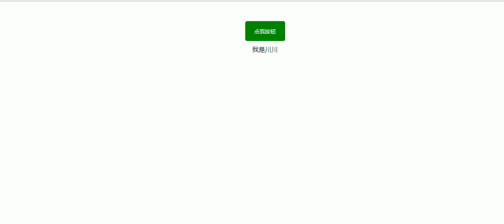
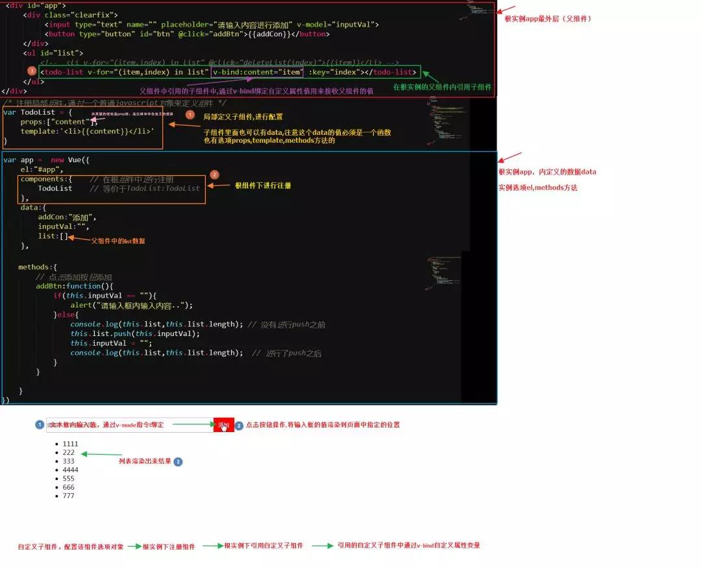

## vuejs 中的组件以及父子组件间通信传值

## 快速导航

<TOC />

<div align="center">

</div>

## 前言

您将在本文当中了解到,**往网页中添加数据,从传统的 dom 操作过渡到数据层操作,实现同一个目标,两种不同的方式**

- 什么是组件,如何定义和使用组件,父子组件之间如何进行简单的通信传值...

- 在切换到写 Vuejs 代码中,你不需要去关注 dom 层操作,更多的精力是放在处理数据上,数据是什么,就让页面显示什么,操作数据，就是在操做 view(视图),这与 JQuery 是不一样的,编程思路是需要进行转化的

单纯的`vuejs`其实是不足以撼动 jQuery 的地位的,**它的强大之处在于它的生态系统非常丰富,路由,模型,UI 组件等各个部分的钩子等令 vuejs 风靡国内外,借鉴了 Angular 中指令,React 中组件化等,上手相对而言比较容易**

如今 jQuery 时代真是江河日下了,这里我并不是说它不重要,它仍然是非常优秀而重要的

只是任何技术都有辉煌和落幕的时候,时代在进步,技术也在不断更新迭代..

从 github 上的 star 数看得出,vue 势头略盖过 react,甩 angular 几条街,已形成三足鼎立趋势,凡是 react,angular 能做的,无论是 pc,移动端,甚至 webapp,pwa 应用(lavas=vue+pwa),小程序(wepy),vue 几乎无孔不入了

在 vue 的使用过程中,从开始学习单纯的引入 script 标签加载 vuejs 脚本形式到最终使用 vue-cli 脚手架搭建出来的项目,它又换成另外一种编程思路

前一种方式更多是对 vuejs 中的一些 API 学习的验证,还是可以的,它是把 html,js 和各种逻辑耦合在一起进行编码,类似于 jQuery 的风格.它也能搞事,但是这与脚手架搭建起的应用是不同的

后一种**使用脚手架方式却是我们常用的方式,它是以一种单文件组件方式,也就是以.vue 后缀名文件就是一个组件,这个单文件组件定义包含了模板,逻辑和它的样式,它做了一个非常好的组件封装.**

在 vuejs 中组件与组件之间的通信,关联操作,数据共享,路由状态的切换变更,UI 组件的嵌套,插件与主程序的额外拓展等,如果处理他们起来觉得很简单,那才是真简单..

## vuejs 是什么?

- 它只关注视图层的 view,是构建用户界面的渐进式框架
- 数据驱动,声明式渲染(模板,插值表达式),模块化,组件化,客户端路由(vue-router),数据状态管理(vuex),构建工具(vue-cli)

::: tip 思考
与 React 的相似之处:用于构建用户界面的 JavaScript 框架,同样是数据驱动,组件化,但是 React 没有那么多 API,很多东西,需要自己去实现
:::

## vue 中核心点

- **响应式数据绑定**,当数据(model 层)发生改变,它会自动更新视图(view),**内部实现原理是利用 Es5 中的 Object.definedProperty 中的 setter/getter 代理数据,监控对数据的操作**,当然在最新的`vue3.0`中使用的是`proxy`去实现了的，解决了原先无法监听属性的添加和删除、数组索引和长度的变更,并可以支持 `Map`、`Set`、`WeakMap` 和 `WeakSet`

* 视图组件,UI 界面对应的每个功能模块,可视为组件,划分组件是为了更好管理,维护,实现代码的复用,减少代码之间的依赖,也是高内聚,低耦合
* **虚拟 DOM**:运行 js 的速度是很快的,大量的操作 DOM 就会很慢,时常在更新数据后会重新渲染页面,这样造成在没有改变数据的地方也重新渲染了 DOM 节点,这样就造成了很大程度上的资源浪费,**用内存中生成与真实 DOM 与之对应的数据结构,这个在内存中生成的结构称为虚拟 DOM**,**当 model 中数据发生变化时,Vue 会将模板编译成虚拟 DOM 渲染函数,并结合响应系统，在应用状态改变时,vuejs 能够智能地计算出重新渲染组件,并以最小代价并应用到 DOM 操作上**
* **MVVM 模式**:其中`M:model数据模型`,`V:view视图模板`,而 VM(观察者,vue 帮我们实现了的):**view model 负责业务处理**,对数据进行加工,处理,之后交给视图,它是通过在摸板中指令与数据进行关联控制的，**使用 mvvm 模式,编码的重点是在于 view 层和 model 层,以前是面对 DOM 开发(MVP),现在更多的是面向数据编程**

上面罗列出来的呢,只是一些抽象的概念,具体的理解,必须得通过代码才能体会的,在以后的文章的中都会一一的去探索和感受

## vuejs 的使用

- **方式 1**：独立引用(本地方式),通过 `script` 标签形式(本篇示例先已这种方式)
- **方式 2**: 线上引用,`bootcdn`(直接引入或者下载到本地都可以)
- **方式 3**: npm 方式(`npm install vue`),获取最新稳定版本
- **方式 4**: 命令行方式(vue-cli 脚手架工具)

## 原生 js 实现一 dom 需求操作

往页面中插入一个`button按钮`，和一内容,并且点击按钮时,改变它自身的颜色,实现内容的显示和隐藏的效果

实例效果如下

<div align="center">

</div>

- ### 实现方式 1:利用原生 js

`css` 代码

::: details 点击可查看

```
body {
       margin:0;
       text-align:center;
   }
button {
       width:100px;
       height:50px;
       margin-top:50px;
       background:green;
       color:#fff;
       outline:none;
       border:none;
       border-radius:5px;
       cursor:pointer;
       margin-bottom:10px;
    }
```

:::

`JavaScript` 代码

::: details 点击可查看

```
/*
MVP:模式,原生js操作dom
1. 获取dom元素节点,创建元素
2. 添加元素dom操作
3. 添加事件操作,逻辑处理

*/
window.onload = function(){
  var  oBody = document.getElementsByTagName("body")[0], // 获取dom节点
       oDiv  = document.createElement("div"), // 创建div元素
       oBtn  = document.createElement("button"),// 创建button元素
       onOff =  true; // 切换状态
       oDiv.setAttribute("class","content"); // 给div元素添加一个content类
       oBtn.setAttribute("id","btn"); // 给button按钮添加一个id为btn


      oBtn.innerHTML = "点我按钮"; // dom操作,添加内容
      oDiv.innerHTML = "我是川川"; // 同上
      oBody.appendChild(oBtn);// 把节点元素添加到dom中
      oBody.appendChild(oDiv);

      // 添加事件
      oBtn.onclick = function(){// 添加事件,改变样式,执行逻辑
              if(onOff){
                 this.style.backgroundColor="red";
                 oDiv.style.display = "none";
                 // hide()
               }else{
                  this.style.backgroundColor="green";
                  oDiv.style.display = "block";
                  // show()
               }
                 //onOff==true?hide():show();
                  onOff = !onOff;
               }

              // 可以把里面的代码封装一下
              // 隐藏
             /*function hide(){
                     oBtn.style.backgroundColor="red";
                     oDiv.style.display = "none";
            }
           // 显示
           function show(){
                 oBtn.style.backgroundColor="green";
                 oDiv.style.display = "block";
          }*/

     }
```

:::

- ### 实现方式 2：jQuery

css 代码：并没有什么多大的改变,只是添加来类名

::: details 点击可查看

```
body{
       margin:0;
       text-align:center;
}
.btn{
       width:100px;
       height:50px;
       margin-top:50px;
       background:green;
       color:#fff;
       outline:none;
       border:none;
       border-radius:5px;
       cursor:pointer;
       margin-bottom:10px;
}
.activeBtn{
      background:red;
}
```

:::

`jQuery` 代码

::: details 点击可查看

```
$(function(){
   var $body = $("body"),
       $btn = $("<button id='btn' class='btn'>点我按钮</button>"),
       $div = $("<div class='div'>我是川川</div>"),
       onOff = true;

      $body.append($btn);
      $body.append($div);


      $btn.click(function(){
          if(onOff){
               $(this).addClass('activeBtn');
               $div.css("display","none");
          }else{

               $(this).removeClass('activeBtn');;
               $div.css("display","block");
          }
          onOff = !onOff;
      })
})
```

:::

- ### 实现方式 3:vue

css 代码同上:

html 代码,模板
::: details 点击即可查看

```
<div id="app">
     <button id="btn" class="btn" v-bind:class="status?defaultClass:activeClass"  v-on:click="btnFun">{{btnMsg}}</button>
    <div v-if="status" class="content">{{descMsg}}</div>
</div>
```

:::
使用 `vuejs` 代码
::: details 点击即可查看

```
var vm =  new Vue({
     el: "#app",
     data: {
     btnMsg: "点我按钮",
     descMsg: "我是川川",
     status:true,
     defaultClass:"btn",
     activeClass:"activeBtn"
  },
  methods:{
     btnFun:function(){
       this.status = !this.status;
     }
  }
})

```

:::

上面的代码也可以整合成这样
::: details 点击即可查看

```
var data = {
    btnMsg: "点我按钮",
    descMsg: "我是川川",
    status:true,
    defaultClass:"btn",
    activeClass:"activeBtn"
}
var methodsObj = {
    btnFun:function() {
      this.status = !this.status;
    }
}
var vm =  new Vue({
   el: "#app",
   data:data,
   methods:methodsObj
})
```

:::

- ### 三种方法对比

**共同点**:实现同一个效果,但是底层逻辑都是一致的

**不同点**: **用原生 `js`,`jQuery` 这两种方式在于操作 `DOM`,怎么创建,获取,遍历元素等,添加事件,需借助原生方法或者 jQuery 提供的方法操作 dom**

而**vuejs,它关注点是数据,数据是什么,就让页面显示什么,并通过在模板中绑定指令,属性的方式与数据进行关联,数据与方法进行分离,数据驱动实现页面的渲染**

在上面的 `vuejs`代码中,涉及到的知识有:**vue 实例化的属性和方法**,**模板**,**插值表达式**,指令,属性的绑定,事件方法监听绑定,条件渲染 `v-if`,动态绑定 `class`:

- 其中`el`: 实例选项,值的类型是字符串或者实际 `html`元素对象,边界管理,挂载点,确定`vue` 的作用域范围

- `data`:实例选项,数据，值的类型可以是 `Object` 或者函数，注意在定义子组件时,只接受`function methods`:实例选项,方法,值是一个对象

::: tip 注意

不要使用箭头函数定 `methods` 函数,例如:`btn:()=>tthis.status = !this.status`,箭头函数绑定来父级作用域的上下文,所以这个 `this` 将不会指向这个 `vue` 实例,`this.status` 将是 `undefined`
:::

**插值表达式**:双大括号语法,这是数据绑定最常见的形式，其中双大括号里面的表达式,不仅仅可以是变量,还可以进行简单逻辑(加减..判断)运算

```v-pre
`{{表达式}}`
```

::: warning 注意
表达式若在双大括号之外,它是不起作用的,**大括号相当于是声明了具备了 vue 的执行坏境**
:::

`v-html`:值的类型是 `string`,它是在 `html`标签内联中写的,`v-html=""`,双大括号会将数据解释为纯文本，并不是 HTML ,为了渲染输出真正的 HTML ，你需要使用 `v-html` 指令,被插入的内容都会被当做 HTML，数据绑定会被忽略

::: tip 注意
你不能使用 v-html 来复合局部模板，因为 Vue 不是基于字符串的模板引擎。组件更适合担任 UI 重用与复合的基本单元
:::

网站上动态渲染的任意 HTML 可能会非常危险，因为它很容易导致 XSS 攻击。应该对可信内容使用 HTML 插值，绝不要对用户提供的内容插值，例如表单之类的，正常情况下,都是用插值表达式双大括号方式

- **v-text**:值的类型是 string,例如：`v-html=""`,更新元素文本内容,与插值表达式是等价的,**与 v-html 区别是,它不会渲染解析 html 标签,会原样当做字符串输出**

- **v-on**:指令:**绑定事件监听器,事件的类型由参数指定,可缩写@符号**,值的类型:函数(方法),它是写在内联元素 html 标签上的,可以携带参数,`v-on:click=“方法名"`

::: tip 注意
用在普通元素上,只能监听原生 `DOM` 事件,用在自定义元素组件上时,也可以监听子组件触发的自定义事件(这在子组件向父组件传值的时候,子组件通过`$emit` 内置的实例方法触发自定义事件,这个自定义事件是写绑定在父组件上的,这个特别重要)
:::

- **v-bind**:绑定内联 `html`标签元素的属性(`style`,`class`,`id`,`src`,`title`,`alt`,`width`,`height` 等),值的类型任何,可简写为冒号:,例如`v-bind:href=""`;`v-bind:class=""`,`:title=""`,**动态地绑定一个或多个特性，或一个组件 prop 到表达式,绑定自定义属性**

- **v-if**: 值的类型任何,根据表达式的值的真假条件渲染元素,表达式中的值为 `false`时,该元素会从 `dom` 中移除

**官方解释**:在切换时元素及它的数据绑定 / 组件被销毁并重建。如果元素是 `<template>` ，将提出它的内容作为条件块。当条件变化时该指令触发过渡效果

- **v-show**:当表达式的值为 `false`,只是表现形式的隐藏(`display:none`)，根据表达式之真假值，切换元素的 CSS 中的 `display` 属性

**如果频繁切换时就用 v-show,如果是一次的话,那么就用 v-if,在性能上,v-show 要优于 v-if**,因为不是频繁的改变 dom 结构,而从代码冗余结构上:v-if 要比 v-show 要少

**共同点**:都是控制元素的显示和隐藏,**若是需要频繁切换时,就用 v-show,若是使用频率较低,那么就用 v-if**

**数据**:基本数据类型(Number,string,null,undefined,boolean,symbol)和非基本数据类型(函数,对象)，上面的 data 里面定义的属性就是数据了

其实对于数据理解,无论是网页或者 app 上我们能看到的东西都可视为数据

**宏观上**:内容 html 结构作为数据的载体容器，层叠样式（css）修饰元素标签外观展示,行为动作(javascript)相应的业务逻辑,请求,事件操作等,对应的就是资源(包括图片,文字),其实能够承载信息的载体都可视为数据（上面代码中的状态,数值等）

## 什么是组件？

<div align="center">

</div>

- 通俗一点:**页面上的某一个部分,是对应用模块的一种抽象,它往往可以具有独立的逻辑和功能页面,同时又能根据规定的接口规则进行相互融合,编写成一个完整的应用,它好比是电脑中的每一个元器件**(如键盘,硬盘,鼠标，显示器等),**而在网页中,对应的是导航栏,侧边栏,底部,列表,弹窗,下拉菜菜单,时间选择器等**
- **形式上**:**通过自定义标签元素,它是对原生一些 html 的拓展,封装可重用性代码**,也可以是原生 HTML 元素的形式,以 is 特性进行扩展(在文档中 DOM 模板解析有说明

**主要解决的是在标准 html 标签内嵌套自定义标签出现莫名的 bug 问题**)

- **页面只不过是这些组件的容器,也可以理解为一个大的应用**(网站,app 等)是由很多部分组成,**每个部分就可以看成一个小组件,通过组件的自由组合可形成的功能完整的界面**

当不需要某个组件或者要替换某个组件时,可以随时进行替换和删除,而不影响整个应用的运行，这就是组件式开发

- 前端组件化的核心思路就是**将一个巨大复杂的东西拆分成若干个粒度合理的小东西**

<div align="center">
  
</div>

## 使用组件化的好处

- 提高的开发效率(A,B，C,D 前端小伙伴可同时进行,根据功能模块独立开发)
- 方便重复使用,简化调试步骤,方便单元测试
- 提升整个项目的可维护性,便于团队成员的协同开发,团队中的前端 leader 给成员划分功能模块,每个模块,由谁负责,最后拼接起来成一个完整的应用

## 组件化的特性

- **高内聚**(也就是说**组件的功能必须是完整的**,例如要实现下拉菜单功能,那在下拉菜单这个组件中,就把下拉菜单所需要的所有功能全局实现,那些第三方 UI（例如 iview,elemUI）就是如此)
- **低耦合**(通俗点说,功能逻辑代码要独立,不能和项目中的其他代码发生冲突,在实际项目中,避免不了要涉及团队协作,传统方式是按照业务去编写代码,业务逻辑和数据耦合在一起,这就很容易发生相互冲突,所以运用组件化方式就可大大避免这种冲突的存在)
- 每一个组件都应该有自己清晰的逻辑,职责,完整的功能,较低的耦合便于单元测试和重复利用
- 页面上每个独立的可视/可交互区域都可以视为一个组件
- 每个组件对应的是一个工程目录,组件所需要的各种资源在这个目录下就近维护(也就是模板(内容),数据,样式)
- **当内容结构样式相似时,页面中重复出现多次,那么就可以把它拆分出一个组件**(什么时候该拆分成一个组件,将一个大组件分成若干个小组件)

## 组件的组成

- **一个完整的组件,应该包括模板(内容结构 html),层叠样式(css),行为动作(逻辑,javascript 代码)**，数据,在你用脚手架搭建一个项目的时候,一个单文件组件.vue 文件就是一个组件,它就包含了模板,数据,样式
- 组件可以层层嵌套,理论上是可以无限制的拆分,但是也不可盲目拆分,应当遵循上面提到的组件化原则,**什么时候该拆分一个组件,得根据实际情况由前端代码的你来决定的,组件层次嵌套多了,意味着结构复杂,那么对应的数据传递也会变得复杂**

<div align="center">

</div>

## 怎么理解父组件与子组件,兄弟组件,非父子组件

刚开始看 vue 官方文档时候,对于理解父子组件真的很懵逼,迷迷糊糊的,**父组件与子组件其实是一个相对的概念,你可以把它理解包含与被包含的关系,被包含的自定义标签元素称为子组件**

**根实例下的模板的内容是父组件**,可以对比以前写 html 的时候,元素嵌套那种层级关系。

而**通过全局注册(Vue.component(tagName, options))或者局部注册的组件是子组件**,**在根实例的作用域范围内,父实例的模块中以自定义元素 调用子组件进行使用,要注意的是确保在初始化根实例之前,注册了子组件**

**兄弟组件**:同级关系的自定义标签元素在父模板中进行使用称为为兄弟组件

**非父子组件**:非同级关系自定义标签元素(**可以通过总线的方式**,本篇不涉及此内容,以后在总结)

<div align="center">

</div>
没有代码的实际演示,是理解不了上图他们之间怎么通信传值的,组件之间的通信传值是一块硬骨头,逻辑比较绕,远比函数传参复杂得多,为来更好的理解父子组件间传值,下面以一个todolist的经典例子

同样,我会一步一步从原生 js,jQuery 在到 vuejs,并且实现父子元素的通信,实现效果如下图所示:

输入框内输入值,点击添加按钮,将表单中的值添加到页面中,同时,又可以删除列表项内容,注意是删除列表项而不是隐藏

<div align="center">

</div>

- ### 原生 js 实现 todolist

`css` 代码:

::: details 点击即可查看

```
body{
 margin:0;
 text-align:center;
 padding-top:30px;
 width:-moz-fit-content;
 width:-webkit-fit-content;// 子元素有浮动时,仍然想要子元素水平居中，配合margin:auto;
 width:fit-content;
 margin:0 auto;

}
input{
  width:400px;
  height:30px;
  outline:none;
  float:left;
}
#btn{
  width:50px;
  height:35px;
  display:inline-block;
  float:left;
  background:red;
  color:#fff;
  outline:none;
  border:none;
  cursor:pointer;
}
.clearfix:after{
  content:"";
  height:0;
  display:block;
  clear:both;
  overflow:hidden;
}
ul li{
   text-align:left;
   cursor:pointer;
}
```

:::
`html` 代码

::: details 点击即可查看

```
<div class="clearfix">
       <input type="text" id="input"  value="" placeholder="请输入内容进行添加" />
       <button id="btn">添加</button>
</div>
<ul id="list"></ul>
```

:::
javascript 代码
::: details 点击即可查看

```
// 获取元素
var oInput = document.querySelector("#input"),
   oBtn =  document.querySelector("#btn"),
   oList = document.querySelector("#list");

   // 元素上添加事件
   oBtn.onclick = function(){

        var oInputVal = oInput.value;
        var oLis =document.getElementsByTagName("li");
        if(oInputVal == ""){
          alert("输入内容为空,请输入内容...");
        } else {
          //console.log(oInputVal);
         oList.innerHTML += "<li>"+oInputVal+"</li>";
         oInput.value = "";

         for(let i = 0;i<oLis.length;i++){
                // 通过addEventListener事件绑定监听
               oLis[i].addEventListener('click',function(){
                   this.parentNode.removeChild(this);
                })
          }
        }
    }
```

:::

- ### 使用 jQuery 方式实现

css,html 代码省略,与上面一致
::: details 点击即可查看

```
$(function(){
       var $input = $("#input"),
          $btn = $("#btn"),
          $ul = $("#list");

          // 添加事件
          $btn.click(function(){
            var oInputValue = $input.val();
            if(oInputValue == ""){
                alert("输入内容为空,请输入内容...");
            }else{
                 $ul.append("<li>"+oInputValue+"</li>");
                 $("#input").val('');
            }
           })
           /*$("#list").delegate('li','click',function(){
                     console.log(this);
                     $(this).remove();
              })
            */
           // 通过on绑定监听事件
             $("#list").on('click','li',function(){
                console.log(this);
                $(this).remove();//从DOM中删除所有匹配的元素
              })
})
```

:::
::: tip 拓展

- **bind()** 方法向被选元素添加一个或多个事件处理程序，以及当事件发生时运行的函数。

- **live() 方法**为被选元素附加一个或多个事件处理程序，并规定当这些事件发生时运行的函数。
  通过 live() 方法附加的事件处理程序适用于匹配选择器的当前及未来的元素（比如由脚本创建的新元素,这个方法在最新的 JQuery 版本中移除了的,不推荐使用

- **delegate() 方法为指定的元素**（属于被选元素的子元素）添加一个或多个事件处理程序，并规定当这些事件发生时运行的函数。
  使用 delegate() 方法的事件处理程序适用于当前或未来的元素（比如由脚本创建的新元素，要注意与 on 写法上的区别

- **on() 方法**在被选元素及子元素上添加一个或多个事件处理程序,**使用 on 方法时,注意使用 on()方法时，添加的事件处理程序适用于当前及未来的元素(比如由脚本创建的新元素)**,如果移除事件处理程序，则使用 off()方法,要绑定在父级元素上，而且在低 jQuery 版本中不支持这个方法
- **remove 方法**不会把匹配的元素从 jQuery 对象中删除，因而可以在将来再使用这些匹配的元素。但除了这个元素本身得以保留之外，其他的比如绑定的事件，附加的数据等都会被移除

* **empty**:删除匹配的元素集合中所有的子节点,清空的是内容

:::

对于上面的`jQuery`使用`on`对元素进行事件监听绑定的时候,有一个坑就是,要格外注意的是:要绑定在想要操作元素的父级元素身上,否则会不起作用,其实它是利用了事件委托冒泡的机制

而在低 `jQuery`版本中,没有 `on` 这个方法,若使用它,则会报错,而对于 `on` 方法取而代之的是 `delegate()`这个方法，这里要注意与 `on` 方法写法的区别,总体来说,`on`方法已经替代了

- ### 使用 vue 实现

- 怎么定义组件,注册组件？
- 父组件怎么向子组件传值？
- 子组件怎么向父组件通信？

<div align="center">

</div>
你将在以下看到,我先不使用组件方式实现todolist,然后转化为组件的方式进行编写

添加内容实现父组件传值给子组件,删除列表项,子组件怎么触发父组件进行通信,感受数据驱动影响视图,这里使用 vue 的方式暂且先通过 script 标签脚本注入的方式进行使用,与引用 jQuery 库方式没有什么区别

- ### 未组件化实现 todolist

css 代码省略与上面的一致
html 代码(模板）：内容结构上最外层包裹了一个根元素 app

::: details 点击即可查看

```
<div id="app">
     <div class="clearfix">
         <input type="text" name="" placeholder="请输入内容进行添加" v-model="inputVal">
         <button type="button" id="btn" @click="addBtn">{{addCon}}</button>
     </div>
     <ul id="list">
         <li v-for="(item,index) in list" @click="deleteList(index)">{{item}}</li>
      </ul>
</div>
```

:::

`javascript` 代码
::: details 点击即可查看

```
var app = new Vue({
        el:"#app",
        data:{
          addCon:"添加",
          inputVal:"",
          list:[]
        },

        methods:{
          // 点击添加按钮添加
          addBtn:function(){
          if(this.inputVal == ""){
               alert("请输入框内输入内容..");
           }else{
               this.list.push(this.inputVal);
               this.inputVal = "";
           }

           },
           // 删除列表子项
           deleteList:function(index){
             this.list.splice(index,1);
            }
          }
})
```

:::

如下图效果所示:

<div align="center">

</div>

从上面的示例代码中涉及到几个知识点:`v-model指令`,`v-for循环列表`，通过先前学过的内联样式中绑定事件方法`@(v-on)`

在根实例 `app` 中的 `metods` 方法中操作数据,实现我们想要的功能,其实 `vue`只是帮我们做了`vmodel` 层的事情,具体的业务逻辑,仍然是离不开原生 `js`的,例如操作数组添加,删除,截取,拼接等一些方法的

- **v-model**:在表单控件或者组件上创建双向数据绑定
- **v-for**:循环展示数据,使用该指令时，必须使用特定的语法,alias in expression:alias 表示的是 `expression`中别名,而 `expression` 表示的当前遍历元素的对象,例如:`v-for="item in Array"`而在模板中使用

```v-pre
`{{item}}`
```

::: tip 注意
在使用**v-for 的时候,要加上一个:key=""它会提升页面渲染性能**，这个`key`值是唯一的,`v-for` 默认行为试着不改变整体，而是替换元素。迫使其重新排序的元素，你需要提供一个 key 的特殊属性
:::

其实使用 `index` 做列表的 key 值也不是一个最好的选择,**如果不需要给列表进行排序进行额外的操作，如果频繁的需要跟列表进行变更的时候,使用 index 是存在问题的**,一般都是后台返回的字段中,写入一个唯一的标识符,例如:id，关于 key 详细内容,可以移步官方文档阅读

可以循环渲染数组,对象，数字,字符串，上面的示例代码中 `in` 或者 `of` 前面的 `item`代表的是数组每一项值，而 `index`代表的是索引,`in` 后面的是数据中的数组名

从上面的效果中看出,在我们每次进行表单输入值,点击添加按钮添加事件操作时,页面中都会新增出现一条列表项,而且**每个列表项在结构样式上都是相似的,那么我们就可以把这个列表项封装成一个组件的,封装好的组件在页面上可以随处使用**

## 定义组件-使用组件

全局定义组件:通过 Vue 提供的内置方法,`Vue.compontent('组件名称',配置选项对象)`， `Vue.component('my-component-name', { 选项/* ... */ })`,其中第一个参数表示的是组件的名字,第二个参数是配置选项对象(可包括数据`data`,`template`,`props`,`methods`等实例选项)

这里要注意的是,**当直接在 DOM 中使用一个组件(而不是在字符串模板 template 或者单文件组件的时候)，官方推荐 w3c 标准自定义组件名(字母全小写且必须包含一个连字符,烤串式写法**) 例如下面全局注册`component-a`,`component-b`,`component-c`组件
::: details 点击即可查看

```
Vue.component('component-a', { /* ... */ })
Vue.component('component-b', { /* ... */ })
Vue.component('component-c', { /* ... */ })
```

:::
而在 DOM 中引用组件时
::: details 点击即可查看

```
<div id="app">
 <component-a></component-a>
 <component-b></component-b>
 <component-c></component-c>
</div>
```

:::

当然命名组件时也可以是驼峰式，它们在注册之后可以用在任何新创建的 `Vue` 根实例 (new Vue) 的模板中

**局部定义**： **在根实例外自定义组件名称,并且在根实例中通过`components`方式进行注册**,全局注册组件官方是不推荐使用的,在后续的利用 `vue-cli` 搭建的单文件组件里,都是使用局部注册组件的方式

通过一个普通 `javascript` 对象来定义组件
::: details 点击即可查看

```
var ComponentA = { 配置选项对象/* ... */ }
var ComponentB = { 配置选项对象/* ... */ }
var ComponentC = { 配置选项对象/* ... */ }
```

:::

然后在`components`选项中定义你想要使用的组件
::: details 点击即可查看

```
new Vue({
 el: '#app'
 components: {
   'component-a': ComponentA,
   'component-b': ComponentB
 }
})
```

:::

对于`components` 对象中的每个属性来说，其属性名就是自定义元素的名字，其属性值就是这个组件的选项对象

在以后的 `vue-cli` 模块系统中,通过 Babel 和 webpack 使用 ES2015 模块，需要这么写
下面的 import 和 export default 都是 Es6 中模块系统

```
import ComponentA from './ComponentA.vue'

export default {
 components: {
   ComponentA
 }
}
```

上面的是 Es6 的写法,在对象中放一个类似`ComponentA`的变量名其实是`ComponentA: ComponentA`的缩写，即这个变量名同时是：

1. 用在模板中的自定义元素的名称
2. 包含了这个组件选项的变量名

::: warning 警告
定义组件名大小写问题
:::

**定义组件名的方式有两种:**

使用`kebab-case`(字母全小写,连字符)

```
Vue.component('my-component-name', { /* ... */ })
```

当使用`kebab-case`(短横线分隔命名)定义一个组件时,你也必须在引用这个自定义元素时使用`kebab-case`，例如 `<my-component-name>`,也就是要一一对应关系，否则就会报错

```
did you register the component correctly? For recursive components, make sure to provide the "name" option.
```

2. 使用 `PascalCase(驼峰式)`,遇到多个单词时,首字母大写

```
Vue.component('MyComponentName', { /* ... */ })
```

**当使用`PascalCase`(驼峰式命名)定义一个组件时,你在父模板中引用这个自定义元素时两种命名法(kebab-case 与 PascalCase)都可以使用**,也就是在 DOM 中使用`<my-component-name>`和`<MyComponentName>`都是可以接受的,**但是要注意的是,直接在 DOM(即非字符串的模板)中时只有 kebab-case 是有效的**

**定义组件时,避免混淆,个人推荐使用 PascalCase(驼峰式)方式,而在模板中引用该自定义元素组件时,使用 `kebab-case`(连字符方式)**,但是别人在模板中引用组件时,若写了 `PascalCase`(驼峰式)格式,至少得明白怎么回事

**两者比较**:

- **共同点**:都可以定义注册组件，在模板中使用
- **不同点**:若在 vue-cli,webpack 构建的项目里,若使用全局注册所有的组件,这意味着如果你已经不使用一个组件了,它仍然会被包含在你最终的构建项目中。这会造成用户下载的 JavaScript 的无谓的增加,也就是全局注册的组件不会被销毁.

下面通过全局注册组件和局部注册组件的方式父组件传值给子组件的方式实现添加操作
html 代码

::: details 点击即可查看

```
<div id="app">
    <div class="clearfix">
        <input type="text" name="" placeholder="请输入内容进行添加" v-model="inputVal">
        <button type="button" id="btn" @click="addBtn">{{addCon}}</button>
    </div>
        <ul id="list">
          <!--  <li v-for="(item,index) in list" @click="deleteList(index)">{{item}}</li> -->
          <todo-list v-for="(item,index) in list" v-bind:content="item" :key="index"></todo-list>
       </ul>
</div>
```

:::

`JavaScript` 代码
::: details 点击即可查看

```
/* 注册全局组件通过Vue.component('自定义组件名称',配置选项对象) */
Vue.component('TodoList',{ // 第一个参数为组件名字

     props:["content"],  // 用props接收父组件传过来的content是在父组件里用v-bind自定义的一个变量用于接收父组件携带的实参值
     template:'<li>{{content}}</li>'  // template模板,要渲染的具体内容
})

var app =  new Vue({
       el:"#app",
       data:{
          addCon:"添加",
          inputVal:"",
          list:[]
        },
        methods:{
           // 点击添加按钮添加
           addBtn:function(){
              if(this.inputVal == ""){
                  alert("请输入框内输入内容..");
              }else{
               console.log(this.list,this.list.length); // 没有进行push之前
               this.list.push(this.inputVal);
               this.inputVal = "";
               console.log(this.list,this.list.length);  // 进行了push之后
               }
              }
         }
})
```

:::

注意上面全局注册组件是在根实例之外操作的,与局部注册代码进行比较

下面是局部注册的代码

::: details 点击即可查看

```
/* 注册局部组件,通过一个普通javascript对象来定义组件 */
var TodoList = {
    props:["content"],
    template:'<li>{{content}}</li>'
}


var app =  new Vue({
       el:"#app",
       components:{    // 在根组件中进行注册
           TodoList    // 等价于TodoList:TodoList
       },
       data:{
           addCon:"添加",
           inputVal:"",
           list:[]
       },

       methods:{
        // 点击添加按钮添加
        addBtn:function(){
           if(this.inputVal == ""){
               alert("请输入框内输入内容..");
           }else{
             console.log(this.list,this.list.length); // 没有进行push之前
             this.list.push(this.inputVal);
             this.inputVal = "";
             console.log(this.list,this.list.length);  // 进行了push之后
            }
          }
        }
})
```

:::

下面来分析下上面代码是怎么进行父组件传值到子组件中的,将数据渲染到页面中去的

**首先要理解父组件和子组件,他们是一个相对的概念**

在上述示例代码中,**根组件(app)模板内的代码都属于父组件,而通过 Vue.compont()或者局部注册的组件都是子组件**

所谓的**父组件向子组件传值,这个值传递其实就是数据,特定的是实参数**

在上述代码中,`input`框被包裹在父组件中,`input`框中输入的值是数据,通过`v-model`进行双向数据绑定,通过`inputVal`这个变量保存

经过按钮的点击操作后,它是保存在父组件中的 `list` 数组中,是直接挂载根实例下的,通过按钮的添加操作,将每次新添加的值渲染到指定页面位置当中去

**父组件中的数据是无法直接的在子组件中使用的,所以在父组件引用的子组件中,通过 v-bind 指令绑定自定义属性值的方式**,父组件中的数据,可以通过`v-for`循环列表拿到数据

在上面的时例代码中,通过自定义一个 `content`变量属性用来接收父组件中的数据,`v-bind:content="item"`,这个`item`是父组件中`list`数组中的列表项,它是把 `list` 中的每一项值赋值给 `item`,然后通过这个 `item`

通过`v-bind`的方式传给这个`todo-list`组件,通过 `content` 这个变量来传的.

光这样是不够的,还需要在子组件里去接收父组件自定义的这个 `content` 变量,在子组件中是通过 `props` 这个属性来接收父组件的数据

后面的值可以是数组,也可以是对象,对象允许配置高级选项，如类型检测、自定义校验和设置默认值

其实这个`content` 变量是一个 `prop 值`,\*\* prop 是你可以在组件上注册的一些自定义特性。当一个值传递给一个 `prop`特性的时候,它就变成了那个组件实例的一个属性

本质上这个 `prop` 的类型是由父组件传过来的值决定的\*\*,当然在写法上这个 prop 要注意大小写问题,具体可查看文档的

**在子组件的模板中使用 props 接收的值,这样的话,就达到父组件传给子组件了**,为了更好的理解,我画一张图把这个过程屡一下的

<div align="center">

</div>

上面示例代码中,实现父组件向子组件传值添加操作,那么现在我想点击每个列表项的时候,能进行逐条删除操作,该怎么实现呢,这就涉及到子组件向父组件传值的问题了

## 子组件向父组件传值通信

通过以上示例看出,当父组件根实例 app 里面 data 的 list 数据发生变化时,子组件 `TodoList` 也会发生变化,也就是说父组件里面的数据会影响子组件的显示,那么问题来了,现在我想要点击列表删除该项

既然子组件的渲染结果是由父组件决定的,想要删除子组件,就必须要更改父组件的数据,所以在删除子组件的时候,我们需要点击该子组件,子组件需要把对应的内容传给父组件，让父组件去改变数据，让父组件的数据改变了的，随之子组件便会跟着消失或者增加

**子组件向父组件传值是通过 vue 提供的\$emit 内置方法实现的,`vm.$emit("eventName自定义事件名称"`,携带的附加参数),触发当前实例上的事件。附加参数都会传给监听器回调**
以下是具体代码
html 代码：
::: details 点击即可查看

```
<div id="app">
   <div class="clearfix">
      <input type="text" name="" placeholder="请输入内容进行添加" v-model="inputVal">
      <button type="button" id="btn" @click="addBtn">{{addCon}}</button>
   </div>
   <ul id="list">
      <!--  <li v-for="(item,index) in list" @click="deleteList(index)">{{item}}</li> -->
      <todo-list v-for="(item,index) in list" v-bind:content="item" v-bind:index="index"   v-on:deleteitem="deleteItemFun"  :key="index"></todo-list>
   </ul>
</div>
```

:::
`javascript`代码
::: details 点击即可查看

```
/* 注册局部组件,通过一个普通javascript对象来定义组件 */
var TodoList = {
      props:["content","index"],
      template:'<li @click="deleteList">{{content}}</li>',
      methods: {
         deleteList: function(index){
         //alert(1);
             this.$emit('deleteitem',this.index);// 第一个参数是触发父组件自定义delete事件,第二个是子组件参数,向父组件传递

          }
      }
}

var app =  new Vue({
         el:"#app",
         components:{    // 在根组件中进行注册
             TodoList    // 等价于TodoList:TodoList
          },
          data:{
             addCon:"添加",
             inputVal:"",
             list:[]
          },

         methods:{
             // 点击添加按钮添加
             addBtn:function(){
             if(this.inputVal == ""){
                 alert("请输入框内输入内容..");
              }else{
                 console.log(this.list,this.list.length); // 没有进行push之前
                 this.list.push(this.inputVal);
                     this.inputVal = "";
                     console.log(this.list,this.list.length);  // 进行了push之后
                  }
               },
              // 删除列表项
               deleteItemFun: function(index){
                  //alert(1);
                  this.list.splice(index,1);
                }

          }
})

```

:::

上面的代码中,**子组件向父组件传值,通过\$emit 方法向外触发事件的方式**

当点击子组件的时候,在该子组件绑定点击 `click` 事件方法,在该子组件 `methods` 方法内,通过`$emit` 向外触发一个自定义事件

**在父组件创建子组件的同时可以去监听父组件`@deletelist="deleteItemFun"`**,在父组件的这个模板当中,创建子组件的同时也监听了子组件`deletelist`这个事件

一旦删除事件`deleteitemFun`被触发的时候就会执行父组件实例下挂载的 `deleteItemFun` 这个方法

当点击列表项的时候,父组件监听到子组件`deleteitem`时候就会到父组件的`methods`中执行`deleteitemFun`这个方法，执行相应的逻辑,这里的自定义事件是`deleteitem`
::: tip 注意
如果你直接将 `this.list = []`的话,那么点击一项时,整个都会删除,明显不符合需求,所以同样需要有个索引值,那么同样,父组件传递给子组件一个索引值就可以了的,**通过 props 进行传递,而子组件触发父组件时,在\$emit 第二个参数,通过携带索引值参数**,这个参数也会随之的被传入到父组件中去
:::

::: warn 注意
子组件内定义的事件方法或者数据是无法在父组件中使用的,反过来也是如此,也就是说,**组件与组件之间,拥有独立的数据,data,模板 template，还有方法 methods 等其他实例选项(例如:computed，生命周期等)**
同样，画一张图屡一下思路的
:::

<div align="center">

</div>

**小结:**

到这里的话,父组件和子组件之间的简单传值就已经结束了,在写 vue 代码的时候,不要直接去操作 dom，而是通过数据的改变让页面自动变化

**父组件向子组件传值,在父组件中通过`v-on`绑定自定义属性方式存储父组件中的数据,然后通过 props 在子组件中接收,这样就可以拿到父组件中的数据**

而反过来,**在子组件想要向父组件通信传值,通过\$emit 自定义事件向外触发的方式,并且可以携带参数**

然后**在父组件的引用子组件中进行自定义事件的绑定，改变子组件,通过\$emitf 方法通知父组件,从而改变父组件挂载的数据,间接的操作了子组件**

其实,别看官网或者网上的一些文章简单的提到这两种方式的,在实际中,可以看出是得做了不少工作的，那张父子组件传值图虽然简单粗暴,但是内部涉及的知识却是不少的

## 总结

整篇文章信息量比较大,从认识 vue 是什么,vue 中的核心点,以及 vue 的使用,原生 js 实现一 dom 操作,分别从原生 js，jQuery,在到 vue,他们实现的方式有什么不同,什么是组件,使用组件化的好处,组件化的特性,组件的组成

怎么理解父组件与子组件,兄弟组件,非父子组件,最后实现 todolist,**分别用原生 js，jQuery,Vue 逐一实现的,使用原生 js，JQuery,主要是感受比较他们与 vuejs 的差异**
例子虽然比较简单,但是它囊括了很多知识...

vuejs 虽然强大,但是底层核心逻辑依然是是不变的,有些事情仍然是需要我们自己做的,只不过是原生 js,jQuery 是面向 DOM 编程,而 vuejs 可以理解为面向数据编程,它关注的是数据层 model

其中重点是在于理解父子组件间的简单通信,关于组件的内容,比较多,也比较杂,理解组件之间的通信非常重要

<footer-FooterLink :isShareLink="true" :isDaShang="true" />
<footer-FeedBack />
