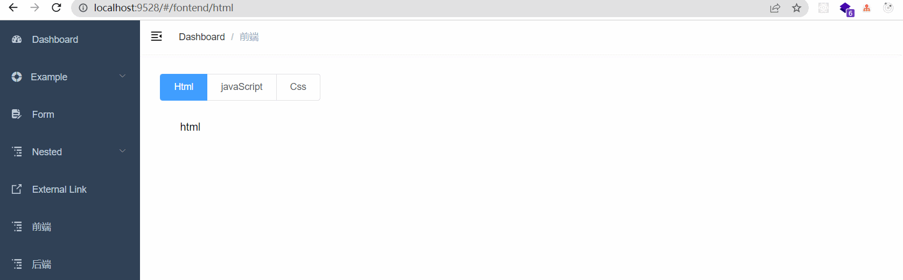

## vuejs中路由的嵌套

## 快速导航

<TOC />

## 前言

在做`Vue`的项目当中,路由的嵌套是一个非常常见的操作，在我们网页界面当中的一些切换,跳转,或多或少都会用到

只要参与开发一些后台管理系统,那必然会用到嵌套路由,涉及到路由的传参等

先来看一个例子,需求,点击左侧边栏,显示一级导航,二级导航切换


## 路由的设置规则

一个路由(`route`)就是一组映射关系(`key-value`),多个路由需要路由器(`router`)进行管理

前端路由:`key`是路径,`value`是组件

```js
import Vue from "vue";
import VueRouter from 'vue-router';

Vue.use(VueRouter);

// 实例化router对象,定义一些规则和配置
const router = new VueRouter({
    routers: [
        // 一级路由
        {
            path: '/',
            component: Layout,
            redirect: '/dashboard',
            children: [
                {
                 path: 'dashboard',
                 name: 'Dashboard',
                 component: () => import('@/views/dashboard/index'),
                 meta: { title: 'Dashboard', icon: 'dashboard' }
            }]
        },

        {
    path: '/fontend',     // 一级路由
    name: 'FontEnd',
    component: Layout,
    meta: {
          title: '前端',
          icon: 'nested',
    },
    redirect: '/fontend/html',
    children: [        // 子路由/二级路由
       {             
         path: '',
         name: 'font',
         redirect: '/fontend/html',
         hidden: true,
         component: () => import('@/views/fontend/index'),
        //  meta: {
        //   title: '前端',
        //   icon: 'nested',
        //  },
         children: [   // 二级路由下的子路由
            {
             path: 'html',
             name: 'Html',
             hidden: true,
             component: () => import('@/views/fontend/html.vue'),
            //  meta: {
            //   title: 'html',
            //   icon: 'nested',
           
            //  },
            
           },
           {
               path: 'javascript',
               name: 'javaScript',
               hidden: true,
               component: () => import('@/views/fontend/javaScript.vue'),
               meta: {
                title: 'javaScript',
                icon: 'nested',
               },
           },

           {
             path: 'css',
             name: 'Css',
             hidden: true,
             component: () => import('@/views/fontend/css.vue'),
             meta: {
              title: 'css',
              icon: 'nested',
             }
           },
         ]
       },
    ]
     
})

export default router;

```
对应的视图组件
```html
<template>
  <div class="container">
       <el-radio-group v-model="activeTab" @change="handleTab">
          <el-radio-button v-for="item in lists" 
                           :key="item.path" 
                           :label="item.name" >{{item.name}}
                           
          </el-radio-button>
       </el-radio-group>
       <keep-alive>
          <router-view />
       </keep-alive>
  </div>
</template>

<script>

export default {
  name: 'FontEnd',
  data () {
    return {
      activeTab: '',
      lists: [
        {
           // path: '/fontend/html',
           name: 'Html'
        },
         {
           // path: '/fontend/javaScript',
           name: 'javaScript'
        },
        {
           // path: '/fontend/css',
           name: 'Css'
        },
      ]
    };
  },

  mounted() {
    console.log(this.$route);
  },

  methods: {
    handleTab(val) {
       console.log(val);
       this.$router.push({
          name: val
       })
    }
  },
  watch: {
    // 监听路由 当前菜单
    $route: {
      handler(val) {
        this.activeTab = val.name;
      },
      immediate: true,
    },
  },
}
</script>

<style lang="scss" scoped>
.container {
  padding: 30px;
}
</style>

```

## 多级路由的嵌套

在`routes`值的数组对象中,每一个对象,就是一组路由,而每一组路由又可以设置子路由,理论上可以无限的嵌套下去

子路由的设置是使用`children`属性,它的值是一个数组,数组里面包含的对象就是对应的子路由,如下示例所示

```js
const router = new VueRouter({
    routers: [
        {
          path: '/fontend',     // 一级路由
          name: 'FontEnd',
          children: [        // 子路由/二级路由
             {             
              path: '',
              name: 'font',
              redirect: '/fontend/html',
              component: () => import('@/views/fontend/index'),
              children: [   // 二级路由下的子路由
                {
                  path: 'html',   // 二级路由路径不需要写根路径/
                  name: 'Html',
                  component: () => import('@/views/fontend/html.vue'),
                },
                {
                    path: 'javascript',
                    name: 'javaScript',
                    component: () => import('@/views/fontend/javaScript.vue'),
                },
                {
                  path: 'css',
                  name: 'Css',
                  component: () => import('@/views/fontend/css.vue'),
                },
             ]
        },
    ]
     
})
```
当二级路由及多级路由时,使用`children`配置项,并且路径里,不需要写根路径`/`

而在模板中的`router-link`跳转时,则需要写完整的路径
```js
<router-link to="/font/html">html</router-link>
```
## 路由几个重要注意点

1. 路由组件通常存放在`pages`或`view`文件夹下,而一般组件通常存放在`components`文件夹下
2. 通过切换,隐藏了的路由组件,默认是销毁掉的,等在需要的时候再去挂载
3. 每个组件都有自己的`$route`属性,里面存储自己的路由信息,通过`this.$route.query`或`this.$route.params`可以获取路由的参数
4. 整个应用只有一个`router`路由器,可以通过组件的`$router`属性获取到,可以通过`this.$router.push`或`this.$router.replace`实现编程式导航,等价于`router-link`


## 如何解决vue-element-admin导航切换的闪烁问题

在使用`elementUI`的`radio`切换的时候,会出现闪烁抖动,因为视图组件`router-view`使用了动画,在`AppMain.vue`文件中,去掉动画`name`属性即可
```js
   // 使用name定义动画
  // <transition name="fade-transform" mode="out-in">
  //     <router-view :key="key" />
  //   </transition> 
    // 去掉name之后
    <transition  mode="out-in">
      <router-view :key="key" />
    </transition>
```
## 如何解决左侧边栏菜单高亮问题

这个就是一个css样式问题,审查元素直接找到这个高亮的元素,添加相对应的背景色就可以了的
在`vue-element-admin`中是`layout/component/Sidebar/index.vue`中添加如下样式
```css
 .el-menu-item.is-active {
  background: #263445  !important;
}
```
## 使用动态组件实现Tab内容的展示

如果不使用路由的方式去实现,那么可以使用动态组件的方式去实现,点击切换哪个`Tab`显示对应哪个组件就可以了的

当然也有其他种方式实现,类似原生`js`选项卡切换的,这里就不介绍了的,主要介绍下怎么利用动态组件方法去实现

动态组件是使用`component`组件,通过绑定`is`属性,值为对应的组件`:is="components"`如下代码所示
```html
<template>
  <div class="container">
       <el-radio-group v-model="activeTab">
          <el-radio-button v-for="item in lists" 
                           :key="item.path" 
                           :label="item.name" >{{item.name}}
                           
          </el-radio-button>
       </el-radio-group>
       <!-- 使用动态组件渲染到此处 -->
       <keep-alive>
           <component :is="activeTab"></component>
       </keep-alive>
  </div>
</template>

<script>
import Html from "./html.vue"
import javaScript from "./javaScript.vue";
import Css from "./css.vue"
export default {
  name: 'FontEnd',
  components: {
    Html,
    javaScript,
    Css
  },
  data () {
    return {
      activeTab: 'Html',  // 此处默认显示Html
      lists: [
        {
           // path: '/fontend/html',
           name: 'Html'
        },
        {
           // path: '/fontend/javaScript',
           name: 'javaScript'
        },
        {
           // path: '/fontend/css',
           name: 'Css'
        },
      ]
    };
  },

 
}
</script>

<style lang="scss" scoped>
.container {
  padding: 30px;
}
</style>

```
效果如下所示


## 总结

路由在`vue`里面是一个非常重要的知识,它就是一组映射关系,多个路由需要路由器进行管理,需要遵循一定的规则,子路由设置,使用`children`属性

在设置子路由名字时,`path`路径名字不需要写路径,而在模板中,使用`router-link`时,`to="path"`,这个`path`路径却要写全,连同父级路由

整个应用只有一个`router`路由器,可以通过`$router`属性获取到

<footer-FooterLink :isShareLink="true" :isDaShang="true" />
<footer-FeedBack />

