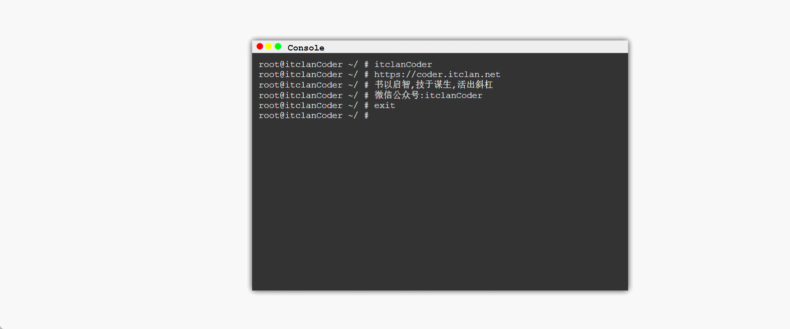

## Js 如何实现一个类似 chatGPT 打字机效果

## 快速导航

<TOC />

## 前言

在使用`chatGPT`的时候,会有一个打字机的效果,以下是分别使用原生`Js`和`Vue`实现

## 示例效果

 <div align="center">
     
  </div>

## 原生 JS 实现

如下是示例代码

```html
<!DOCTYPE html>
<html>

<head>
    <meta charset="utf-8">
    <title>Printer 打字机效果</title>
    <style>
        * {
            margin: 0;
            border: 0;
            padding: 0;
            font-family: "Courier New", Courier, monospace;
        }
        
        #window {
            width: 600px;
            height: 400px;
            background-color: black;
            margin: 100px auto;
            box-shadow: 0 0 10px rgba(0, 0, 0, 0.8);
        }
        
        #title-bar {
            width: 595px;
            height: 20px;
            line-height: 20px;
            padding-left: 5px;
            font-size: 14px;
            background-color: #eee;
            font-family: Consolas, serif;
        }
        
        #title-bar span:before {
            content: "\25cf";
        }
        
        #title-bar span {
            font-size: 24px;
        }
        
        #close {
            color: red;
        }
        
        #min {
            color: yellow;
        }
        
        #max {
            color: #00FF00;
        }
        
        tilte-title {
            font-family: 'Arial Black', SimHei;
            font-weight: bold;
        }
        
        #show-board {
            width: 580px;
            height: 360px;
            background-color: #333;
            color: #eee;
            padding: 10px;
            font-family: "Courier New", Courier, monospace, Consolas, serif;
        }
    </style>
</head>

<body>

    <div id="window">
        <div id="title-bar"><span id="close"></span><span id="min"></span><span id="max"></span><strong id="tilte-title">&nbsp;Console</strong></div>
        <div id="show-board"></div>
    </div>

    <script>
      (function(root, factory){
	if(typeof define === 'function' && define.amd){
		define([], factory);
	}else{
		root.Printer = factory(root);
	}
}(this, function(root){
	var Printer = {};
	Printer.printer = {"version": "0.0.1"};
	var init_options = {
		"speed" : 50,		//文字的速度
		"selector" : 'canvas',		//要打印到的标签的ID			
		"startIndex" : 0,		//从第几个字符开始打印
		"endIndex" : 0,		//打印到第几个字符结束
		"hasCur" : true,		//是否有光标
		"curId" : 'cur',		//光标的ID
		"curStr" : '_',		//光标字符
		"curStyle" : 'font-weight: bold;',	//光标的样式（CSS样式）
		"curSpeed" : 100,		//光标的速度（ms）
		"lnStr": ""
	};


	var str = "", options = init_options;
	var flwCurTimer, dom, curObj, reStr='', curSwitch,index=0;

	Printer.init = function(arg_str, arg_options){
		str = arg_str;
		for( var option in arg_options ){
			options[option] = arg_options[option];
		}
		dom = document.getElementById(options.selector);
		index = options.startIndex;
		options.endIndex = options.endIndex == 0 ? str.length : options.endIndex
		options.hasCur && flwCur();
		return this;
	}


	Printer.print = function(){	//打印函数
		for(var i=0; i<str.length; i++) {
			(function(index){
				setTimeout(function(){	
					if (str.charAt(index) === '\n'){
						reStr += '<br>' + options.lnStr;
					} else {
						reStr += str.charAt(index);
					}
					dom.innerHTML= options.lnStr + reStr
				}, options.speed * (index + 1))
			})(i);
		}

		setTimeout(function(){
			if(options.hasCur){
				var element = document.createElement("span");
				element.id = options.curId
				dom.appendChild(element);

				curObj = document.getElementById(options.curId);
				clearTimeout(flwCurTimer);
				setInterval(chCur, options.curSpeed);
			}
		}, options.speed * str.length)
	}

	function flwCur(){	//跟随光标
		dom.innerHTML += '<span id="'+options.curId+'" style="'+options.curStyle+'">'+options.curStr+'</span>';
		flwCurTimer = setTimeout(flwCur, 1.5 * options.speed);
	}

	function chCur(){	//闪烁光标
		curObj.innerHTML = curSwitch ? options.curStr : "";
		curSwitch = !curSwitch
	}

	return Printer;
}));
    </script>
    <script>
        var str = 'itclanCoder\n';
        str += 'https://coder.itclan.net\n';
        str += '书以启智,技于谋生,活出斜杠\n';
        str += '微信公众号:itclanCoder\n';
        str += 'exit\n';
        Printer.init(str, {
            selector: 'show-board',
            lnStr: 'root@itclanCoder ~/ # '
        }).print();
    </script>
</body>

</html>
```


## Vue版本实现

<template>
  <div class="daziji-box">
    <div class="content"></div>
    <div class="textarea">
     <textarea v-model="message" placeholder="请输入文字后回车看看效果" @keydown.enter="handleEnter"></textarea>
    </div>
  </div>
</template>

<script>
export default {
  data () {
    return {
      msg:'你好，我是模仿ChatGPT的打字机效果',
      message:'',
    }
  },
  mounted() {
    this.autoWriting(0)
  },
  methods:{
    handleEnter() {
      event.preventDefault();//阻止enter键回车换行
      this.msg=this.message
      const dom = document.querySelector('.content')
      dom.innerHTML = ''
      this.autoWriting(0)
      this.message=''
    },
    autoWriting(index){
        const dom = document.querySelector('.content')
        const data = this.msg.split('')
        if (index < data.length) {
            dom.innerHTML += data[index]
            setTimeout(this.autoWriting, 200, ++index)
        }
    }
  }
}
</script>

<style>
   
.daziji-box .content {
    margin: 20px 0;
}    
.daziji-box .content::after{
    content: '_';
    animation: blink 1s infinite
}
@keyframes blink{
    from{
        opacity: 0;
    }
    to{
        opacity: 1;
    }
}

</style>

## 具体示例代码

```html
<template>
  <div class="daziji-box">
    <div class="content"></div>
    <div class="textarea">
     <textarea v-model="message" placeholder="请输入文字后回车看看效果" @keydown.enter="handleEnter"></textarea>
    </div>
  </div>
</template>

<script>
export default {
  data () {
    return {
      msg:'你好，我是模仿ChatGPT的打字机效果',
      message:'',
    }
  },
  mounted() {
    this.autoWriting(0)
  },
  methods:{
    handleEnter() {
      event.preventDefault();//阻止enter键回车换行
      this.msg=this.message
      const dom = document.querySelector('.content')
      dom.innerHTML = ''
      this.writing(0)
      this.message=''
    },
    autoWriting(index){
        const dom = document.querySelector('.content')
        const data = this.msg.split('')
        if (index < data.length) {
            dom.innerHTML += data[index]
            setTimeout(this.autoWriting, 200, ++index)
        }
    }
  }
}
</script>

<style>
   
.daziji-box .content {
    margin: 20px 0;
}    
.daziji-box .content::after{
    content: '_';
    animation: blink 1s infinite
}
@keyframes blink{
    from{
        opacity: 0;
    }
    to{
        opacity: 1;
    }
}

</style>

```

## 分析

实现这个打字机的效果,核心逻辑,主要是在`autoWriting`这个方法的实现,页面初始化加载自动打印

通过`setTimeout`设置200毫秒的时间间隔， 每隔200毫秒向dom中插入对应的数据,先将输入的字符串进行打散(`split`),然后一个一个插入到DOM节点


至于那个光标闪烁,是通过一个伪类`after`将光标定在这个`class`的最后面， 并使用动画的关键帧,实现显示隐藏的循环动画，模拟光标的闪烁

<footer-FooterLink :isShareLink="false" :isDaShang="true" />
<footer-FeedBack />