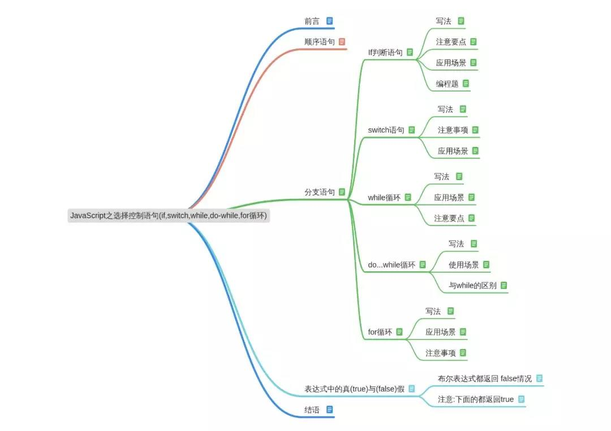
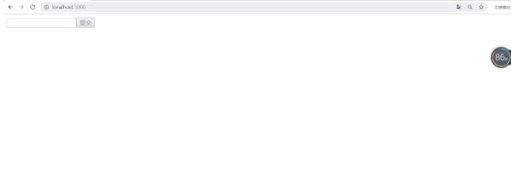

## Js 之选择控制语句及很重要的表达式真与假

## 快速导航

<TOC />

<div align="center">
   
</div>

## 前言

您将在本文当中学习到

- 顺序语句
- 分支语句
- If 判断,switch,while 循坏,do..while 循环,for 循环,表达式中的真(true)与假(false)

在程序代码中,我们经常都会使用流程控制语句,它是用来控制程序中各语句执行顺序的语句,利用语句的组合便能完成一定功能的小逻辑模块

流程控制方式采用结构化程序设计中规定的三种基本流程结构

即：**顺序结构、分支结构和循环结构**，如下图所示：

<div align="center">
   
</div>

## 顺序语句

按照正常的语句顺序从上往下执行

## 分支语句

根据某些条件选择执行

- if 语句(针对条件单一的情况使用)
- if-else 语句（针对两种情况的时候使用）
- if-else-if 语句(多重 if 嵌套）
- while 语句(往往一进入,就需要判断,需要条件为真时执行一组语句)
- switch 语句(多个 case 子句匹配)

## If 判断语句

条件语句是一种代码结构,用来测试表达式的真假,并根据布尔表达式的结果执行不同的代码,也就是判断结构让程序可以选择执行哪些程序语句

**写法**

```
if(条件表达式) {
   语句体;
}
```

::: tip 注意要点

- 条件表达式的结果必须是 boolean 类型
- 语句体中可以有一条语句,也可以有多条语句,如果语句体中只有一条语句,那么{}可以省略不写
- 可以使用三目运算符替代

:::

**应用场景**

针对条件单一的情况使用单 if 语句 建议判断区间或范围的时候用

**编程题**

求最大值:编写一个方法，找出两个数字 a 和 b 中最大的那一个

- **方式 1：if...else**
  ::: details 点击即可查看

```
示例：
输入：a = 1, b = 2
输出：2
```

```
var maximum = function(a,b) {
   if(a -b > 0) {
     return a;
   } else {
     return b;
   }
   // 或者如下所示:三目运算符
   return a-b>0?a:b;
}
maximum(1,2)
```

:::
**方式 2:使用 Math 提供的数据函数 max**

::: details 点击即可查看

```
var maximum = function(a, b) {
    return Math.max(a,b)
}
maximum(1,2)
```

:::

在实际的程序代码中:if 的使用可以说无处不在

<div align="center">
   
</div>

例如:上面例子中的:当表单输入框内不为空时,右侧的按钮激活,否则就禁用

```
// reducer代码中的代码
if(newState.inputVal !="") {
    newState.btnDisable = false;
  }
// UI组件中
 <button onClick =  { hanldeAddContent } disabled = {  btnDisable }>提交</button>
```

相比于`if..else`语句,`switch`语句可能会没那么熟练,`switch`语句只支持常量值相等的分支判断，而 `if`语句支持更为灵活，任意布尔表达式均可 但通常比一系列嵌套 `if`语句效率更高；逻辑也更加清晰

## switch 语句

将表达式的值与 `case 子句`匹配，并执行与该情况相关联的语句

**应用场景:常用于等值判断**

**写法**
::: details 点击即可查看

```
switch (express表达式) {
  case value1:
    // 当 express 的结果与 value1 匹配时，执行此处语句
   语句体1;
    break;
  case value2:
    // 当 express 的结果与 value2 匹配时，执行此处语句
    语句体2;
    break;
  ...
  case valueN:
    // 当 express 的结果与 valueN 匹配时，执行此处语句
    语句体3;
   break;
   default:
    // 如果 express 与上面的 value 值都不匹配，执行此处语句
    语句体4;
    break;
}
```

:::
::: warning 注意事项

- 在 JS 中 switch 语句与其他变成语言的一个主要区别是:switch 语句中的判断表达式可以是任意类型,而其他语言,类如 java 等一些语言就要求该表达式必须为整型
- 表达式可以是变量也可以是常量，也可以是一个复杂表达式,用全等===符号,express 是一个用来与 case 子语句匹配的表达式
- case 子句必须是常量表达式,case 子句可以有多个,但是每一个 case 子句的取值不能够重复
- default 子句类似于 if 语句中的 else 语句,可以省略,但是不建议,一般用来处理一种其他的情况,可以出现在 switch 语句中的任意位置，但是一般建议写在最后面
- break 子句表示退出 switch 语句体,break 语句也可以省略,一旦省略会出现 break 穿透现象,一般不会省略 break 子句

:::

**实例**： 打 10086 时,电话呼叫案例，业务查询请按 1，手机充值请按 2，业务办理请按 3，密码服务与停复机请按 4，集团业务请按 8，人工服务请按 0

例如如下所示:`Redux` 中 `Redux` 中`if`改写成 `switch`语句

if 语句是这样的
::: details 点击即可查看

```
import * as constants  from "./actionTypes";
function reducer(state = defaultStatus, action) {
    if(action.type === constants.HANDLE_INPUT_CHANGE) {
        const newState =  JSON.parse(JSON.stringify(state));
        if(newState.inputVal !="") {
            newState.btnDisable = false;
        }
        newState.inputVal = action.value;
        return newState;

    }

    if(action.type === constants.HANDLE_ADD_CONTENT) {
        const newState =  JSON.parse(JSON.stringify(state));
        newState.list.push(state.inputVal);
        newState.inputVal = "";
        newState.btnDisable = true;
        return newState;

    }

    if(action.type === constants.HANDLE_DELETE_ITEM) {
        const newState =  JSON.parse(JSON.stringify(state));
        newState.list.splice(action.index, 1);
        return newState;

    }
    return state;

}

```

:::
经过 `switch`的改写后,如下所示

```
import * as constants  from "./actionTypes";

function reducer(state = defaultStatus, action) {
    const newState =  JSON.parse(JSON.stringify(state));
    switch(action.type) {
        case constants.HANDLE_INPUT_CHANGE:
                if(newState.inputVal !="") {
                    newState.btnDisable = false;
                }
                newState.inputVal = action.value;
                return newState;
        case constants.HANDLE_ADD_CONTENT:
                newState.list.push(state.inputVal);
                newState.inputVal = "";
                newState.btnDisable = true;
                return newState;
        case  constants.HANDLE_DELETE_ITEM:
                newState.list.splice(action.index, 1);
                return newState;
        default:
             return state;
    }

}

```

通过与`if`语句的比较：可以看的出,`switch`语句有几下特点

- `switch` 语句常用于判断固定值的时候用
- 凡是能用 `switch` 能做的,用 `if`都能做,单反过来则不行
- 在实际开发中,如果需要进行代码的优化,当遇到多个条件是等值条件的判断选择时,不妨用 `switch` 语句替代

**小结**：选择控制语句的使用

- `if` 语句: 针对一种情况的时候
- `if-else` 语句: 针对两种情况的时候,非黑即白
- 多重 if 语句: 针对多种情况的时候,常用于区间判断
- 嵌套 if 语句: 针对多种条件的时候（若是等值判断可用 switch 替代）
- `swtich` 语句: 针对条件是等值,某个固定值的情况 上面说完了选择结构,下面来说说循环结构

## while 循环

可以在某个条件表达式为真的前提下，循环执行指定的一段代码，直到表达式不为真时结束循环

**应用场景**:如果你希望在一开始条件为真时执行一组语句,当你不知道循环执行的次数，只知道达到某个条件的时候循环继续,那么就选择 while 循环

**写法**

```
while (条件表达式)
  statement
```

**条件表达式:**

在每次循环前被求值。如果求值为真，`statement` 就会被执行。如果求值为假，则跳出 `while` 循环执行后面的语句

**statement**

只要条件表达式求值为真,该语句就会一直被执行。要在循环中执行多条语句，可以使用块语句（{ ... }）包住多条语句

::: tip 注意
使用 break 语句在条件表达式计算结果为真之前停止循环
:::

如下代码所示:求 1-100 之和

```
var number = 1;      // 循环的初始条件,定义在外面
var sum = 0;
function getSum(n){
    while(number<n) {   // 循环满足什么条件时执行
          sum += number;
          ++number;      // 循环变量的更新
     }
    return sum;
}
getSum(100);
```

使用 while 循环的时候,需要注意以下几点:

- 循环的初始条件是定义在外面的
- 只有 `while` 中条件表达式为真时,才执行里面的语句体
- `while` 循环中应该有循环变量的更新,否则它会造成死循环

## do...while 循环

创建一个执行指定语句的循环，直到条件表达式值为`false`。在执行 `statement` 后检测条件表达式，所以指定的`statement`至少执行一次

**写法**

```
do {
   语句体;
}while(条件表达式循环条件)
```

**使用场景:** 往往需要一开始就要执行一次,就像很多游戏一样,一上来,就让你先玩一盘,闯过了多少关,才进行下一环节

**与 while 的区别是**

- whle 循环是先判断后执行,而 do..while 是先执行,后判断
- 当第一次条件不成立时，while 不会执行,而 do-while 无论是否成立都至少会执行一次
- 循环中每次都会计算的表达式。如果条件表达式循环条件值为真， 语句体会再次执行。当条件表达式循环条件值为假，则跳到 do...while 之后的语句

例如将`while`语句改成`do..while`写法

```
var number = 1;
var sum = 0;
function getSum(n) {
    do {
          sum += number;
          ++number;
    } while (number < n);

    return sum;
}

console.log(getSum(3));
```

## for 循环

用于创建一个循环，它包含了三个可选的表达式，这三个表达式被包围在圆括号之中，使用分号分隔，后跟一个用于在循环中执行的语句

**应用场景**:用于固定循环次数的场景

**写法**

```
for(初始化变量;循环条件;循环自增变量){
  循环体;
}
```

::: tip 注意事项

- for 语句头部圆括号中的所有三个表达式都是可选的
- 初始化值可以定义在圆括号里头,也可以定义在外头,但是个人强烈建议定义在里头,不要写让人猜的代码,更不要写奇奇怪怪的代码,让人看不懂,不是在炫技,而是在挖坑,本质上就是垃圾代码
  :::

```
var sum = 0;
function getSum(n) {
    for (var number = 0; number < n; number++) {
        sum += number;
     }
     return sum;
}
console.log(getSum(100))
```

`for`循环往往是在我们已知循环次数的情况下使用它,常用于遍历数组

**小结**

- `for` 循环拥有三个表达式的语法结构,得给定初始条件,条件判断、自增变量,它是在已经知道循环次数的情况下使用它
- `while`循环是先判断后执行,表达式中只有一个 `boolean`类型的值用于作为循环结束的判断,若表达式为真,则执行语句体,若为假,则跳出 `while`循环,它常用于:不知道循环执行的次数，只知道达到某个条件的时候循环继续时使用
- `do- while`循环是`while`循环的变形，在语法上与 `while` 有相似度，它是先执行后判断,判断循环是否继续执行的`boolean`表达式放在了循环体的后面，它也是在不知道循环执行的具体次数，只知道达到某个条件时循环继续或结束,但，至少执行一次

当然针对`for`循环常常用于遍历,可以用`forEach`,`map`等一些迭代器方法替代的

## 表达式中的真(true)与(false)假

在上面的`if` 语句,`while`语句,`do..while`,以及 for 循环,都离不开条件表达式,而条件表达式的结果,毫无疑问,影响着语句体的执行,下面这些实际开发中的技巧有必要提一嘴

下⾯的布尔表达式都返回 `false:`
::: details 点击即可查看

```
null
undefined
0 // 数字0
“” // 空字符串
NaN 怎么检测:可以利用系统内置对象Boolean()，它会返回一个布尔值,注意这个Boolean的作用是用来初始化 Boolean 对象的值的
```

:::
::: tip 注意下面的都返回 true

```
"0"; // 字符串0
[]; // 空数组
{}; // 空对象
非0数字
Infinity
```

:::

**注意**:任何不是`null`和`undefined`包括值为 `false` 的 `Boolean`对象，直接用于条件语句时都会被当做 `true`来对待,有`new`时,会执行语句体的代码,而无 new 则不会执行语句体的代码

```
var x = new Boolean(false);
if (x) {
  // 这里的代码会被执行
}
```

基本类型的布尔值不受此规则影响,如下代码

```
var x = false;
if (x) {
  // 这里的代码不会执行
}
```

::: warning 注意
不要用创建 Boolean 对象的方式将一个非布尔值转化成布尔值，直接将`Boolean` 当做转换函数来使用即可，或者使用双重!!运算符
:::

```
var x = Boolean(expression);     // 推荐
var x = !!(expression);          // 推荐
var x = new Boolean(expression); // 不太好
```

有`new`与`无new`的结果是不一样的,前面无 `new`的 `Boolean` 会返回一个 `boolean`结果 值得注意的是:

对于任何对象，即使是值为 `false` 的 `Boolean`对象，当将其传给 `Boolean`函数时，生成的 `Boolean`对象的值都为 `true`,如下所示

```
var myFalse = new Boolean(false);   // false
var g = new Boolean(myFalse);       // true
var myString = new String("Hello");
var s = new Boolean(myString);      // true
if (myFalse) {
    console.log("itclanCoder");    // 这条语句会执行
}
```

官方的建议是:不要在应该使用基本类型布尔值的地方使用 Boolean 对象,滥用 Boolean 对象,如果需要将其他类型转化为布尔值的时候,可以使用,例如将字符串转为 boolean 类型等

以下是列出的值得注意:

```
Boolean('0') == true;  // true
'0' != true                  // true
 0 != null ;                // true
 0 == [] ;                 // true,比较的是值,如果是全等===,那么将是false
 0 == false              // true
 Boolean(null) == false;   // true
 null != true;    // true
 null != false   // true
 Boolean(undefined) == false;   // true
 undefined != true;         // true
 undefined != false;       // true
 Boolean([]) == true     // true
 Boolean({}) == true  // true
```

有时候,当你需要排除不是 0 和空字符和 false,或许你会写这样的代码

```
if (x != "" && x != null) {
   // 语句体
}
```

上面的代码不是不可以,但很冗余,可以优化为如下所示

```
if (x) {
  // 语句体
}
```

当你使用 while 循环时,当你希望 变量 x 不是 0 和空字符串, 和 false,你或许看到这样的代码

```
while(x != null){
  // 语句体
}
```

同样,可以优化为如下所示

```
while(x) {
  // 语句体
}
```

上面的代码优化同时考虑到了 null,空字符,或者 false 的情况,如果说要非真的话,那么就取反嘛

## 结语

小节主要学习到 js 中的选择控制语句,if 语句,switch 语句,while 语句以及 do..while 语句,for 循环的对比,每个语句都有与之对应的应用场景以及解决的问题

当然最后学习到了表达式中的真(true)与假(false),在我们平时做一些逻辑判断的时候,对于一些边界值的判断往往是非常重要的

<footer-FooterLink :isShareLink="true" :isDaShang="true" />
