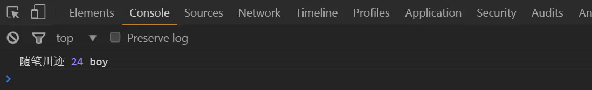

# 深度理解闭包

## 快速导航

<TOC />

## 前言

在前面一文中我们已经初探了闭包产生的本质原因是作用域链引起的,并且也已知晓作用域是基于函数的,而上下文是基于对象的,并且在 Es6 之前是没有块级作用域的,只有全局作用域和函数作用域以及 eval 作用域

我们往往是通过匿名函数的自执行来模拟块级作用域,我们说明了作用域链的使用

当查找一个变量或者函数时,是由函数内向外逐级的进行查找,若有,则返回,若无,则返回 undefinied

作用域链是连接函数内与函数外的一桥梁,实现在函数外访问函数内或者其他函数作用域内的局部变量,但并未对闭包做过多的说明,那么今天我们继续对闭包进行学习,一探究竟,拨开云雾,让闭包不在怕怕

## 闭包是什么?

下面直接分析一段简易的代码:

```
* 在函数外部无法访问函数内部的变量,而函数内可以访问函数外的变量,在函数的内部,嵌套一个子函数,这个子函数可以访问父函数作用域内的变量,然后父函数把这个子函数return出去,让在函数外部可以通过子函数访问自己的局部变量
*
* @Global variable {name = "随笔川迹"}
* @function parentFun
* @local variable {age = 24}
* @function subFun
* @local variable {sex = boy}
* @return subFun parentFun返回值为subFun函数
* @parentFun() 函数调用
*
*/
var name = "随笔川迹";          //函数外定义,全局变量
function parentFun(){
    var age = 24;           //函数内定义,局部变量
    function subFun(){
        var sex = "boy";    // 同上
        console.log(name,age,sex);   // 访问变量
    }
    //console.log(sex);报错 sex is not defined,定义在subFun函数内的局部变量sex,在该父函数外是无法访问的
    return subFun;     //将subFun的函数值返回
}
//console.log(age);报错age is not defined,同上分析同理可得
var person = parentFun();
person();                     // 函数调用执行

```

控制台打印输出如下:实现了在函数外访问函数内的局部变量

上面的代码简单的翻译成白话文如下:

- 全局作用域范围内定义了一个`name=“随笔川迹”`的全局变量
- 定义了一个普通的函数`parentFun`函数
- 在`parentFun`函数作用域内定义了一个局部变量`age =24`
- 在`parentFun`函数作用域内定义了一个`subFun`子函数
- 在`subFun`子函数内定义了一个`sex=“boy”`局部变量,然后打印输出
- 在`parentFun`函数作用域内尝试访问子函数`subFun`内的`sex`变量失败
- 在`parentFun`函数作用域内返回子函数`subFun`(其实就是在父函数中返回子函数 subFun 的引用,每个一个函数都必须要有 return 返回值,默认返回值是 undefined,当然除了构造器函数以外,是可以不使用 return 语句,因为它在 new 出来构造器函数就自调用了的,会默认的返回它构造器函数的返回值,通常不使用 return 关键字,因为当构造函数的函数体执行完以后,便显式的返回了,具体以后在详谈)
- 在全局作用域下访问`parentFun`函数作用域内的局部变量`age`，失败
- 执行调用函数`parentFun()`,把`parentFun`的返回结果赋值给变量`person`
- 执行`person()`

如上过程，可见思考小结如下

- 在函数外无法访问函数内的变量或函数,反之则可以(尤其是在使用函数嵌套函数,内部函数执行调用的时候格外注意的)
  上面示例中`age`变量是父函数`parentFun`的私有变量,一般我们通过普通的途径是无法从函数外部访问的,而当我们通过返回`parentFun`函数的内部子函数`subFun`的模式,间接的将 age 暴露给函数外部,相当于是对外提供了可访问的接口,类似这种形式的子函数`subFun`就是一个典型的闭包,可以通过子函数访问父函数的局部变量(私有变量)
- 子函数可以访问父函数的局部变量，父函数把子函数`return`出去,让在函数外部可以通过子函数访问自己的局部变量
- 当一个函数(上面指的是`parentFun`)的返回值是另外一个函数(子函数`subFun`),而返回的那个函数如果调用了其父函数内部的其他变量(上面的父函数`parentFun`的`age`变量，以及全局作用域的`name`),如果返回的这个函数在外部被执行,就产生了闭包
- 闭包其实就是将函数内部与函数外部连接起来的桥梁,可以让函数外部的代码访问函数内的局部变量,闭包可以理解为定义在函数内部的函数,
  ::: tip 注意
  闭包在子作用域中保存了一份在父级作用域取得的变量,这些变量不会随父级函数执行完后销毁而销毁,因为他们常驻内存了
  :::

  ## 闭包的作用

  - **作用 1**: 如上在函数外部读取函数内的局部变量
  - **作用 2**：保存变量于内存中,避免全局变量的污染

```
/* 执行闭包作用后,私有变量被保存在内存当中
* @function result
* @init count = 0
* @return count addFun函数返回count值
* @return addFun 在result作用域内返回addFun的值,引用函数的值
* @result() 函数调用
*
*/
function result(){
    var count = 0;
    function addFun() {
        count++;
        return count;
    }
        return addFun;
}
var countResult = result();
console.log(countResult()); // 1
console.log(countResult()); // 2
console.log(countResult()); // 3
```

上面的代码中,`count`是函数`result`的一个私有局部变量,它的值在函数`addFun`中不断的变化,并且每当执行一次该函数时,都会保存上一次结果的值,在原有的基础上执行后加加操作,所以函数`result`中的`count`是一直被保存在内存中,函数执行完后，并没有被释放,从新开始计数

**适用场景**:有时候需要一个模块中定义这样的变量,执行某些操作后,始终保存上一次的值,希望这个变量一直保存在内存中,但又不会污染全局变量,这个时候,我们就可以使用闭包,这就为什么在不同的函数模块内定义变量名相同的标识符,但互相之间却又不相干扰的原因,本质上就是闭包词法作用域在起作用

- **作用 3**:对外提供公有的属性和方法

```
/**
* 对外提供共有的属性和方法
*
* @function parentFun
* @local variable {weChatNum = "itclan",author="随笔川迹"}
* @Object obj
* @property  {number,name}
* @method allInfo
* @return {wechatNum,author}
* @return obj.allInfo() 函数parentFun引用obj对象
*
*
*/
// 函数声明
function parentFun(){
    var weChatNum = "itclan",  // 局部变量
        author = "随笔川迹",    // 局部变量
        obj = {                // 注意这是对象字面量的表达方式,其实相当于是new Object()的简写,在obj下添加属性和方法
            number:weChatNum,
            name:author,
            allInfo:function(){               // 属性值为函数的称为方法
                return {weChatNum,author};
            }
    }
    return obj.allInfo(); // 返回obj对象下面的allInfo方法,引用obj对象
}
var fun = parentFun;        // 函数对象的引用,后面不加括号
console.log(fun.weChatNum,fun.author,fun.obj); //undefined undefined undefined
console.log(fun());// Object {weChatNum: "itclan", author: "随笔川迹"}
```

其实从上面的示例当中,我就可以发现总结出:执行变量对象`fun`函数表达式的时候,相当于就是在调用执行`parentFun`函数,其实是返回了对象`obj`对象下面的方法 allInfo 的执行结果,也就是该方法的返回值

从函数外对比访问函数内的私有属性或者方法可知,在函数外无法访问函数内的变量和方法,转而绕道通过在该嵌套函数作用域内返回该内部的对象的返回值,其实也就是引用该内部对象,并在函数外部调用该嵌套函数,不仅实现函数外访问内部函数的变量和方法,也可以直接的使用运行结果中`obj`中的属性和方法

这里注意我们要理解的是所谓内部函数与外部函数要相对谁而言的,函数所属的嵌套关系(父子级关系),这正好是利用闭包给对象设置私有属性并或者方法利用特权方式访问私有属性,管理了私有变量和私有方法，将对变量状态的变化封装在安全的环境中

## 闭包的应用场景(常见)

循环中找到对应的元素的索引
js 代码

```
/
* 原本是想点击哪个按钮,正确的显示对应哪个按钮元素的索引值,但是却无论点哪个都是索引最后一个
* 错误的原因是:因为for循环执行的速度很快,执行结束后,变量i的值已经变成了最后一项，所以当点击事件执行时,读取的信息总是最后一项
*/
window.onload = function(){
     var aBtns = document.getElementsByTagName("input");
     for(var i = 0;i<aBtns.length;i++){
        aBtns[i].onclick = function(){
        console.log(new Date,i); // 3 3 3
     }
  }
}
HTML内容结构代码
<input type="button" value="按钮1" name="">
<input type="button" value="按钮2" name="">
<input type="button" value="按钮3" name="">
```

点击按钮操作 gif 图演示


**解决办法方式 1**:使用匿名函数自执行

```
/
* 匿名函数自执行的方式解决,模拟了块级作用域
* 利用闭包把父级变量保存到自己的作用域的特点,每次循环添加点击事件时,把当前的循环中变量的值传给function,这样函数每次保存了正确的变量
*
*/
window.onload = function(){
        var aBtns = document.getElementsByTagName("input");
        for(var i = 0;i<aBtns.length;i++){
            (function(i){
                aBtns[i].onclick = function(){
                    console.log(new Date(),i);  // 0 1 2
                }
            })(i);
        }
}
```

**解决办法方式 2**:使用 let 命令

```
window.onload = function(){
    var aBtns = document.getElementsByTagName("input");
      for(var i = 0;i<aBtns.length;i++){
         let j = i; // 上面for语句中直接使用let语句也是可以的
         aBtns[j].onclick = function(){
         console.log(new Date(),j); // 0 1 2
      }
    }
}
```

改正后如下 gif 所示


- 模块化代码,减少全局变量的污染,匿名函数自执行进行累加(最上面的示例中其实已经用到了)
- 采用函数对象引用方式的`setTimeout`调用，一个函数作为定时器调用的第一个参数

```
/**
* 采用函数对象引用方式的setTimeout调用
* setTimeout(执行的函数,时间毫秒)；延迟多少秒后执行前面的函数,那么它需要传递一个函数对象的引用来作为参数，通过调用另一个函数来返回一个内部函数的调用,将那个内部函数对象的引用传递给setTimeout函数,内部函数执行时需要的参数,外部函数调用时传递给它
setTimeout()在执行内部函数时,无需传递参数,因为内部函数是可以访问为爱不函数调用时提供的参数的
*
*/
var oBtn = document.getElementById("btn"); // 获取元素
    oBtn.onclick = function(){ // 添加事件
     setTimeout(expResult,2000); // 传递内部函数的引用作为第一个参数
    }
    function funText(name,sex,weChart){
       return (function(){
          console.log("点击按钮延迟2秒后打印输出",name,sex,weChart);// 点击按钮延迟2秒后打印输出 随笔川迹,boy,itclan
    })
}
var expResult = funText("随笔川迹","boy","itclan");
```

如下 gif 图所示:


- 将函数关联到对象的实例方法(也就是等待时机成熟使用,比如实现函数柯礼化,反科里化)
  **应用场景**:需要分配一个函数对象的引用,以便在某个时间执行该函数,这不就是函数封装的强大之处嘛,随调随用，封装不就是将相同的代码给提取出来,封装成一个函数,将不同的事件对象给找出来,通过传递参数的方式进行控制嘛,还有想想构造器函数的使用,实例化对象调用原型下面的公共属性和方法,都是闭包的应用啊,所以说面向对象编程本身就离不开闭包的使用,至于构造器函数这里就不贴代码了的,以后在详聊仔细体会的

## 闭包的使用注意事项

- 由于闭包会使得函数中的变量会被保存在内存中,因常驻在内存中,如果变量对象不使用会比较占用内存,在 IE8 以下浏览器会造成内存泄露
- **解决办法**: 就是在退出函数之前,将不使用的局部变量全部删除清空就可以了(后面的代码所示)
- 如果你把父函数当做对象使用,把闭包当做它的公有方法,把内部变量当做它的私有属性,这时候,要注意不要随便的改变父函数的内部变量的值

## 闭包会造成内存泄露?

不会,因为`IE8`以下浏览器对`javascript`对象和 DOM 对象使用不同的垃圾回收机制,因此闭包会在低版本浏览器下会存在一些特殊的问题,闭包的作用域链是保存着`element`元素,也就是意味该元素永驻在内存中无法被释放销毁

html 内容结构代码

```
<input type="button" id="btn" value="按钮" name="">
```

js 代码

```
function　fun(){
    var oBtn = document.getElementById("btn");
    oBtn.onclick  = function(){
        console.log("按钮的id值为",oBtn.id); // btn
    }
}
fun();
```

如上的代码中给按钮`btn`元素添加点击事件,并且创建了一个匿名函数的闭包

在闭包匿名函数内创建了一个循环引用,匿名函数会保存父函数的私有变量对象,是没法减少元素的引用数,只要匿名函数存在,dom 元素对象的引用至少是 1,它占用的内存会永久在内存中，不会被回收

**解决办法**:通常将`oBtn.id`保存在一个函数外局部的变量对象中，解除对 DOM 对象的引用,同时将 DOM 元素对象置为 null

```
function　fun(){
    var oBtn = document.getElementById("btn");
    var id = oBtn.id;   // 将引用对象保存在一个局部变量对象中
    oBtn.onclick  = function(){
        console.log("按钮的id值为",id); //btn
    }
    oBtn = null;  // 使用完之后，将DOM对象置为空,减少DOM操作数
 }
 fun();
```

**小结**:闭包并不会引起内存泄露,只是由于`IE8`等以下浏览器对`javascript`对象和`DOM`对象垃圾回收机制不同,从而导致内存无法回收,这是 IE 浏览器厂商的问题,并不是`js`的问题

网上很多 js 开发者给闭包扣上内存泄露这个帽子,其实我觉得还是挺冤的,恰巧难道不是利用闭包词法作用域来解决这种引用计数等问题么,所以说闭包是是一个概念,与内存泄露还是没有关系的(有争议,不过多的撕逼口水大战的,100 个人读哈姆雷特,有一百中理解的)

## 造成内存泄露的原因

所谓内存泄露指的是浏览器因为某些原因没有回收无用对象而占用内存,使页面响应迟钝,崩溃,延迟数据的显示等问题

1.浏览器本身自带的问题(IE,firefox 下),垃圾回收的机制不同,当出现循环引用计数时，就会出现问题,js 中是标记清除作为垃圾回收,也就是给变量加上标记,而 IE 是引用计数策略,也就是跟踪记录每个值被引用的次数,两者不一致,当 js 访问的 DOM 对象依然是基于引用计数策略,只要是 js 对象循环引用,在 IE 下就会出现内存泄露的问题 2.某些 DOM 操作(比如上面的 js 对象与 DOM 对象循环引用)

**解决办法**:手动的设置,将 js 对象设置为空,或者按照如上示例,先用一个变量将 js 对象给存储起来,然后该变量对象在闭包函数内进行使用,最后将 js 对象设置为 null,保证正常的内存回收

## 总结

整篇文章先从回顾什么是闭包开始,到闭包有什么作用，使用场景,以及闭包的使用注意点

在谈到了闭包会不会造成内存泄露的问题,以及怎么解决这种内存泄露的问题,当然关于影响内存泄露的有很多,浏览器自身问题,显示类型转换等其他问题

我觉得更多造成内存泄露的问题是我们自己代码健壮性的问题,以后单独拿出来聊聊的,以及我们也可以使用 chrome 浏览器中的 Timeline 和 prifies 工具进行查看内存泄露等进行性能分析,一扯呢,就会扯很多进来,其实呢,总归结底来说

闭包只是一个概念,有时候越解释得多,反而让自己迷糊,无法自拔,越陷越深,它的应用也很多,是无处不在

什么函数的封装,定时器,事件监听函数,Ajax 异步请求,跨窗口通信,回调函数,模块化,面向对象程序的编写,各种设计模式(单例模式,工厂模式,观察者模式)

以及那些什么 AMD 规范(requirejs)和 CMD(seajs)等等模块化思想都是离不开闭包,就像但凡有函数声明的地方就会自动的产生一个 this 一样,当然 this 指向并不是指向该函数本身

是由它的上下文和执行坏境调用者决定,不仅与它的调用方式有关,还与有无严格模式有关

理解闭包对于理解 this 也是很重要的,当然闭包更多的是在面试的时候,这些抽象的概念是令你屡试不爽的,因为它是基础嘛,对于使用 js 异步操作是相当重要的,也是自我进阶 js 的必经之路

## 提点概要

- 闭包是什么,子函数能够访问父函数的局部变量
- 闭包的作用:一是读取函数外部的局部变量,二是,保存变量于内存当中,可避免全局变量的污染,三是:对外提供公有的属性和方法
- 闭包的常见应用场景,循环中找到对应元素的索引,模块化代码,以及采用函数对象引用方式的 setTimeout 定时器的应用
- 闭包的使用注意事项
- 闭包会造成内存泄露？不会,有争议的话题,不必互相喷,自己理解了就可以
- 造成内存泄露的原因:IE8 低版本浏览器下 js 引擎与 DOM 对象垃圾回收机制不同,js 对象循环计数导致内存泄露可用闭包词法作用域解决,见上,js 对象与 DOM 对象互相引用迹某些 DOM 操作导致内存泄露,常见解决方式为可手动设置解决,见上
