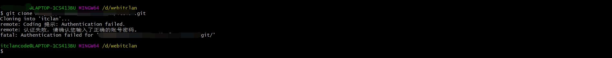

## git-使用速查

## 快速导航

<TOC />

## 如何免密向 github/gitLab 提交代码

当在本地工作区编写代码完后,最后往往需要`push`到远端的仓库当中去,如果没有进行任何的设置,每次都要输入用户名和密码,然后才能推送,这样很麻烦,下面介绍下几种方式免密向`github`推送

### **方法 1**:手动创建`.git-credentials`文件

- 在你的用户目录下新建一个文本文件:`.git-credentials`
  ::: tip 注意
  在`windows`用户中无法手动建这种`.`的后缀名文件,可以在命令行终端使用`touch`命令,也可以使用`vscode`或者`sublime`这样的编辑器进行创建
  :::

```
windows: C:/Users/username  // windows用户
Mac OS X: /Users/username   // Mac OS用户
Linux: /home/username       // linux
```

- `.git-credentials`在文件中输入以下内容

```
https: {username}:{password}@github.com
```

`username`和`password`是你的 github 账号和密码

- 修改 git 配置 执行命令

```
git config --global credentials.helper store
```

上述命令会在`.gitconfig`文件与`.git-credentials`在同目录下)末尾添加如下配置

经过上述三步配置之后, 你 `push`代码到`github`时, 便无需再输入用户名密码了

### **方法 2**:命令行方式创建

在命令行输入命令:

```
git config --global credentials.helper store
```

这一步会在用户目录下的`.gitconfig`文件最后添加

```
helper = store
```

向远端`push` 代码

push 你的代码 (git push), 这时会让你输入用户名和密码, 这一步输入的用户名密码会被记住, 下次再`push`代码时就不用输入用户名密码!这一步会在用户目录下生成文件`.git-credential`记录用户名密码的信息

方案 1 与方案 2 都是创建`.git-credentials`文件并写入用户信息，一个是手动创建，一个命令创建

**缺点**:密码,用户名暴露

### **方法 3**: 配置`ssh`,设置秘钥(推荐)

在你从`github`或`gitlab`中克隆远端代码下来的时候,默认是`https`,而另外一种方式是`ssh`的

- **https**:使用`https url`对初学者来说会比较方便，复制`https url`然后到`git Bash`里面直接用 clone 命令克隆到本地就好了，但是每次`fetch`和`push`代码都需要输入账号和密码,此方法很麻烦
- **ssh**: 使用`SSH url`,需要在只用之前先配置和添加好`SSH key`。每次`fetch`和`push`代码都不需要输入账号和密码，如果你想要每次都输入账号密码才能进行`fetch`和`push`也可以另外进行设置

<div align="center">

</div>
当然在本地也是可以通过git remote -v,查看克隆代码的方式的

- 若是`https`方式使用上面的命令,会显示如下

```
origin  https://github.com/github用户名/仓库名称.git (fetch)
origin  https://github.com/github用户名/blogcode.git (push)
```

- 若是`ssh`方式,则会显示如下

```
origin git@github.com:github用户名/仓库名称.git (fetch)
origin git@github.com:github用户名/仓库名称.git (push)
```

- 检查电脑上是否有`ssh key`

打开`git bash`,在终端输入`~/.ssh`或用`~/.ssh ls`,这行命令的作用,主要是查看你电脑上有没有`.ssh`文件夹

- 如果电脑有,就会显示

```
bash: /c/Users/itclancode/.ssh: Is a director
```

- 如果电脑没有,就会显示

```
  bash: /c/Users/itclancode/.ssh: No such file or directory
```

  <div align="center">
  
  </div>

- 创建`SSH Key`

进入你磁盘根目录,`C:\Users\你磁盘的目录\.ssh`内,在`git bash`中输入

```
ssh-keygen -t rsa -C "你github的邮箱"
```

 <div align="center">
  
  </div>
执行完设置邮箱后,就会显示下面这两行

```
Generating public/private rsa key pair.
Enter file in which to save the key (/c/Users/16627/.ssh/id_rsa):
```

这是让你输入一个文件名,用于保存刚才生成的 `SSH key`代码。如果不设置任何名称,会默认生成`id_rsa`和`id_rsa.pub`两个秘钥文件。这个并非是固定的,可以有多个

这时候已经创建好`.ssh`这个文件夹了，会提示

```
Created directory /c/Users/xxxx/.ssh
```

紧接着又会提示你

```
Enter passphrase (empty for no passphrase):
```

就是让你输入密码，如果你设置了密码，那在你使用`ssh`传输文件的时候，你就要输入这个密码。为了避免麻烦，建议不用设置，直接回车,免密码推送,不要给自己找麻烦

```
Enter same passphrase again
```

这是让你再输入一次密码，就跟我们注册账号时候设置密码需要设置两次一样。上一步没设置密码，这里直接回车就可以了。到这里你的秘钥就设置好了，你会收到这段代码提示

```
Your identification has been saved in /c/Users/…/.ssh/id_rsa
Your public key has been saved in /c/Users/…/.ssh/id_rsa.pub
```

还会向你展示你的秘钥长啥样

 <div align="center">
  
  </div>

当你看到上面这段代码，那就说明你的 `SSH key` 已经创建成功

- 添加`SSH Key`到`GitHub`,其他`gitlab`,`coding`或`码云`平台都是一致的

首先打开[登录 Github 官网](https://github.com),进入设置页面,添加`ssh key`

<div align="center">
  
  
  </div>
点击右上角新建一个`SSH Key`
<div align="center">
  
  </div>
打开生成`id_rsa.pub`文件，全选其中的内容粘贴到网页的Key中,就可以了的
<div align="center">
  
  </div>
当你完成这一步后,往后就可以愉快的提交代码,不用输入密码和账号了
这相当于是在你电脑创建了一个私钥与`github`上的进行匹配

- 测试一下该`SSH key`是否匹配成功

在`git Bash`中输入以下代码,注意是`git@github.com`，不是你的邮箱

```
$ ssh -T git@github.com
```

接下来就会提示你输入密码，如果上边设置 ssh 的时候，你没设置密码会提示你

```
Warning: Permanently added ‘github.com,192.30.255.112’ (RSA) to the list of known hosts
```

警告完了，如果你能看到如下提示，那你已经成功设置 SSH 密钥

```
Hi “用户名”! You’ve successfully authenticated, but GitHub does not provide shell acces
```

如果你看到`access denied`，者表示拒绝访问，那么你就需要使用 `https`去访问

[配置 ssh 相关参考文档](https://help.github.com/en/github/authenticating-to-github/connecting-to-github-with-ssh)

## 常见问题

### 使用-git-clone-克隆远端代码失败

```
git clone xxx
cloning into 'xxx'..
remote: Coding提示:Authentication failed
remote: 认证失败: 请确认您输入了正确的账号密码
fatal: Authentication failed for 'https://xxx.git'
```

如下错误所示

**原因**:这种情况很大原因是你的电脑以前用不同的 git 账号 clone 过代码,每次计算机会做记录 git 账号,在`clone`代码时候导致 git 时候计算机识别不出 git 账号是否匹配,输入正确的账户名和密码即可

**解决办法**:

- 方法-1:window 用户
- 打开电脑的控制面板(window+R-->control 可快速进入)--->进入用户账户-->管理 windows 凭据--->将您克隆的代码地址删掉,重新克隆,或者修改为正确的邮箱地址和用户密码登录即可(若输入用户名仍然报错,则输入注册的邮箱)
  
  
  

* 方法-2:clone 的代码连接前加上 git 账号和密码
  git clone http://账户名:密码@192.168.0.00/xxxx/xxxx.git

<footer-FooterLink :isShareLink="true" :isDaShang="true" />
<footer-FeedBack />
<footer-AvoidCopy />