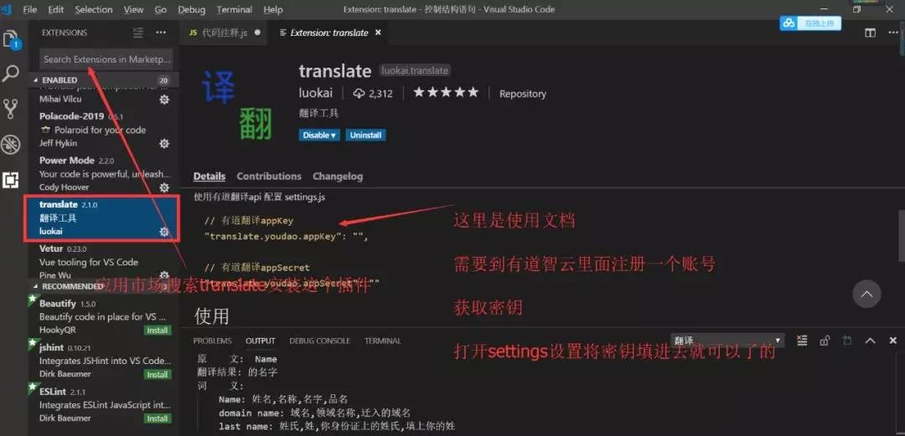

## vscode 使用速查

## 快速导航

<TOC />

## 如何汉化 vscode 软件

第一次下载使用 vscode 软件,是纯英文版本的,针对有的小伙伴面对满屏的英文有些抗拒

有时,当你过去给其他同学调试代码时,难免英文版本的编辑器有些不适应(英文好的除外)

- 插件市场里搜索`Chinese (Simplified) Language Pack for Visual Studio Code`,安装即可
- `Ctrl+Shift+P`组合键打开命令面板，之后输入 `"config"`,`configure Display language`-->选择`zh-cn` 筛选可用命令列表，最后选择配置语言命令,重启`vscode`即可

## 如何自动格式化代码

手动的去格式化代码,对于代码的格式对齐,很是费时间

- 插件市场搜索`Prettier - Code formatter`下载安装
- 使用

```
1. CMD + Shift + P -> Format Document
OR 或者
1. Select the text you want to Prettify: 选中你想要的文本直接格式化
2. CMD + Shift + P -> Format Selection
```

- 设置保存时,自动格式化代码
- 设置`tab`缩进 2 个空格,不同的编辑器缩进可能会存在不一样

<div align="center">
   <div>
   
   </div>
   <div>
     
   </div>
</div>

## 如何在 Vscode 里面实现中英互译

无论是在阅读代码还是在对变量的命名,一旦涉及到英文,你可能习惯性的去有道翻译,或者百度翻译

甚至电脑安装个翻译工具,打开翻译一下,在或者借助浏览器翻译插件

这些方法的确可以解决,但是**更快更直接的方式是在代码编辑器中就可以完成,要知道,在多个进程之间切来切去是很消耗时间和精力的**

- **Translate 翻译插件**

vscode 中安装 Translate(使用这个需要到有道智云里面获取密钥进行配置一下)

<div align="center">
   <div>
   
   </div>
</div>

- 进入`translate`的配置设置,你会发现你需要填入密钥,这个密钥去[有道智云获取秘钥](http://ai.youdao.com),这个网站注册获取密钥

<div align="center">
   <div>
   
   </div>
</div>

- 打开有道智云官方网站,注册一个账号,进入管理后台获取密钥

<div align="center">
   <div>
   
   </div>
   <div>
   
   </div>
</div>

在`vscode`中选中中文或者英文，**直接 ctrl+6**,在控制台下看是否有翻译结果,有则安装完成,正确,无论中英文都能能互译

<div align="center">
   <div>
   
   </div>
</div>

不要觉得上面的配置很麻烦,麻烦一次,简直是一劳永逸,在也不用下载什么翻译软件工具或者打开百度翻译,有道翻译了的,直接在代码编辑器里就可以互译

- **Yao-Translate**

`vscode`之所以受人欢迎,很大程度上就是因为它丰富的第三方开源的插件,安装简单方便,文档使用齐全,想不爱它都不行,可以多试试一些辅助插件
`Yao-Translate`这个翻译插件也很有用

<div align="center">
   <div>
   
   </div>
</div>

- 选中文本,按`ctrl+shift+T`是翻译,选中文本按`ctrl+shift+R`是互译并替换,有时候你在替换翻译一些字段时候,这个很有用

  <div align="center">
     <div>
     
     </div>
  </div>

## 如何查看历史

## 如何一边 coding 一边让萌妹子为你加油

- ### Rainbow Fart 插件

* [Rainbow Fart 程序员鼓励师插件](https://saekiraku.github.io/vscode-rainbow-fart/#/zh/)
* **介绍**:是一个在你编程时持续夸你写的牛逼的扩展，可以根据代码关键字播放贴近代码意义的真人语音

- ### 先目睹为快
  <p>
   <video src="https://saekiraku.oss-cn-beijing.aliyuncs.com/github/vscode-rainbow-fart/showoff-1.mp4" controls="controls" width="100%"></video>
  </p>
- ### 安装与使用
  - 在 vscode 插件市场里,搜索`Rainbow Fart`下载并安装
  - 在 `VSCode` 的菜单栏中找到 查看 - 命令面板，或使用快捷键`Ctrl + Shift + P`（`MacOS Command + Shift + P`）呼出 命令面板
  - 在 命令面板 中输入 > `Enable Rainbow Fart` 并回车
  - 此时应该会弹出一个消息通知，点击通知上的 `Open`按钮
  - 默认打开的端口是`7777`,在打开的页面上点击 `授权`,会听到一声钢琴声,这时表示已经可以成功了
  - 享受编程吧！请尝试在 `VSCode` 中输入 `function`关键字

<div align="center">
  
  </div>
  
 * ### 您或许会遇到的问题(插件使用成功者,可忽略以下内容)
      * 插件无法启动
      * 目前该插件无法在较低版本的 `VSCode `上运行，建议升级 VSCode（本人使用的是 1.46.1）)
      * **方法1:** 前往[vscode官方文档下载](https://code.visualstudio.com/docs#vscode)下载安装最新的Vscode
      * **方法2**:直接本地在线升级vscode工具
          * **菜单栏-->帮助(H)-->检查更新-->更新完毕后-重启vscode即可**
    * `vscode`默认打开的浏览器:是`IE`,不是`chrome`
    * **修改默认浏览器**
        * **方法1**: 电脑管家,或者其他一些第三方工具,修改电脑的默认打开的浏览器,指定`chrome`
        * **方法2**: 手动更改: `window+i`(组合建打开window设置)-->`应用`(卸载,默认应用,可选功能)-->`默认应用`-->`web浏览器`(选择chrome或高级浏览器)

  <div align="center">
  
   
  </div>

目前该插件支持`Es6`,`JavaScript`中的一些常见的关键字,在`Vscode`中输入如下关键字,即可体验
::: details 点击即可查看

```
function
=>
for
while
await
catch
except
err != nil
import
include
v-html
fuck
shit.$time_morning
$time_before_noon
$time_noon
$time_evening
$time_midnight
$time_each_hour
```

:::
目前在其他客户端支持

- [vscode-rainbow-fart](https://github.com/SaekiRaku/vscode-rainbow-fart)
- [Emacs Rainbow Fart](https://github.com/stardiviner/emacs-rainbow-fart)
- [IntelliJ Rainbow Fart ](https://github.com/izhangzhihao/intellij-rainbow-fart)
- [Vim (coc)](https://github.com/iamcco/coc-rainbow-fart)

该插件先在 `github`上的 `vscode` 插件市场中,一下子火了的,前端就是喜欢折腾:no_mouth:

建议戴上耳机,在夜深人静的时候使用,不然在大庭广众下,真的很会影响其他人的,有了这个插件,这下可好,程序员鼓励师可以下岗了:scream:

曾今,我也想过,放下键盘,仗“脸”职来职往,豪横于格子间,如今,此器一出,梦已碎!!!

自己革自己的命:triumph:

## 相关链接

- [Vscode 软件下载](https://code.visualstudio.com/)

* [有道智云](http://ai.youdao.com/)

## 常见问题

<footer-FooterLink :isShareLink="true" :isDaShang="true" />
<footer-FeedBack />
<footer-AvoidCopy />
