# 用 vuepress 搭建博客

## 快速导航

- [前言](#前言)
- [几大建站技术比较](#几大建站技术比较)
  - [Jekyll](#Jekyll)
  - [Hexo](#Hexo)
  - [GitBook](#GitBook)
  - [Docsify-Docute](#Docsify-Docute)
  - [Nuxt](#Nuxt)
  - [比较](#比较)
- [为什么推荐选择-VuePress](#为什么推荐选择-VuePress)
- [前提准备](#前提准备)
- [项目搭建](#项目搭建)
  - [全局安装-vuepress](#全局安装-vuepress)

* [初始化项目](#初始化项目)
* [页面具体内容配置](#页面具体内容配置)
  - [基本配置](#基本配置)
* [设置封面启动页 ](#设置封面启动页)
* [配置导航栏](#配置导航栏)
* [配置侧边栏-slider](#配置侧边栏-slider)
  - [自动获取侧边栏内容](#自动获取侧边栏内容)
  - [展示每个页面的侧边栏](#展示每个页面的侧边栏)
  - [拆分-config](#拆分-config)
* [配置插件](#配置插件)
  - [可配置的插件选项](#可配置的插件选项)
* [支持-PWA](#支持-PWA)
  - [安装-pwa](#安装-pwa)
* [配置评论插件](#配置评论插件)
  - [插件 Valine](#插件Valine)
  - [安装-vuepress-plugin-comment](#安装-vuepress-plugin-comment)
  - [快速使用](#快速使用)
  - [删除管理评论](#删除管理评论)
  - [valine 样式的修改适配](#valine-样式的修改-适配)
* [主题样式修改](#主题样式修改)
* [另外一种方式修改样式](#另外一种方式修改样式)
* [移动端下禁止用户屏幕缩放](#移动端下禁止用户屏幕缩放)
* [自动生成侧边栏](#自动生成侧边栏)
* [部署到-github](#部署到-github)
  - [前提条件](#前提条件)
  - [创建两个仓库](#创建两个仓库)
  - [配置自动化部署脚本](#配置自动化部署脚本)
  - [启动-deploy.sh-脚本](#启动-deploy.sh-脚本)
* [配置自定义域名](#配置自定义域名)
  - [前提条件](#前提条件)
  - [登录域名管理后台](#登录域名管理后台)
  - [检验域名有没有解析成功](#检验域名有没有解析成功)
  - [在仓库底下新建一个-CNAME-文件](#在仓库底下新建一个-CNAME-文件)
* [添加百度统计](#添加百度统计)
* [添加谷歌分析](#添加谷歌分析)
* [添加逼格徽章](#添加逼格徽章)
* [常见问题](#常见问题)
  - [页面显示-404](#页面显示-404)
  - [侧边栏显示的是文件路径，而非文件名](#侧边栏显示的是文件路径，而非文件名)
  - [自动化-bash-deploy.sh-脚本不成功](#自动化-bash-deploy.sh-脚本不成功)
  * [markdown 中引入图片不显示](#markdown-中引入图片不显示)
  * [安装某插件后不生效](#安装某插件后不生效)
  * [热更新问题](#热更新问题)
  * [deploy 脚本部署失败](#deploy-脚本部署失败)
  * [npm-安装某些包失败](#npm-安装某些包失败)
  * [配置自定义域名不生效](#配置自定义域名不生效)
* [相关链接参考文档](#相关链接参考文档)
* [结语](#结语)

## 前言

如果说阅读是知识的输入,那么写作就是知识的输出,输出是一个内化知识理解的过程,有些知识,一问,知道,一动手,不会,看似简单,一看就会,一做就废,凡是不被自己吸收,为自己所用的,都只能称作为做信息,而不能视作为知识.

记录就像是复盘,迭代自己,不断试错,反馈. 无论是前端还是后端,甚至是其他,多动手,多实践才是真理

## 几大建站技术比较

每一个技术的涌现,受人追捧,必然有着它令人着迷之处,相比于`jekyll`,`Hexo`,`GitBook`,`Nuxt`,`Docsify/Docute`,以及现在的`vuepress`,而不久前尤大又多了个兄弟`vitePress`,它们都是一种静态网站生成器,各有特点,没有好坏,都有自己适宜的应用场景

技术永远都是在不断更新迭代,越来越进步

简单做一下对比

### Jekyll

- 特点:Github 自带的,您不用部署静态页面,您只要往 GitHub 上推 md 文件就能产生 blog
- 问题:
  - 当 md 文件多了之后,排序是一个很头疼的问题,纯体力手工劳动,无法实现自动化,速度很是极具考验
  - 后端基于 Ruby 语言
  - 我早期的博客就是用 `jekyll` 搭建的,但是后来因为管理确实麻烦,就没打理了的
- [Jekyll 官方文档](http://jekyllcn.com/)

### Hexo

- 特点:比`Jekyll`要先进一点,先生成文件,在部署

* 基于 `Node.js`的静态网站生成器
* 主题很丰富,在`vuepress`之前很多博客,文档网站都是基于`Hexo`搭建的,是用`jekyll`还是`Hexo`搭建的,基本上做 IT 的小伙伴,也能辨别出来
* 问题:
  - 每次都需要把生成的静态页面推上去,md 若出现错误,编译会出错,配置的不是特别灵活

- [Hexo 官方文档](https://hexo.io/)

### GitBook

- 问题
  - 默认主题有限制,随着文档的增加,每次加载的时间会很长,也不是 Vue 驱动的
  - 官方团队专注于打造一个商业产品,而并非开源工具
- [GitBook 官方文档](https://www.gitbook.com/)

### Docsify-Docute

- 两者都是基于`Vue`,在运行时驱动
- `Docsify`由于只用于解析`Markdown`文件并生成网站,不会生成静态 html 文件,所以它是不利于搜索引擎,百度,谷歌等是难以被收录的,即使做了网站统计,也很爬取到你的内容,但是简单,你只需专注 md 编写就可以
- `Docute`,是`Docsify`的升级,没有构建过程,将 `md`文件呈现为单页面应用程序,会生成静态 `HTML`,对 SEO 很友好,利于百度蜘蛛的抓取
- [Docsify 官方文档](https://docsify.js.org/#/),
- [Docute 官方文档](https://docute.org/#what-is-docute)

### Nuxt

- 更偏向于构建应用程序,SSR 服务端渲染框架,适合构建复杂的系统应用程序,对于开发人员要求是有门槛的,如果自己只专注于内容创作,而耗费精力去搭建一个静态博客,个人觉得,有种大材小用
- [NuxtJS 官方文档](https://zh.nuxtjs.org/)

### 比较

- 阅读体验上:`gitBook` > `Docsify/Docute` = `vuepress` = `HEXO` > `Jekyll`
- 配置上:`Jekyll == Docsify`< `Docute` < `Hexo` < `vuepress`,其中`Jekyll` 和 `Docsify`配置是最简单的,如果只用于专注内容创作,挺合适的,但是功能很弱,拓展性差
- 性能/seo 上:`VuePress`是最好的,虽然 `docsify`,`docute`都是基于 vue,但是他们是在运行时解析,而 `vuepress`是预先解析 `HTML`,体验上会更好,而用`Docsify`搭建的网站,是很难被浏览器,搜索引擎录取的,百度,谷歌抓取不到,无人问津状况
- 灵活上: `Vuepress`更加灵活,可实现定制化,网站风格并非千篇一律,熟悉`Vue`组件化开发的,上手也不难
- 代码上: 文件结构非常清晰,可维护性,可拓展性好

## 为什么推荐选择-VuePress

- VuePress
  - `Vue` 驱动,强大的插件生态系统,官方文档详细
  - 支持搜索引擎优化(SEO),单页面应用,按需加载,支持 PWA(无网络情况下照样能访问)
  - 为技术文档而优化内置 markdown 拓展
  - 在 md(Markdown) 中可以写 vue 组件,甚至写原生 `JS`,`Ts`,`HTML`,`CSS`,无任何压力阻碍,更加的灵活,可定制化
  - 可以自定义开发主题,任意修改,网站风格不在千篇一律
  - 支持 `PWA`(自动生成 Service Worker),像 app 应用一样添加到手机桌面上
  - 集成了 `Google Analytics` 集成,也支持百度统计
  - 基于 git 的最后上传更新时间
  - 支持国际化,多语言,只需配置一下就好
  - 响应式布局,手机端,PC 端网站友好的用户体验
  - 远不止于用来搭建博客,可以开发公司企业官网等网站应用,也可结合`boostrap`,`Element UI`等技术进行二次开发,构建更复杂的应用
  - ....
  - [vuepress 官方文档](https://www.vuepress.cn/)

::: warning 注意

1. 目前 `VuePress`版本并没有支持 `typescript`，并且没有提供类型定义,但如果想要用`TS`,可以安装`vuepress-plugin-typescript`插件,它提供了在 `VuePress`中使用 `typescript` 的部分能力。如果你想获取到正确的类型定义，你可以配合 `vuepress-types` 一起使用
2. `vuepress-types`作为`VuePress`的类型定义包，还处于实验阶段
3. 具体使用,可参考文档[vuepress-plugin-typescript 使用文档](https://vuepress.github.io/zh/plugins/typescript/),可以去尝试一下,这个不仅仅可以写`Ts`,在`md`也可以写`TypeScript`
   :::

在自己用 `VuePress`搭建网站的过程中,从零开始,一行行代码的配置,编写,以及考虑代码模块化的拆分,维护性,可实现按需定制化,到最终部署上线,自定义域名等,在这个过程中,踩了很多坑

当然,也借鉴了不少网上的博客,但很多不是把配置写死,就是代码拓展性极其受限,而且每个人遇到的问题都是不一样的,而官方文档 `VuePress`的 `API`琳郎满目,对于新手小白,的确眼花缭乱,不知从何看起,配着配着就晕了的

而很多博客,大佬,基本上都是基于一个模板,有很多坑并没有提及

官方文档只适合查阅,也并不适合从头看到尾,不用每个 API 都熟记于心,你只需要知道怎么去查,在哪个地方找就可以了的

`VuePress` 的配置的确复杂,但并非令人望而却步,本篇文章有些长,建议一步步的按阶段完成,有些配置你不必知道原因,你只需要知道按照官方文档那么配置,能出来,达到你想要的效果就可以了,至于内部原理,富有闲于时,可自行探索,不必深究

也不要一上来,就去折腾自定义主题,看到酷炫花销的博客,就立马想搞一个出来

一个能吸引到你的网站,让你停留片刻,收藏,点赞,转发,三连击的,起决定性作用,并非是你的 UI,而是你网站所提供的内容服务,如果一味的追求 UI 效果,却忽略建站的初衷,就有些本末倒置了

先把官方默认的主题,玩熟悉了,在去玩自定义主题,以及进行二次开发,都是可以的

口说无凭,话说多了,都是故事,下面一步步带你从零开始,到域名部署等,搭建属于自己的网站,开始自己的记录之旅...

## 前提准备

- 安装`NodeJs`
  - 下载`NodeJs`,并安装到本地,下一步,下一步,即可安装
  - 检测 NodeJs 是否安装成功,可在命令行终端输入`node -v`,同时查看一下 npm 的版本`npm -v`(在安装 Node 完后,npm 是自动就安装上了的,集成在了 Node 运行坏境里)
  ```
  C:\Users\itclancoder>node -v
  v12.18.0
  C:\Users\itclancoder>npm -v
  6.14.4
  ```
  ::: warning 警告
  请确保你的 Node.js 版本 >= 8
  :::
  - NodeJs 下载地址:([NodeJS-长期支持版下载](https://nodejs.org/zh-cn/))
- 安装`git bash`:用于向 github 提交代码,虽然`cmd`或者`power Shell`都可以,但还是建议使用`git bash`
- git bash 下载地址:[git bash](https://gitforwindows.org/)
- 熟悉下`markdwon`语法,不熟悉也没有关系,后续都是用它来写文档,五分钟立马就可以上手,可前往[在线练习 markdonw 语法](https://markdown-it.github.io/)
- vscode 插件商店里安装`markdown`,`markdown Preview`插件,也可下载安装[Typora](https://www.typora.io/)`软件到本地编写`md`

## 项目搭建

### 全局安装-vuepress

- 命令行(cmd/git bash)终端下全局安装`vuepress`

```

yarn global add vuepress # 或者:npm install -g vuepress 或者cnpm install -g vuepress
```

::: warning 警告

1. 若是使用 yarn 安装,需要先全局安装 `yarn(npm install -g yarn`),[yarn 使用官方文档](https://yarn.bootcss.com/)
2. 若是使用 npm 全局安装,请确保你的 `Node.js 版本 >= 8`
3. 如果你的现有项目依赖了 webpack 3.x，推荐使用 `Yarn`而不是`npm` 来安装 `VuePress。`因为在这种情形下，npm 会生成错误的依赖树
   :::

## 初始化项目

在你的电脑某个磁盘下创建一个项目目录:`mkdir itclan`,这个是文件夹名字是任意的

```
mkdir itclan
cd itclan
```

进入 itclan 文件夹后,在`cmd`或`git bash`终端下,使用`npm init -y`,或`yarn init -y`初始化,会自动生成一个`package.json`文件

```
yarn init -y 或 npm init -y
```

经过`yarn init -y`后,会生成一个`package.json`文件,内容如下所示

```
{
  "name": "itclan",
  "version": "1.0.0",
  "main": "index.js",
  "license": "MIT",
}
```

紧接着，在 `package.json`里加一些脚本,配置启动命令

```
"scripts": {
    "docs:dev": "vuepress dev docs",
    "docs:build": "vuepress build docs"
  }
```

::: warning 警告
当 package.json 配置成这种格式时,在当前文件下,启动时使用`npm run docs:dev`,启动项目,而打包构建时,使用`npm run docs:build`
:::
这个也可以简化成:

```
"scripts": {
    "dev": "vuepress dev docs",
    "build": "vuepress build docs"
  }
```

::: warning 警告
当`package.json`配置成这种格式时,在当前文件下,启动时可以使用`npm run dev`,启动项目,而打包构建时,使用`npm run build`
如果是使用 yarn 方式启动和构建项目:可以使用`yarn dev`启动项目,而使用`yarn build`构建项目
:::

- 启动项目: `npm run docs:dev`这条命令相当于`vuepress dev docs`

- 打包项目: `npm run build`这条命令相当于 `vuepress build docs`

  在接着,创建`docs`目录, 这个`docs文件夹`主要用于放置我们写的`.md`类型的文章以及`.vuepress`相关的配置,这个文件夹的名字你可以任意,与你启动项目和构建项目时的配置保持一致就可以了的

```
mkdir docs
```

进入`docs`文件夹中使用`mkdir`命令创建`.vuepress`文件夹,注意这个文件夹的名字时固定的,不要随便改变

```
cd docs
mkdir .vuepress
```

这个`.vuepress`主要就是我们用于存放全局的配置、组件、静态资源等与`VuePress`相关的文件配置都将会放在这里

具体更详细配置说明可见官网:[基本配置](https://v1.vuepress.vuejs.org/zh/config/#%E5%9F%BA%E6%9C%AC%E9%85%8D%E7%BD%AE)
具体更详细的目录树结构说明:[目录结构](https://www.vuepress.cn/guide/directory-structure.html#%E9%BB%98%E8%AE%A4%E7%9A%84%E9%A1%B5%E9%9D%A2%E8%B7%AF%E7%94%B1)
至此,项目大体已经搭建完成了,接下来,主要就是一些配置

## 页面具体内容配置

### 基本配置

要让你的网站显示内容, 就需要进行配置, 需要在`.vuepress`文件夹下新建一个总的配置文件`config.js`, 这个文件的名字是固定的,即`.vuepress/config.js`，它导出一个 `JavaScript 对象`,使用的是`Commonjs`文件导入导出的规范
如有对 CommonJS 使用疑惑可参考文档:[commonJs 使用规范](https://javascript.ruanyifeng.com/nodejs/module.html#)
::: tip 提示
vuepress 依赖于 NodeJS 服务启动,因为 NodeJs 现不支持模块化,所以在 vuepress 中,是无法使用 import 于 export 语法的
:::
进入`.vuepress`文件夹,创建`config.js`文件

```
cd .vuepress
touch config.js
```

`config.js`最基础的配置文件内容如下所示

```
module.exports = {
  title: 'itclanCoder网站',
  description: 'itclanCoder的网站,专注前端技术栈分享'
}
```

如果这时在`itclan`根目录下的终端下,运行`npm run docs:dev`或者`yarn docs:dev`,会出现页面 404 页面,如下所示
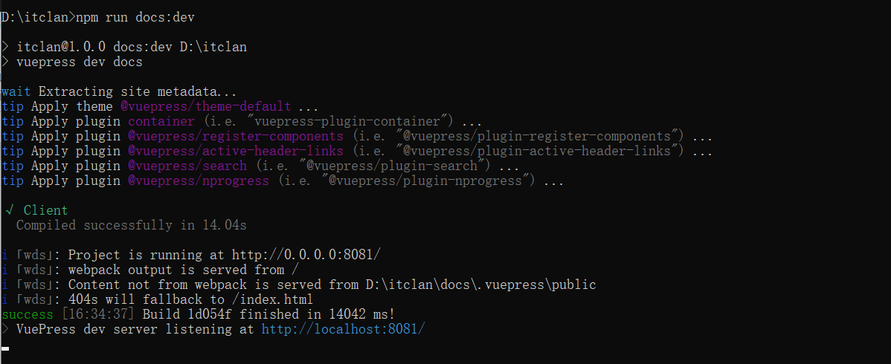
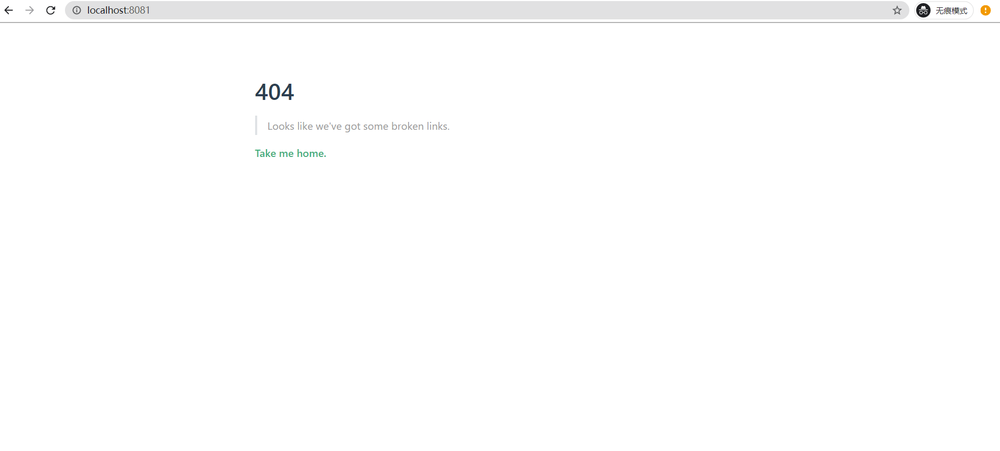

这是因为`vuepress`默认打开的是`docs` 下的 `README.md` 文件, 由于你没有创建,所以找到的是`vuepress` 默认提供的 `404`页面
| 文件的相对路径 | 页面路由地址 |
| ------------- |:-------------:|
| /README.md | /|
| /guide/README. | /guide/ |
| /config.md | /config.html |
在`VuePress`中`README.md`文件,你可以把它视为`xxx.vue`文件,md 文件中既可以写`js`,`css`,`html`,如果你发现页面 404,排除下路由下是不是没有添加`README.md`文件的
在`docs`目录下创建`README.md`文件, 再次`npm run dev`,就可以看到运行起来的效果, 如下图所示
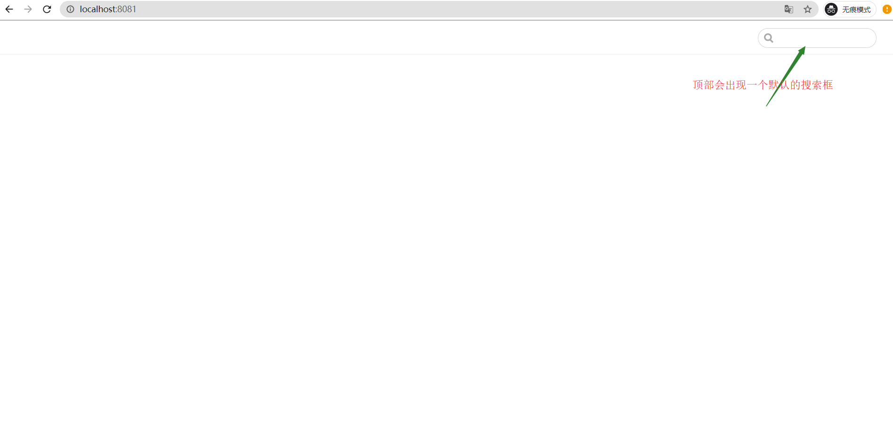
当然,您现在看到的页面是一片空白,那是因为`docs`根目录下的`README.md`中没有任何内容,但现在至少不是 404 了,离曙光又近了一步

## 设置封面启动页

有时候,当别人进入您的网站时,设置一个启动页,这样显得挺友好,而不是一上来,就放一堆的内容,看得令人眼花缭乱

在`vuepress`默认的主题中提供了一个首页（`Homepage`）的布局 (用于您网站的主页)。如果您想要使用它，需要在您项目的根级中`README.md`的`YAML front matter`指定 `home: true`,如下所示

```
---
home: true
heroImage: /images/itclancoder.jpeg
heroText: itclanCoder
tagline: 书以启智,技于谋生,活出斜杠
actionText: 开始阅读 →
actionLink: /latestarticle/
features:
  - title: 读书
    details: 随笔川迹,文以载道,虚心学习,自省自知,多读一页书,就少一分无知,多一分智慧
  - title: 技术
    details: 用心记录技术,走心分享,始于前端,不止于前端,励志成为一名优秀的全栈工程师,真正的实现码中致富
  - title: 生活
    details: 无分享,不生活,一个具有情怀的技匠,路上正追逐斜杠青年的践行者
footer: MIT Licensed | Copyright © 2020-present 随笔川迹
---
```

效果如下所示:
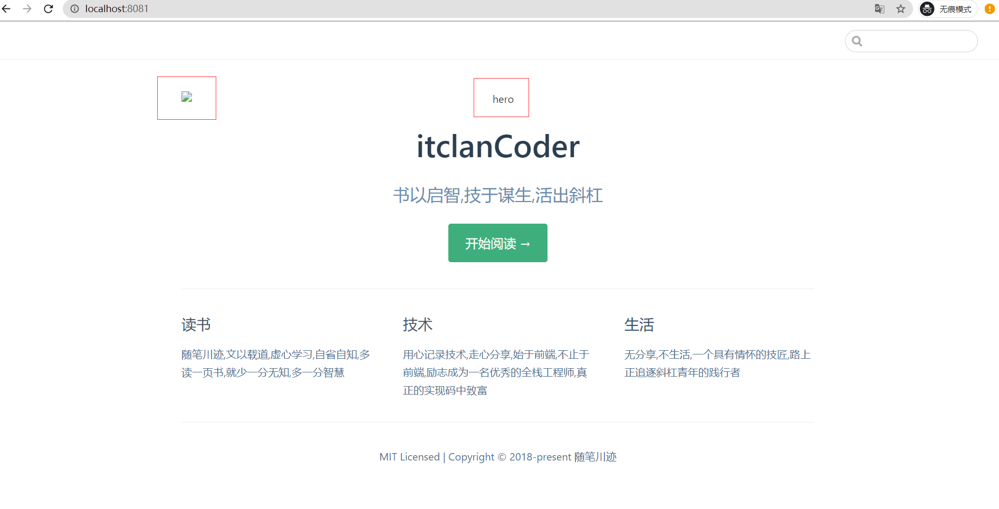
当然,您现在看到,网站上有图片没有正常的显示,那是因为没有添加图片造成的,网站上一些图片,logo 等静态资源可以放到`.vuepress`目录下的一个`public`目录下的

这个`public`是自己创建的,`vuepress`并不会自动帮你生成,在`/.vuepress/public/images`中放入您想要的图片就可以了的

::: warning 警告

1. 这个 public 目录文件夹的名称是固定的,就像`docs`目录下的`config.js`一样,名称是固定的
2. 在引入图片时,直接`/所要引入的图片路径`目录就行,不用带`public`,它会自动的去找`public`下的静态资源文件
3. `vuepress`中所有的**图片文件名,以及目录名不要带有中文**,应该使用英文状态下的格式,否则编译就报错,在您以后用 md 写文章时,同样引入图片时,图片的后缀名都不能带有中文字符
   :::

## 配置导航栏

导航栏中有页面标题、搜索框、 导航栏链接、多语言切换、仓库链接，它们都是可以直接通过配置出来的,在 config.js 中添加如下配置

```
// .vuepress/config.js
module.exports = {
  title: 'itclanCoder网站',
  description: 'itclanCoder的网站,专注前端技术栈分享',
  themeConfig: {
    nav: [
      { text: '首页', link: '/' },
      { text: '前端', link: '/fontend/' },
      { text: '小程序', link: '/wechat/' },
      { text: '面试', link: '/interview/' },
      { text: '关于', link: '/about/' },
    ]
    ]
  }

}
```

::: warning 警告
路由后面的`/fontend/`后面的反斜杠不能少,否则依旧会是 404 的
:::

配置完后,如下所示:
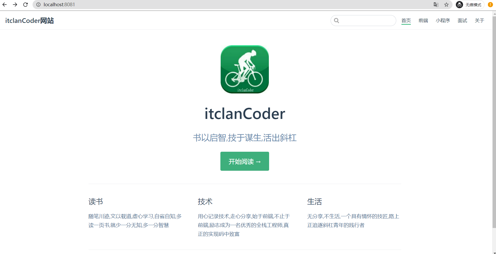
当然,你如果现在点击导航栏,会发现是 404 页面,那是因为导航路由下面没有`README.md`文件
目录树结构如下所示

```
├─package.json
├─docs
|  ├─README.md
|  ├─minprogram        // 与.vuepress同级的每一个文件夹都是一个nav,以后写文章都是在这里里面写
|  |     └README.md
|  ├─interview
|  |     └README.md
|  ├─fontend
|  |    └README.md
|  ├─about
|  |   └README.md
|  ├─.vuepress           // 所有与导航侧边栏vuepress相关配置都会在这个文件夹里面
|  |     ├─config.js
|  |     ├─public        // 公共静态资源,logo,自定义样式等
|  |     |   ├─images
|  |     |   |   ├─itclancoder.jpeg
|  |     |   |   └logo.png
```

与您的电脑上打开的是一一对应的,如下所示
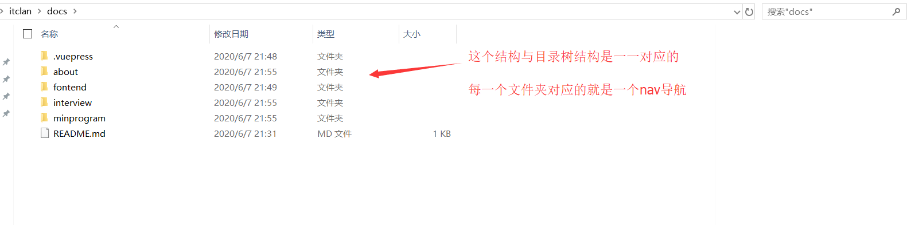
其中导航栏的链接分为三种:一级 nav,链接,二级下拉菜单,带标题的多级分类菜单

- 一级 nav,直接带路由即可

```
themeConfig: {
   nav: [
     { text: '首页', link: '/' },
     { text: '前端', link: '/fontend/' },
   ]
   ]
 }
```

配置完如下所示:
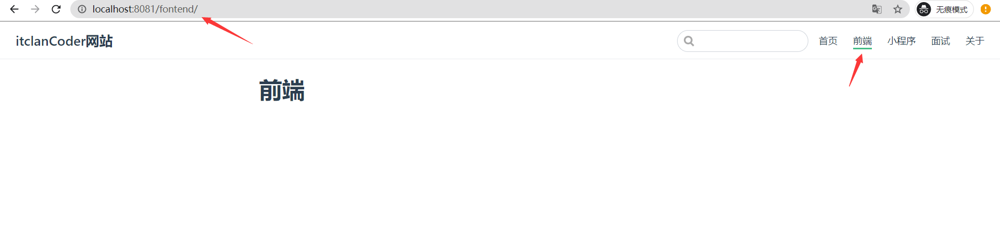

- 如果想 nav 直接是链接,即路由直接是链接地止即可

```
themeConfig: {
   nav: [
     { text: '首页', link: '/' },
     { text: '前端', link: '/fontend/' },
     { text: '网站', link: 'http://doc.itclan.cn' }
   ]
   ]
 }
```

配置完,如下所示
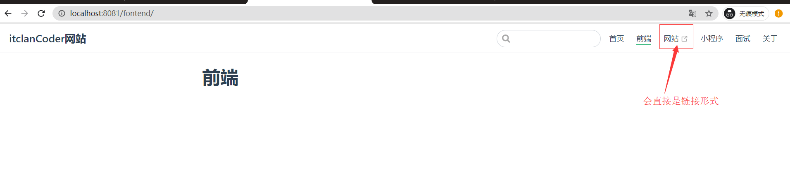

- 如果想 nav 二级下拉菜单,如下配置,`link`的属性值带有链接,会直接是链接,若不是那就是路由,在`vuepress`中提供了一个`items`属性,配置二级导航如下所示

```
themeConfig:{
  nav: [{text: "主页", link: "/"      },
      { text: "前端",
        items: [
          { text: "html", link:"/fontend/html/"},
          { text: "css", link:"/font/css/"},
          ]
      }
    ],
}
```

配置完后,如下所示
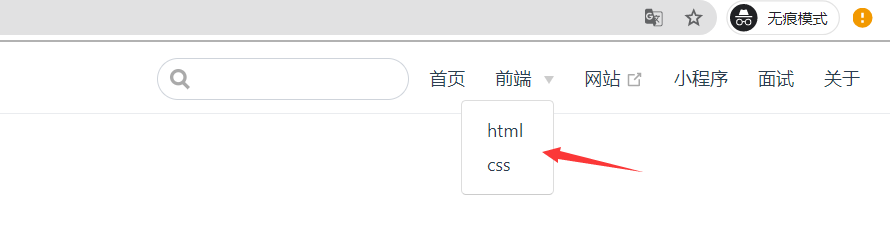

- 如果你想要二级菜单带有标题,分类的菜单形式,如下配置

```
themeConfig:{
  nav: [{text: "主页", link: "/"      },
        { text: '网站', link: 'http://doc.itclan.cn' }, // 后面直接是链接
        { text: "前端",                                 // 二级菜单配置
        items: [
            { text: "html", link:"/fontend/html/"},
            { text: "css", link:"/font/css/"},
          ]
        },
        {
          text: "工具",
          items: [
            {
               text: "思维导图",
               items: [
                { text: "zhiMap", link: "https://zhimap.com/home" },
                { text: "processOn", link: "https://www.processon.com/" },
                { text: "gitmind", link: "https://gitmind.cn/" }
               ]
            },

            {
              text: "文档管理",
              items: [
                { text: "语雀", link: "https://www.yuque.com/dashboard" },
                { text: "腾讯文档", link: "https://docs.qq.com/desktop" }
              ]
            },

            {
              text: "实用工具",
              items: [
                { text: "声享-做ppt", link: "https://ppt.baomitu.com/" },
                { text: "马克鳗-量标注", link: "http://www.getmarkman.com/l" }
              ]
            }
          ]
        },
    ],
}
```

配置完后,结果如下所示
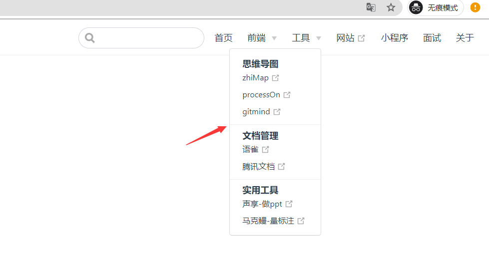
你可以按照这个类似的结构,无限制的配置下去

光有 nav 导航是不够的,下面来配置一下侧边栏,怎么配置侧边栏才是重中之重

## 配置侧边栏-slider

### 自动获取侧边栏内容

如果你希望自动生成当前页面标题的侧边栏, 可以在 config.js 中配置来进行配置启动

```
// .vuepress/config.js
module.exports = {
  themeConfig:{
    sidebar: 'auto',
  }
}
```

- [侧边栏配置地止](https://www.vuepress.cn/theme/default-theme-config.html#%E4%BE%A7%E8%BE%B9%E6%A0%8F)
  ::: warning 警告
  默认情况下，侧边栏会自动地显示由当前页面的标题（headers）组成的链接，并按照页面本身的结构进行嵌套，您可以通过 `themeConfig.sidebarDepth` 来修改它的行为。

默认的深度是 1，它将提取到 h2 的标题，设置成 0 将会禁用标题（headers）链接，同时，最大的深度为 2，它将同时提取 h2 和 h3 标题,如果想要额外拓展,支持 h1~h6,在 markdown 配置拓展中`markdown.extractHeaders`,如下所示

```
module.exports = {
  markdown: {
    extractHeaders: [ 'h2', 'h3', 'h4','h5','h6' ]
  }
}
```

:::

### 展示每个页面的侧边栏

如果您希望为不同的页面组显示不同的侧边栏, 就和官网一样, 点击导航中的哪个 nav,对应就显示对应的的侧边栏,目前目录有 fontend \ interview \ minprogram 等, 这些目录下都存放着多个 md 文件,就是我们写的具体的文章

```
module.exports = {
  themeConfig:{
    sidebar:{
      {
       title: "JavaScript",
       collapsable: true,
       children: [
         ["js/", "目录"],
         ["js/scope", "理解Js中的作用域-作用域链以及闭包"]
       ]
      },
      {
        title: "工具",
        collapsable: true,
        children: [
          ["tools/", "目录"],
          ["tools/vuepress-build-blog", "手把手教你用vuepress搭建博客"]
        ]
       }
    }
  }
}

```

配置完后,具体效果如下所示
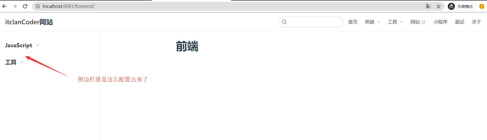
目前的,项目目录结构如下所示

```
├─package.json
├─docs
|  ├─README.md
|  ├─minprogram
|  |     └README.md
|  ├─interview
|  |     └README.md
|  ├─fontend
|  |    ├─README.md
|  |    ├─tools
|  |    |   └vuepress-build-blog.md
|  |    ├─js
|  |    | └scope.md
|  ├─about
|  |   └README.md
|  ├─.vuepress
|  |     ├─config.js
|  |     ├─public
|  |     |   ├─images
|  |     |   |   ├─itclancoder.jpeg
|  |     |   |   └logo.png

```

上面的目录树结构中,`fontend`文件夹下的`tools`与`js`都是两个文件夹,下面对应的有`md`文件,默认会以`README.md`为默认的路由
至此,你如果仔细看看`config.js`里面的一些配置的话,你会发现,代码配置越来越多,当你新增`nav`,或者侧边栏时,`nav`与`slidebar`,会越来越长,会很难受

### 拆分-config

在拆分之前,你可以了解下`CommonjS`中模块化导入导出的规则就可以了,这里你只需要知道,在一个文件中导入一个文件使用`require`方式,而导出一个对象,变量,使用的是`module.exports`就可以了的

```
├─config.js         // 主要入口配置文件
├─nav.js            // 导航栏配置
├─sidebar.js       // 侧边栏配置
├─themeconfig.js   // 默认主题相关配置
├─public
|   ├─images
|   |   ├─itclancoder.jpeg
|   |   └logo.png
```

具体如下示例:`nav.js`

```
const navs = [
  {
    text: "首页",
    link: "/"
  },

  {
    text: "前端",
    items: [
      { text: "CSS", link: "/fontend/css/" },
      { text: "JavaScript", link: "/fontend/js/" },
      { text: "开发工具", link: "/fontend/tools/" }
    ]
  },

  {
    text: "小程序",
    items: [
      { text: "微信小程序", link: "/wechat/minprogram/" },
      { text: "云开发", link: "/wechat/cloudev/" }
    ]
  },

  { text: "关于我", link: "/about/" }
];

module.exports = navs;
```

而在`config.js`中,通过`require`的方式引入即可,如下所示

```
const sidebar =  require("./nav");  // 引入sidebar,后缀名xx.js可以省略
module.exports = {
  themeConfig:{
    sidebar:sidebar // 也可以直接就写sidebar,Es6中的简写,当键与键值同名时,可以直接写一个
}
```

其他,`head`,`plugin`,配置也是如此,代码与之前是没有任何改变的,只不过是对`config.js`进行了分割,进行了模块化管理的,导航的管理导航,侧边栏的管理侧边栏

对于更多详细的默认主题的相关配置,可以查看官方文档:[默认主题相关配置](https://www.vuepress.cn/theme/default-theme-config.html),有首页,导航栏,侧边栏,搜索框,最后更新时间等配置,学会了一个配置,其他配置照着文档配置就好了的
::: tip 配置提醒
每尝试配置一个 API,记得在命令行终端就重新启动`npm run docs:dev`一下,在浏览器查看一下配置效果,目前 vuepress 的热更新存在一些问题(以后官方肯定会修复),在对 vuepress 不是特别熟练的情况下,不要配置了很多选项和插件,到最后才来启动,一旦遇到一些奇葩的问题,报错,你就搞不清楚是在哪一个环节出现问题的
:::

::: details 为什么有必要将 config 进行拆分,分割?
随着你往后想要配置的 nav,slidebar,导航栏,侧边栏,以及插件的增多,如果没有对 config.js 进行分割,该文件的配置将会越来越长,越来越臃肿,到最后,连你自己都看不下去,无法忍受了的,对于后期的代码维护,以及拓展是极其不友好的,所以在一开始,就考虑一下代码的拆分,更多的是方便自己,一劳永逸,不要觉得这个很麻烦,不抽离,越往后,越是灾难,到最后,自己可能在也不会去看了的
:::
如果以上的讲解依然不清楚:可以研究一下:[itclanCoder 博客-项目源码](https://github.com/itclanCode/blogcode),按照这个结构进行配置,就好了的

## 配置插件

有时候,我们想让我们的网站博客更加顺畅,用户体验更好,可以结合一些第三方的插件,开箱即用

配置内置的全局 UI,首先需要在当前项目下使用`npm`或者`yarn`安装插件

```
// 回到顶部插件,推荐使用yarn安装插件,它安装比npm更快,不熟悉的,可以去了解下yarn的,包管理工具
yarn add -D @vuepress/plugin-back-to-top
```

然后在,config.js 中进行配置:

```
module.exports = {
  plugins: ['@vuepress/back-to-top']
}
```

::: warning 警告

1. 安装插件的版本需要与 vuepress 的版本保持一致,如果低版本的`back-to-top`,会出现不了,其他插件配置也是如此
2. 凡是带有@开头的插件,都是官方维护的插件,需要与当前项目的 vuepress 版本保持一致
3. 非@开头的插件,则是社区或者个人开发的插件,vuepress 版本每个一段时间,或许都会升级,以你自己的为准

```
// 在package.json中就可以看到安装过的一些插件版本情况
"devDependencies": {
    "@vuepress/plugin-back-to-top": "^1.5.0",
    "vuepress": "^1.5.0",
    "vuepress-plugin-auto-sidebar": "^1.4.1",
    "vuepress-plugin-img-lazy": "^1.0.3",
  }
```

:::

### 可配置的插件选项

在`vuepress`提供的插件系统中,可以对插件进行一些额外的配置,进行控制,分别提供了`Babel 式`,`对象式`

```
module.exports = {
  plugins: [
         [
            "@vuepress/medium-zoom",
            {
              selector: ".medium-zoom", // 指定含有medium-zoom的类缩放,后面这个类名可自定义,markdown中的img的class类保持一致就可以了的,没有指明的图片类将不支持缩放
              delay: 1000, // 延迟1秒
              options: {
                margin: 24,
                scrollOffset: 0
              }
            }
        ],
        [
          "vuepress-plugin-auto-sidebar",
            {
              titleMode: "titlecase", // 标题模式
              collapsable: true,     // 设置为true,开启折叠
              // sidebarDepth: 0,    // 标题的深度
              collapseList: [
                // 折叠的路由列表
                // "/frontend/css/"
              ],
              uncollapseList: [
                // 不折叠的路由列表
              ]
            }
      ],

  ]
}
```

有时候,当你看到网上一些博客,配置的选项,五花八门,各有不一的,其实无外乎就两种,`babel`与`对象式的`,两种方式都可以,取决于你自己,不过我个人比较倾向于`babel`式风格的,因为每个插件都集中在一块配置,内聚性高,后续修改或者删除之类的也容易,不容易出错,保持插件时可插播式的,互不干扰

详细介绍可参考官方文档[插件配置选项](https://www.vuepress.cn/plugin/using-a-plugin.html#%E6%8F%92%E4%BB%B6%E7%9A%84%E7%BC%A9%E5%86%99)

## 支持-PWA

`vuepress`有一个比较好的优势, 就是它是支持 PWA,也是支持响应式的,无论是在 pc 端浏览还是在手机端浏览器浏览,显示都很友好,而当用户没有网的情况下,一样能继续的访问我们的网站

### 安装-pwa

```
yarn add -D @vuepress/plugin-pwa
# OR npm install -D @vuepress/plugin-pwa
```

在 config.js 中进行配置:

```
module.exports = {
  plugins: [
     [
      '@vuepress/pwa', {
         serviceWorker: true,
         updatePopup: true
       }
     ]
  ]
}

```

::: tip 注意

**为了让你的网站完全地兼容 PWA，你需要提供 `manifest文件`和在头部 `head` 进行引用**:

- 在`.vuepress/public` 提供 `Manifest` 和 `icons`
- 在 `.vuepress/config.js`添加正确的 `head links`
  :::
  在`config.js`的`head`配置项中

```
// 配置
module.exports = {
  head: [
    ['link', { rel: 'icon', href: `/favicon.ico` }],
    //增加manifest.json
    ['link', { rel: 'manifest', href: '/manifest.json' }],
  ],
}

```

`manifest.json`文件

```
{
  "name": "itclanCoder",
  "short_name": "itclanCoder",
  "version": "1.0.0",
  "description": "itclanCoder,随笔川迹博主, itclanCoder的博客,川川的博客",
  "manifest_version": 2,
  "icons": [
    {
      "src": "/icons/apple-touch-icon.png",
      "sizes": "192x192",
      "type": "image/png"
    },
    {
      "src": "/icons/android-chrome-512x512.png",
      "sizes": "512x512",
      "type": "image/png"
    }
  ],
  "start_url": "/index.html",
  "display": "standalone",
  "background_color": "#fff",
  "theme_color": "#3eaf7c"
}

```

- [生成 favicon 图标](https://favicon.io/)

* [Manifest 各个字段含义](https://developer.mozilla.org/en-US/docs/Web/Manifest)

## 配置评论插件

一个网站,莫过于内容的载体,令你三连击之外,有用户访问,并且能够与你进行互动,有反馈,才会有交流,添加评论,留言的功能也很重要

静态的留言系统有很多:例如：

- [Disqus](https://wordpress.org/plugins/disqus-comment-system/)
- [畅言](http://changyan.kuaizhan.com/),
- [LiveRe](http://livere.com/)
- [Gitalk](https://gitalk.github.io/)
- [vssue](https://vssue.js.org/)
- [Valine](https://valine.js.org/)

  大家可以根据自己的喜好,选择一款自己适宜的评论系统的,其中`vssue`是官方推出的,也有专门的团队在维护,也很强大,支持多个平台

今天给大家介绍的是`valine`评论插件

### 插件 Valine

- 一款快速、简洁且高效的无后端评论系统
- 官方文档:[valine](https://valine.js.org/)

在使用 valine 之前,先前往[leancloud 注册账号](https://www.leancloud.cn/)
然后创建应用, 获取`APP ID`和`APP KEY`
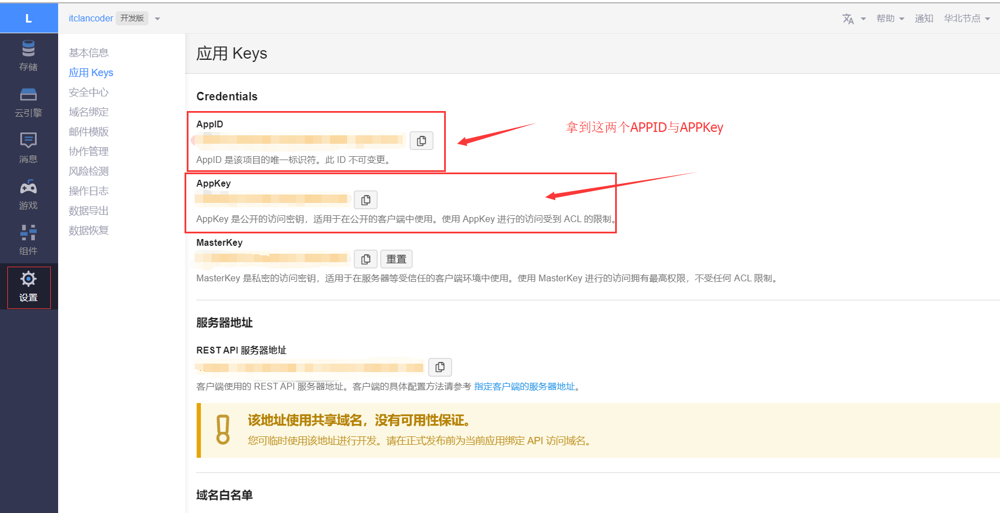

### 安装-vuepress-plugin-comment

```
yarn add -D  vuepress-plugin-comment
```

### 快速使用

在`.vuepress`下的`config.js`的`plugin`插件选项中进行配置

```
module.exports = {
  plugins: [
    [
      'vuepress-plugin-comment',
      {
        choosen: 'valine',
        // options选项中的所有参数，会传给Valine的配置
        options: {
          el: '#valine-vuepress-comment',
          appId: 'Your own appId',
          appKey: 'Your own appKey'
        }
      }
    ]
  ]
}
```

其中`appid`和`appkey`为你创建的应用的`APP ID` 和`APP Key`，把刚才获取到的秘钥复制过来即可,经过配置之后
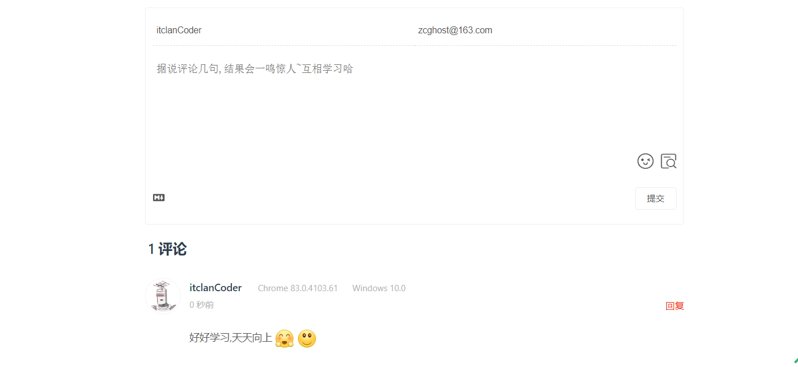

### 删除管理评论

在`leancloud`后台管理里,在存储中,支持删除评论操作

若有骚扰,或违反法律法规的评论,可以进行删除操作的,避免给自己带来不必要的麻烦
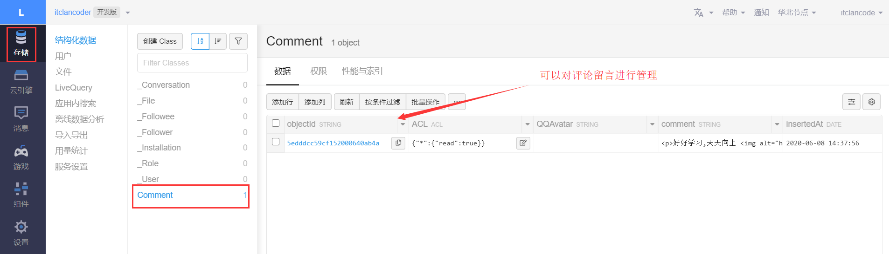

### valine-样式的修改-适配

在您安装好`valine`后,会发现`valine`默认宽度是 100%的,很显然不满足我们的网站,无论是在 pc 端还是移动端,样式会出现问题

这时,需要我们对插件的样式进行修改:

在`.vuepress/public/`目录下创建`styles`文件夹,并创建`index.styl`与`palette.styl`两个文件,文件的名字是固定的

- `index.styl`:将会被自动应用的全局样式文件，会生成在最终的 CSS 文件结尾，具有比默认样式更高的优先级
- `palette.styl`:用于重写默认颜色常量，或者设置新的 `stylus` 颜色常量

* 详细介绍可参考文档[styling-index-palette 介绍](https://www.vuepress.cn/config/#styling)

打开 chrome 的控制台,审查元素,找到`valine`评论的 ID,在`index.styl`文件中,即可写入样式,进行更改,只要你想改主题中的样式,都可以通过这种方式,它会默认覆盖原有的样式

```
// .vuepress/public/styles/index.styl
#valine-vuepress-comment {
  max-width: 750px;
  margin: 0 auto;
}


#valine-vuepress-comment .vheader input[name="link"] {
  display: none;
}

#valine-vuepress-comment .vheader .vinput {
  width: 50%;
}
```

## 主题样式修改

`vuepress`默认是主题颜色是绿色, 如果你不喜欢可以对其进行更改. 如果要对默认设置的样式进行简单颜色替换, 或者自定义一些颜色变量供以后使用, 可以在`.vuepress/styles`中的`palette.styl`文件进行更改,这个文件是你手动创建的

你可以调整的颜色变量:

```
// 参考文档: https://vuepress.vuejs.org/zh/config/#patterns中 palette.styl配置
// 用于重写默认颜色常量，或者设置新的 stylus 颜色常量

// 颜色
$textColor ?= #2c3e50
$accentColor ?= #3eaf7c
$grayTextColor ?= #666
$lightTextColor ?= #999
$borderColor ?= #eaecef
$codeBgColor ?= #282c34
$arrowBgColor ?= #ccc
$navbarColor ?= #fff
$headerColor ?= #fff
$headerTitleColor ?= #fff
$nprogressColor ?= $accentColor

// 布局
$navbarHeight ?= 3.6rem
$bannerHeight ?= 12rem

// 响应式 breakpoints
$MQWide ?= 1440px
$MQNarrow ?= 1024px
$MQMobile ?= 768px
$MQMobileNarrow ?= 480px

// 修改meduiumZoomZindex的层级,默认是100
$mediumZoomZIndex = 10000
```

::: warning 注意
你应该只在这个文件中写入颜色变量。因为 palette.styl 将在根的 stylus 配置文件的末尾引入，作为配置，它将被多个文件使用，所以一旦你在这里写了样式，你的样式就会被多次复制
:::

## 另外一种方式修改样式

除了上面一种覆盖默认样式的方式,还有另外一种方式,你可以在`.vuepress/public/`目录下创建一个`css`文件,`style.css`
然后在`config.js`中的`head`配置属性中通过`link`的方式引入

```
module.exports = {
  head: [
    ["link", { rel: "stylesheet", href: "/css/style.css" }], // 这种方式也可以覆盖默认样式
  ]
}

```

::: warning 注意
这个文件夹下覆盖的默认样式,优先级要大于,根目录下的 styles 中的 index.styl,相当于是行内样式>外部样式
:::

## 移动端下禁止用户屏幕缩放

当你在手机浏览器端打开`vuepress`的网站时,你会发现你可以对屏幕进行放大和缩小,有时候,这并不是一个很好的操作
如何禁用？
在`.vuepress/public/`目录下创建一个`js`文件夹,在这个`js`文件夹下创建一个`disable-user-zoom.js`,写一段`js`代码即可

```
window.onload = function() {
  document.addEventListener("touchstart", function(event) {
    if (event.touches.length > 1) {
      event.preventDefault();
    }
  });
  document.addEventListener("gesturestart", function(event) {
    event.preventDefault();
  });
};

```

然后在`config.js`的`head`头部引入即可,同时也引入`meta`移动端禁止用户缩放的标签,禁止用户对屏幕进行方法和缩小

```
module.exports = {
  head: [
    [
      "meta", // 移动端禁止用户缩放
      {
        name: "viewport",
        content:
          "width=device-width,width=device-width, initial-scale=1.0, minimum-scale=1.0, maximum-scale=1.0, user-scalable=no"
      }
    ],
    ["link", { rel: "stylesheet", href: "/css/style.css" }], //
    ["script", { charset: "utf-8", src: "/js/disable-user-zoom.js" }] // 移动端,禁止用户缩放,引入你写的js
  ]
}

```

## 自动生成侧边栏

有时候,你会发现,每次管理侧边栏,都需要手动去创建管理侧边栏的,虽然已经对 `slidbar` 以及 `nav` 做了拆分,但是依旧不完美,可以
借助`vuepress-plugin-auto-sidebar`,这个插件,自动去配置管理我们的侧边栏的

- [vuepress-plugin-auto-sidebar 仓库](https://github.com/shanyuhai123/vuepress-plugin-auto-sidebar)
- [vuepress-plugin-auto-sidebar 使用文档](https://shanyuhai123.github.io/vuepress-plugin-auto-sidebar/)
  经过上面的操作,相信聪明的你,完成这个插件的使用,应该是不难了

一定要耐心的学着葫芦画瓢,如果让自己从零开始写,用`vue`,`vue-router`,`webpack`去写这么一个网站,还是多多少少有些复杂度的
目前,你只需知道怎么配置,怎么修改配置,能达到自己的效果就可以了的

## 部署到-github

### 前提条件

- 文档放置在项目的 `docs`目录中；
- 使用的是默认的构建输出位置；
- `VuePress` 以本地依赖的形式被安装到你的项目中，并且配置了如下的`npm scripts:`,然后在`itclan/package.json`文件中
  添加如下命令

* 本地若没有安装`vuepress`非全局安装,`pwa`以及其他一些插件不会生效

```
{
  "scripts": {
    "docs:build": "vuepress build docs"
  },
  "devDependencies": {
    "vuepress": "^1.5.0"
  }
}
```

### 创建两个仓库

- 在`github`上创建两个仓库,一个仓库的名称:`https://<USERNAME>.github.io/<REPO>/` 即`https://github.com/<USERNAME>/<REPO>`,或者直接仓库的名称就是`username.github.io`(这个 username 是你 github 的登录账号的名称,是固定的),这个仓库的作用是用来部署线上版本用的
- 在创建一个仓库,这个仓库的名称任意,这个仓库是用来平时日常开发代码的,比如我的:`blogcode`

::: details 为什么要创建两个代码仓库呢,一个仓库不是很好么?

1. 一个仓库用于日常的开发,新增文章或者二次开发,不断迭代,注意不要往这个仓库里`push`构建出来`dist`文件
2. 另一个仓库只用于线上预览,项目中最终构建 build 生成的`dist`目录文件推送到这个远程仓库当中
3. 保持两个仓库的相互独立,互不干扰,如果全部放在一个仓库里,不易于后续维护和代码的管理
4. 如果你想把代码静态资源部署到其他服务器上,你只需把`build`构建出来的`dist`文件放到你服务器根目录下就可以了的
   :::

::: tip 提醒
如果您的仓库不是放置在根目录下(就是`https://itclancode.github.io/blogcode/`这种形式,而非`https://itclancode.github.io/`),则在`config.js`的基础配置中需要更改`base`的路径,它默认是指向根路径的,可以省略

```
module.exports = {
  base: "/blogcode/"
}
```

:::

在本地启动时,就会区分出来的,默认端口是`8080`,如果设置了`base`后,后面会跟上路径
也可参考官方文档:[部署到 github](https://vuepress.vuejs.org/zh/guide/deploy.html#github-pages)

### 配置自动化部署脚本

在`itclan`(以你自己的为准)根目录下,创建一个如下的脚本文件`deploy.sh`

```
#!/usr/bin/env sh

# 确保脚本抛出遇到的错误
set -e

# 生成静态文件
npm run docs:build

# 进入生成的文件夹
cd docs/.vuepress/dist

# 如果是发布到自定义域名
# echo 'www.example.com' > CNAME

git init
git add -A
git commit -m 'deploy'

# 如果发布到 https://<USERNAME>.github.io,把下面一行注释掉,替换username即可,注意以下这是ssh的方式
# git push -f git@github.com:<USERNAME>/<USERNAME>.github.io.git master
# git push -f git@github.com:itclancode.github.io.git master

# 如果发布到 https://<USERNAME>.github.io/<REPO>
# git push -f git@github.com:<USERNAME>/<REPO>.git master:gh-pages
# git push -f git@github.com:itclancode/blogcode.git master:gh-pages

cd -

```

::: tip
注意克隆到本地仓库代码的方式,默认是`https`方式,如果你克隆代码方式是`https` 方式,上面的提交地止,就换成`https`的,如果是 ssh 的方式的就换成 `ssh`方式,否则是会出现问题的

若是 ssh 的方式,可以配置秘钥:这样不用每次提交代码,都输入用户名和密码的
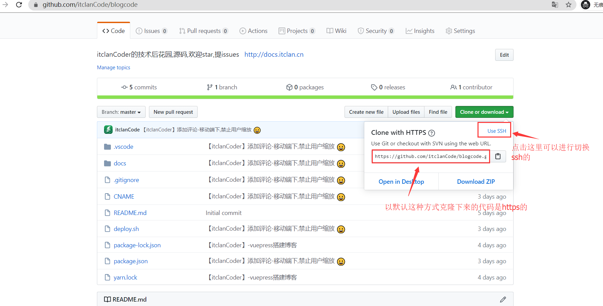
:::
也可以通过在命令行终端输入`git remote -v`查看克隆下的远端仓库地止的,看得出是那种方式克隆下来的

```
git remote -v
```

### 启动-deploy.sh-脚本

当你在`git bash`命令行终端执行`bash deploy`,注意在`DOS`命令行终端下,不支持这个`bash`命令,或者双击`deploy.sh`这个脚本
就会自动的执行这个脚本,分别完成构建和向远端指定的仓库提交代码

有时候,我们希望执行一行命令就可以完成自动化部署，那么您需要在`package.json`中的`scripts`中添加`deploy:bash deploy.sh`就可以了的,往后在命令行终端执行`npm run deploy`或者`yarn deploy`就可以自动执行该`deploy.sh`脚本了的

```
"scripts": {
    "dev": "vuepress dev docs",
    "build": "vuepress build docs",
    "deploy": "bash deploy.sh"
  },

```

::: tip 提示
如果自动部署脚本不成功,可以尝试如下操作

1. npm run docs:build,手动构建
2. git push -f https://itclancode.github.io.git master
   :::

当你`push`,完后,地止栏里输入`xxx.github.io`,如果能够访问成功,那说明部署已经成功了,如下所示
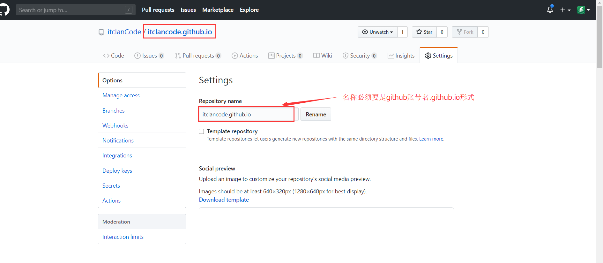

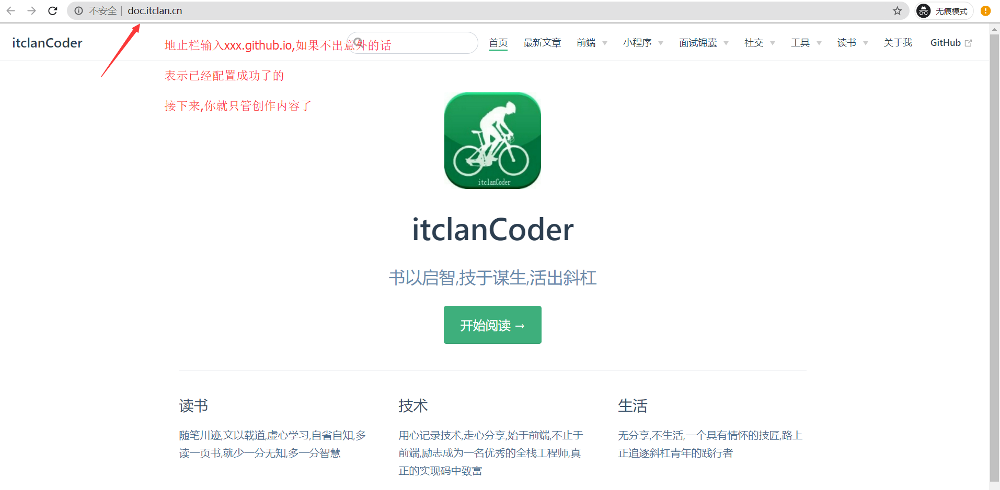

## 配置自定义域名

### 前提条件

- 在域名管理商那里购买了`域名`,例如:阿里云,腾讯云都可以购买,备案(折腾一两次,大概流程就差不多了的)

### 登录域名管理后台

在这里我以阿里云为例:[阿里云控制台](https://dc.console.aliyun.com/)
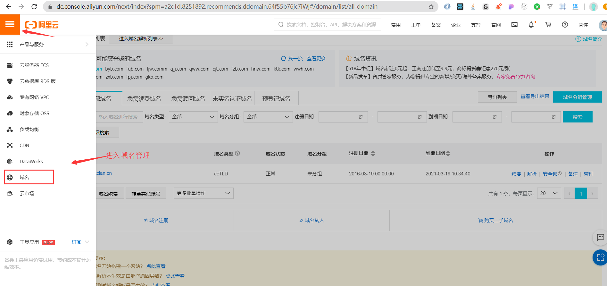
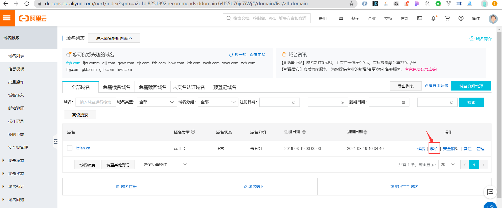
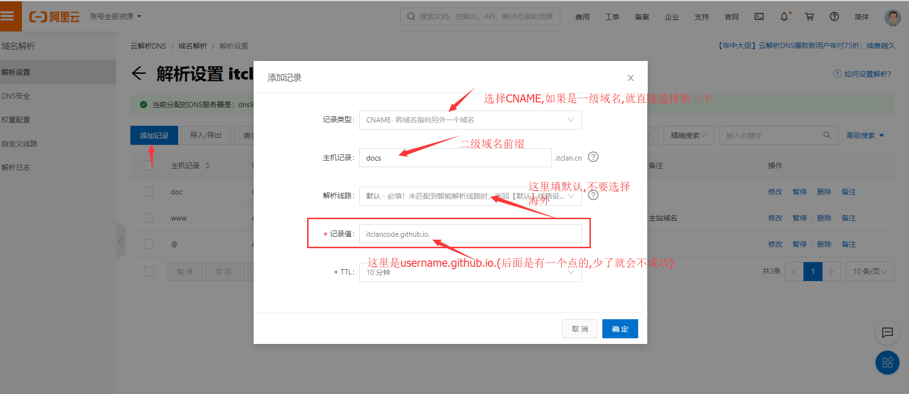

### 检验域名有没有解析成功

可以在本地的命令行终端,进行`ping`一下的,如

```
C:\Users\itclancode>ping doc.itclan.cn

正在 Ping itclancode.github.io [xxx.xxx.xxx.xxx] 具有 32 字节的数据:
请求超时。
来自 xxx.xxx.xxx.xxx的回复: 字节=32 时间=51ms TTL=48
来自 xxx.xxx.xxx.xxx 的回复: 字节=32 时间=52ms TTL=48
来自 xxx.xxx.xxx.xxx 的回复: 字节=32 时间=53ms TTL=48

xxx.xxx.xxx.xxx 的 Ping 统计信息:
    数据包: 已发送 = 4，已接收 = 3，丢失 = 1 (25% 丢失)，
往返行程的估计时间(以毫秒为单位):
    最短 = 51ms，最长 = 53ms，平均 = 52ms

C:\Users\itclancode>ping itclancode.github.io

正在 Ping itclancode.github.io [xxx.xxx.xxx.xxx] 具有 32 字节的数据:
请求超时。
来自 xxx.xxx.xxx.xxx 的回复: 字节=32 时间=51ms TTL=48
来自 xxx.xxx.xxx.xxx 的回复: 字节=32 时间=55ms TTL=48
请求超时。

xxx.xxx.xxx.xxx的 Ping 统计信息:
    数据包: 已发送 = 4，已接收 = 2，丢失 = 2 (50% 丢失)，
往返行程的估计时间(以毫秒为单位):
    最短 = 51ms，最长 = 55ms，平均 = 53ms
```

如果能 ping 得通,说明配置没有问题的

- [阿里云域名检测工具](https://zijian.aliyun.com/?spm=a2c4g.11186623.2.15.6db92da1C19ghl#/domainDetect)
  如果遇到解析不成功:先仔细查看一下文档,按照文档指示一步一步的排查,官方文档很详细,但是就是不明显,得耐心一点的
  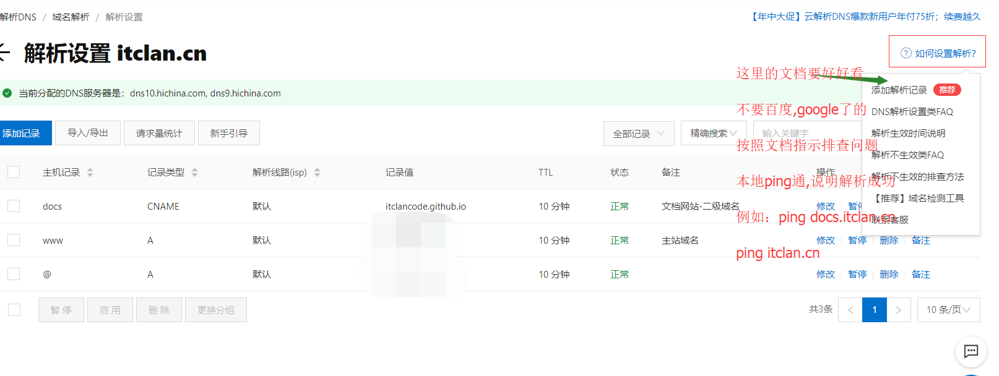

### 在仓库底下新建一个-CNAME-文件

在你仓库根目录下创建一个 CNAME 文件,里面内容是,就是你想要指向绑定的域名

这个文件也可以在远程仓库里创建,注意是在你那个要部署的仓库里

```
doc.itclan.cn
```

在你推上去后,在代码仓库设置页面的`Custom domain`中应该就可以看到变化了的,最终测试是否成功

## 添加百度统计

- 进入百度统计官方网址:[百度统计](https://tongji.baidu.com/)

* 新增网站,填入你的网站信息即可
  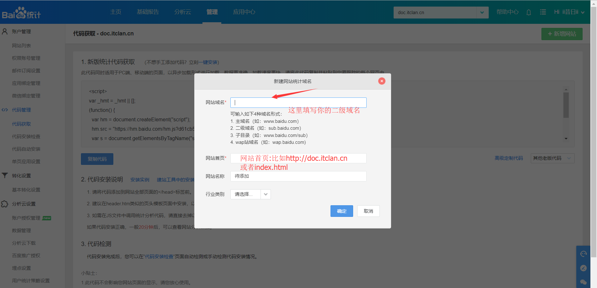
  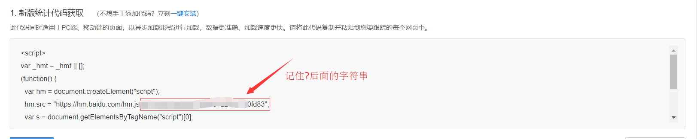

  - 在`.vuepress/config.js`的`head`中添加如下一段代码即可

```
[
    // 添加百度统计代码
    "script",
    {},
    `
      var _hmt = _hmt || [];
      (function() {
          var hm = document.createElement("script");
          hm.src = "https://hm.baidu.com/hm.js?d61cb503bd6183sdfb7a28c4730fd83"; // 注意是你自己网站的这个参数
          var s = document.getElementsByTagName("script")[0];
          s.parentNode.insertBefore(hm, s);
      })();
    `
  ],

```

一般过 24 小时后,百度就会统计你网站每日的访问量的,您可以根据这些信息,不断的优化您自己的网站

## 添加谷歌分析

### 前提条件

- 下面的一切基于您具备科学上网能力之上
- 有一个`Google`账号,没有的话,能科学上网,注册一个即可
- 前往[谷歌分析站点](https://analytics.google.com/)
- 创建媒体资源,获取`ga`,格式是`UA-00000000-0`
- 安装插件,并配置选项

 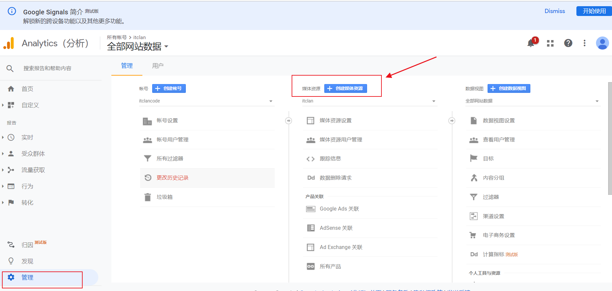 
 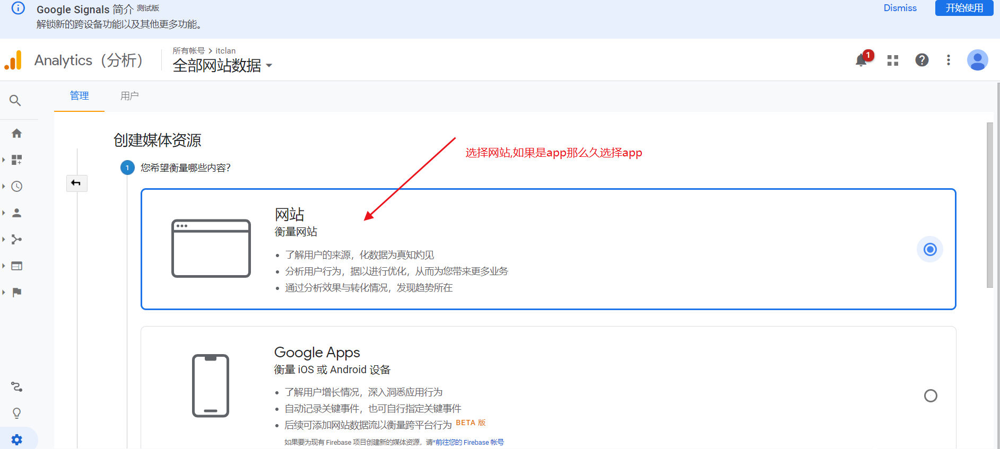 
 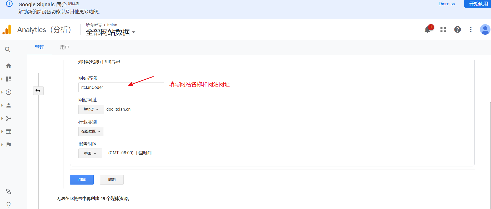 
 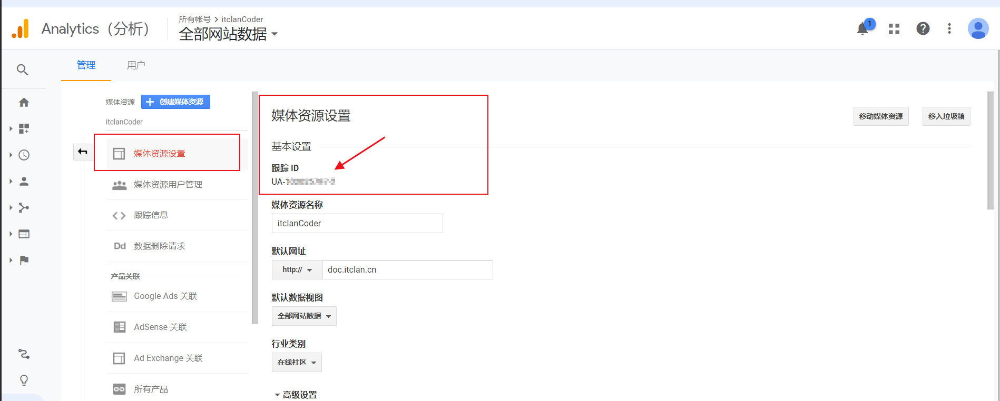

### 安装

在当前项目目录下,使用`yarn`安装`@vuepress/plugin-google-analytics`,插件

```
yarn add -D @vuepress/plugin-google-analytics
# OR npm install -D @vuepress/plugin-google-analytics
```

::: tip 注意
如果你的项目正在使用 `Google analytics`插件，推荐使用 `Yarn`而不是`npm`来安装所有依赖。因为在这种情形下，npm 会生成错误的依赖树
:::

### 使用

```
module.exports = {
plugins: [
  [
    '@vuepress/google-analytics',
    {
      'ga': '' // UA-00000000-0 ,填入你google账号分析那个ID即可
    }
  ]
]
```

## 添加逼格徽章

有时候看到一些 Github 项目里,项目前会新填一些徽章,这些徽章是可以自己自定义生成的

- 使用的方式也很简单,使用 `markdonw`语法添加图片的方式引入到你 `md`文件中就可以了的

```

```

- 链接地止[徽章生成地止 shields.io](https://shields.io/)

<a target="_blank" href="https://github.com/itclanCode/blogcode"></a>
<a target="_blank" href="https://juejin.im/user/5900e97b1b69e60058b936ed/posts"></a>

## 常见问题:ghost: <Badge text="必看" type="error"/> 

- ### 页面显示-404

在 `vuepress`说明了文件路径与页面路由之间的映射关系
| 文件的相对路径 | 页面路由地址 |
| ------------- |:-------------:|
| /README.md | /|
| /guide/README. | /guide/ |
| /config.md | /config.html |
当你访问 `/guide/`而 `404` 时,这是由于`guide`目录下缺乏了它对应的 `README.md`文件

### 侧边栏显示的是文件路径，而非文件名

当您的`md`文件没有任何内容时,就会显示文件路径,如`/read/lingdu/wanted.html`),如下所示
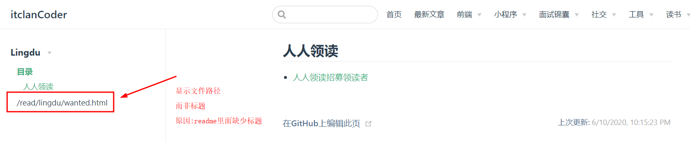

这是由于你的 `md`文件中缺乏标题导致的，**标题的产生有两种方式**

1. 添加 [Front Matter](https://v1.vuepress.vuejs.org/zh/guide/frontmatter.html#front-matter) 的 title 属性 <Badge type="warning" text="推荐使用"/>

```
---
title: 标题
---

```

2， `markdown`语法中的添加标题

```
# 一级标题
## 二级标题
```

### 自动化-bash-deploy.sh-脚本不成功

- 您可以把`deploy.sh`中的`set -e`给注释掉的,然后在执行`bash deploy.sh`,或者就是手动向远程 push 操作的
- 克隆远程仓库与`deploy.sh`中推向的`git`仓库不一致,是`https`方式的还是`ssh`方式的,要一一对应

### markdown-中引入图片不显示

建议与文章相关的图片放置在同级目录下,而不要放置在`.vuepress/public/`目录中

```
─README.md
├─fontend
|    ├─tools      // 与工具相关的文章
|    |   ├─README.md
|    |   └vuepress-build-blog.md
|    ├─js          // js相关的文章
|    | ├─README.md
|    | ├─scope.md
|    | └understand-closure.md
|    ├─images           // 所有与md相关的图片放在在images目录下的
|    |   ├─tools-article-imgs  // 与工具相关文章的图片
     |   |     ├─vuepress-build-blog  // 手把手教你用vuepress搭建博客文章相关图片
|    |   |     |     ├─404-page.png
|    |   |     |     ├─baidutongji-0.png

|    |   ├─js-article-imgs
|    |   ├─css-article-imgs
|    ├─css
|    |  ├─elem-center.md
|    |  ├─flexible-box.md
|    |  └README.md
├─about
|   ├─about.md
|   └README.md

```

与路径相关内容[静态资源文档](https://www.vuepress.cn/guide/assets.html)

### 安装某插件后不生效

在当前项目中安装`plugin-back-to-top`-或-`pwa`-等插件后,发现不生效,其他插件也是如此

**原因**:本地项目未安装`vuepress`,因为一些第三方插件依赖`vuepress`,除了全局坏境下安装了`vupress`,当前项目下也得安装

**解决**:在本地的`package.json`中检查`vuepress`是否有安装,若没有则用`npm install -D vuepress`安装一下

```
"devDependencies": {
  "@vuepress/plugin-back-to-top": "^1.5.0",
  "vuepress": "^1.5.0",
}

```

### 热更新问题

在`vuepress 1.5.0`之前的版本中,若`md`文件或者其他配置文件(或自定义组件)有所更改,页面内容并不会马上更新,每次都需要重新`npm run docs:dev`,热更新存在一些问题

**解决**:只需使用`npm`升级`vuepress`的版本即可,在`vuepress:^1.5.1`中此问题已经解决

```
npm install -D vuepress@next
// 在当前项目的package.json中就会看到vuepress的最新版本
"vuepress": "^1.0.0-rc.1",
```

这个`rc`代表的是`（Release Candidate）`候选版本。系统平台上就是发行候选版本。`RC`版不会再加入新的功能了，主要着重于除错
当然,网上也有说在`package.json`,添加如下代码也可以解决,可自行测试

```
resolutions: {
  "watchpack":"1.7.2"
}
```

### deploy-脚本部署失败

当你在命令行终端执行`bash deploy.sh`,报如下错误
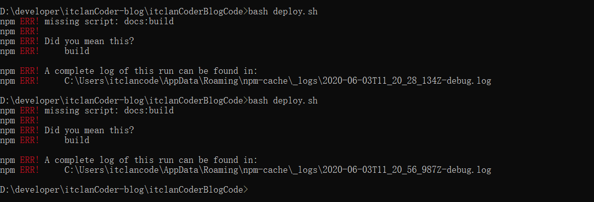
单独执行`npm run docs:build`没有问题,但是一旦执行这个自动化部署脚本命令,就报这个错误,这个错误令人很奔溃
把`deplpy.sh`中的`set -e`注释掉,重新在执行`bash deploy.sh`就可以了的

```
# set -e
```

### npm-安装某些包失败

有时候,您在使用某些`cli`或者`命令`的时候,会报这个错误
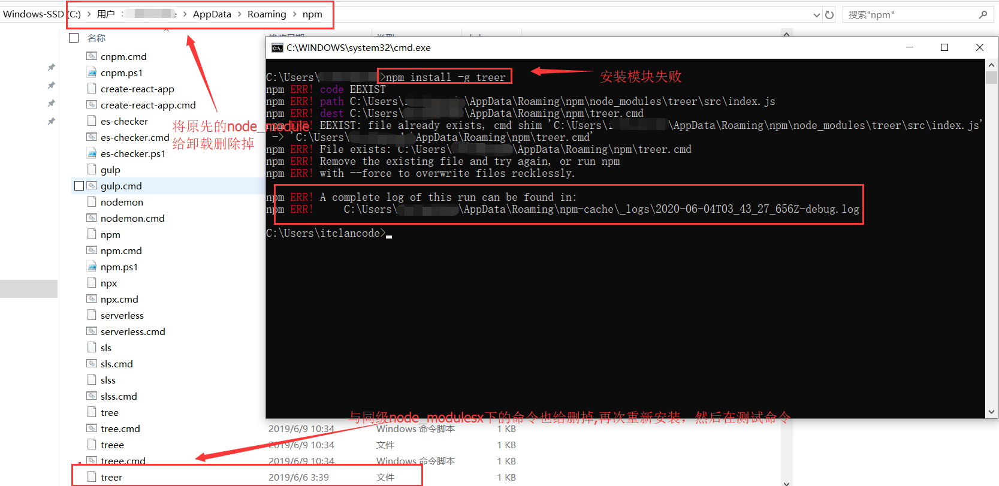
遇到此类问题可以尝试如下操作

- 清除`npm`缓存,`npm cache clean -f`
- 删掉本地的`node_modules`,重新使用`cnpm`或`yarn`重新安装
- 将错误翻译出来,然后直接复制到浏览器,查看有没有同样遇到的问题的
- 去错误日志文件内,看具体的报错信息
- 根据错误信息去相应的目录下,把相应`npm`中的`node_modules`给删掉,重新在安装
  

### 配置自定义域名不生效

项目的根目录下是否缺少`CNAME`文件,并且里面的内容与自定义的域名不一致,该文件的名称必须是大写
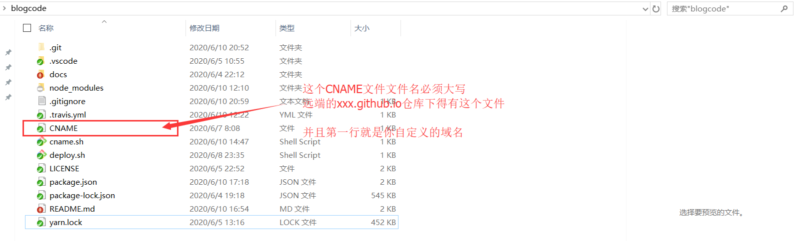

```
doc.itclan.cn
```

::: tip 提醒
这个 CNAME 文件在本地活动仓库中可以没有,但是在远端仓库中必须要存在,这个·`CNAME` 文件可以在远端项目根目录下创建写入的
:::

关于`vuepress`搭建网站到自定义域名部署上线,基本上就完成了,如果您觉得`github pages`访问很慢,也可以将代码托管给[gitee](https://gitee.com/)或者[coding](https://coding.net/)等一些第三方平台上的,这样访问速度就会快些

当然你也可以直接`clone`[blogcode 源码](https://github.com/itclanCode/blogcode)进行二次修改,但是我个人觉得,建议还是自己手动一行一行的配置一下,结合[vuepress 中文官方文档](https://www.vuepress.cn/),进行学习配置

建议您克隆[blogcode 简易版-示例 Demo](https://github.com/itclanCode/vuepress-build-blog-demo),您当前看到的博客,就是基于此简易示例`Demo`进行拓展的,该模板没有掺杂特别多的东西,在示例的`md`中也有对应的`markdown`语法的拓展的演示,可自行修改

一上来,就折腾一堆文件,不明不白的东西,难免会令新手奔溃,这就像读源码的,一上来,读上千行的代码,根本不知道从哪看起,而分模块的读,先整体,后局部,从简易的示例模块中读,才是正确的方式

## 相关链接参考文档

- [vuepress 中文官方文档](https://www.vuepress.cn/)
- [vuepress 插件市场](https://github.com/vuepressjs/awesome-vuepress#plugins)
- [markdonw-Emoji 表情包](https://github.com/markdown-it/markdown-it-emoji/blob/master/lib/data/full.json)
- Valine-评论插件
  - [Valine 官网](https://valine.js.org/)
  - [leancloud 官网](https://www.leancloud.cn/)
- [自动生成侧边栏-auto-sidebar 文档](https://shanyuhai123.github.io/vuepress-plugin-auto-sidebar/)
- [travis-ci 官网](https://travis-ci.com/)
- [npm 仓库](https://www.npmjs.com/)
- [阿里云控制台](https://account.aliyun.com/login/login.htm?oauth_callback=http%3A%2F%2Fdc.console.aliyun.com%2Fnext%2Findex%3Fspm%3D5176.12818093.recommends.ddomain.488716d0fW4NrQ)
  - [万网域名检测工具](https://zijian.aliyun.com/?spm=a2c4g.11186623.2.15.6db92da1C19ghl#/domainDetect)
  * [域名解析生效测试方法](https://help.aliyun.com/knowledge_detail/39834.html?spm=a2c1d.8251892.0.0.77815b76EaO3wE&_from=help_widget_detail)
  * [添加解析记录](https://help.aliyun.com/knowledge_detail/29725.html?spm=a2c4g.11186631.2.1.47685b006BpVme)
  * 如有不清楚的,可回滚到上方[登录域名管理后台,仔细看图解](#登录域名管理后台)

* [百度统计](https://tongji.baidu.com/)
* [逼格徽章在线生成地止](https://shields.io/)

## 结语<Badge text="老铁,没毛病,加油" type="error"/>

在您自己搭建博客的过程中,每个人遇到的坑,问题或多或少都会不一样,只有自己配置过一次,即使往后遇到什么问题,也知道问题出现在哪里

有些东西,你看着简单,自己去动手去做就知道,所谓台上一分钟,台下十年功,并不是没有一定道理的,在自己没有实现出来之前,不要轻易说简单,它并不等于容易,也不要高估自己,唯有亲身去实践,才有发言权,而不是嘴上跑火车

例如:侧边栏动态生成配置(难点),折叠控制(自动化排序),自定义组件,定制化需求,自动化部署,域名解析等,每走一步或多或少,都会遇到一些奇奇怪怪的问题

花一点时间,折腾一下,踩到坑了,就是挫折,跳出来了,就是成长~,手动一行行的配置,的确有些枯燥,但是会让你理解更加深刻,相比于`jekyll`,`Hexo`等`Docsify-Docute`,你更能感受到`vuepress`确实很强悍,灵活,拓展性很强,虽然配置有些复杂,但是值得去折腾

**动手吧,少年,你比你想象的更优秀,搭建博客只是一个开始,持续不断输出优质内容才是漫漫长路,曾今您或许持以仰望,对那些高大上的网站,觉得遥不可及**,如今,却触手可及

自己的网站,自己做主,一定要坚信,对于这种绝大多人都可以快速搭建起来的应用网站,你也是可以的,只要耐心折腾一下,本身并无多大技术含量,只有折腾过了,你才会发现新的大陆

如果您有关于`VuePress`搭建网站或二次开发中有任何问题,欢迎提[issue](https://github.com/itclanCode/blogcode/issues),也欢迎评论下方,留言,我们一起学习讨论,加油
