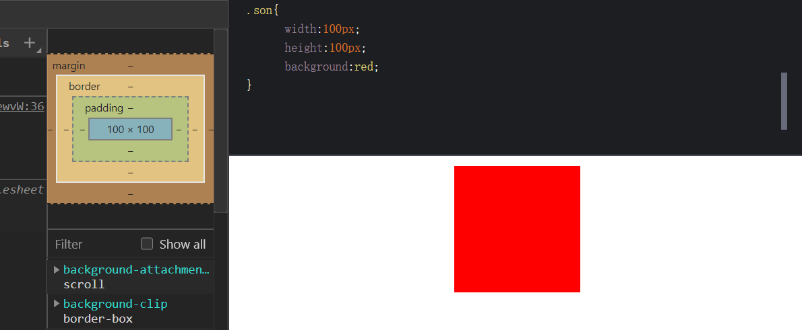

<TOC />

### 前言

以下一些题,均来各大小公司现场的真实笔试题,所有面试题都经过笔者一一验证,如有不足之处,谢谢读者指正和完善

### 第 1 题. 画一下盒子模型

它是所有布局控制的基础,虽然如今的前端是组件化开发模式,组件是一种对`html` 元素数据的封装

对原生 `html`标签元素的一种拓展,但底层核心依旧依赖`DIV+CSS`
::: details 点击可查看详情
盒子模型分为两种:**标准盒模型(w3c 标准)**和**非标准盒模型(IE 传统/怪异盒模型)**

**共同点:**:都是决定`html`标签元素在浏览器中如何进行布局,怎么显示,都是对元素计算尺寸的模型,拥有对`html`元素`width`,`height`,`padding`,`border`以及元素实际尺寸的计算关系

**不同点**:它们主要的区别在于元素的计算方式不同

- **标准盒模型(w3c 标准盒模型)**:一个盒模型包括 4 个区,分别是`内框`,`内边距`,`边框`,`外边距`,在指定一个元素的大小时,就是根据盒模型中的各个部分的大小来决定的
  

- **内盒尺寸计算**

  元素大小:宽度 = 内容宽度+内边距+边框(`width` = `width`+`padding-left`+`padding-right`+`border-left`+`border-right`)

  元素大小:高度 = 内容高度+内边距+边框(`height` = `height`+`padding-top`+`padding-bottom`+`border-top`+`border-bottom`)

- **外盒尺寸计算**

  元素空间宽度 = 内容宽度+内边距+边框+外边距(`width` = `width`+`padding`(左右内边距)+`border`(左右边框)+`margin`(左右外边距)

  元素空间高度 = 内容高度+内边距+边框+外边距(`height` = `height`+`padding`(上下内边距)+`border`(上下边框)+`margin(`上下外边距))

* **IE 传统/怪异盒模型**:

- **内盒尺寸计算**

  元素大小: 宽度 = 内容宽度(width 包含了元素的宽度+边框+内边距)

  元素大小：高度 = 内容高度(height 包含了元素的高度+边框+内边距)

- **外盒尺寸计算**

  元素空间宽度 = 内容宽度+外边距(width 包含了元素的内容宽度,边框+内边距)

  元素空间高度 = 内容高度+外边距(height 包含了元素的内容高度,边框+内边距)

综上所述: 在标准盒模型中,元素的宽度和高度仅仅包含内容的宽度,高度(不包含边框和内边距两个区域),而在怪异盒模型(IE 盒模型),元素的的宽度,高度含了边框,内边距

这样给 web 开发人员带来了很多麻烦

无论是哪种模型情况，最终都会触发标准盒模式

**解决办法**:在 css3 中增加了一个**盒模型属性 box-sizing**,它能够事件定义盒模型的尺寸解析方式,也就是可以通过属性值来决定盒子元素的计算方式,属性值有四个

```
box-sizing: content-box | border-box | inherit | padding-box
```

- **content-box**: 默认值,元素保持 w3c 标准盒模型,元素的宽度和高度(width/height)等于元素的边框宽度(border)+元素的内边距(padding)+元素的内容宽度或高度(content width/height)即(`border` 和`padding` 不算到`width`范围内)
- **border-box**:让元素变为 IE 怪异盒模型,元素的宽度或高度等于元素内容的宽度或高度,这里的内容宽度或高包含了元素的`border`,`padding`的内容的宽度或高度(即 `border` 和`padding` 划归到 `width` 范围内)
- **inherit**:此值会使元素继承父元素的盒模型模式
- **padding-box**:用来指定元素的宽度或高度包含内容的宽度或高度和内边距,但不包括边框宽度(将 `padding`算入`width` 范围)

总之,当设置为`box-sizing:content-box`时，将采用标准模式解析计算,当设置为`box-sizing:border-box`时,将采用怪异模式解析计算

`box-sizing`:主要用来控制元素的盒模型的解析模式,主要目的是控制元素的总宽度,标准盒模型中,默认就是`content-box`

**设置属性`box-sizing:border-box`时,给元素添加边框(border)和内边距(padding),都不会影响元素盒子的总尺寸，也就是不会把盒子溢出,不会影响布局,这个在移动端布局时,经常用**

而在标准盒模型下,一旦修改了元素的边框和内边距,就会影响元素的盒子尺寸,不得不重新计算元素的盒子尺寸大小,会影响到整个页面的布局
:::

### 第 2 题 如何让一个长度未知的图片水平和垂直方向均居中

元素水平垂直居中是 web 开发中常见遇到的问题
::: details 点击即可查看

- **方法 1-使用`transform` + `absolute`**

这个组合，常用于图片的居中显示，子元素设置绝对定位,父级元素相对定位,也可以将父元素 `wrapper`的相对定位，移入子元素`img`中，替换掉绝对定位。效果也是一样的,
html 示例代码

```
<div class="wrapper">
    
</div>
```

css 示例代码

```
.wrapper {
    width: 100%;
    height: 300px;
    border: 1px solid #ccc;
    position: relative;
}
.wrapper > img {
    position: absolute;  // 子元素绝对定位
    left: 50%;           // left值50%
    top: 50%;            // top值50%
    transform: translate(-50%, -50%);  // 利用transform变换,translate平移,水平,垂直方向上
}
```

- **方法 2-利用-table-cell**

利用 `table`的单元格居中效果展示。与 `flex`一样，需要写在父级元素上

```
<div class="wrapper">
    <p>itclanCoder元素水平垂直居中</p>
</div>

```

css 代码

```
.wrapper {
    width: 100%;
    height: 300px;
    border: 1px solid #ccc;
    display: table-cell;
    text-align: center;
    vertical-align: middle;
}
```

- **方法 3-使用弹性`flex`布局**

在实际开发中,很多元素的高度,宽度是不固定的,随着自身的内容撑大而撑大的,怎么让它在页面中实现水平垂直居中显示呢?

html 标签

```
<div class="wrapper flex-center">
    <p>itclanCoder元素水平垂直居中</p>
</div>
```

css 层叠样式

```
.wrapper {
    width: 100%;
    height: 300px;
    border: 1px solid #ccc;
}

.flex-center {     //在父级元素中,添加如下代码即可
    display: flex;
    justify-content: center;  // 水平居中
    align-items: center;      // 垂直居中
}
```

具体更详细元素水平垂直居中方法可参考[元素水平垂直居中]("../../fontend/css/elem-center.md")
:::

### 第 3 题-实现一个三列布局-两侧两列宽 100px-中间一列自适应

两列固定,中间自适应,或左边固定,右边自适应,都是属于圣杯布局
::: details 点击即可查看详情
html 元素

```
<div class="wrapper">
    <div class="left"></div>
    <div class="middle"></div>
    <div class="right"></div>
</div>
```

css 代码示例

```
.wrapper {
  display: flex;
}
.left,.right {
  width: 100px;
  height: 300px;
  background: blue;
}

.middle {
  flex: 1;
  background: red;
}
```

示例效果如下所示


具体更多圣杯布局内容可以[圣杯布局]("../../fontend/css/elem-center.md")
:::

### 第 4 题-两个 float 的盒子,都是左浮动,外边距问题

两个`float`的盒子,都是左浮动,盒子 A 的`margin-right`为 100px,盒子 B 的`margin-left`为 `200px`,问盒子 A 与盒子 B 之间的间距是多少

::: details 点击即可查看详情
html 代码

```
<div class="wrapper">
    <div class="box-a">A</div>
    <div class="box-b">B</div>
</div>
```

css 代码

```
.box-a, .box-b {
  width: 100px;
  height: 100px;
  float: left;     // 两个盒子都浮动
}

.box-a {
  background: pink;
  margin-right: 100px;  // 盒子A右外边距100px
}

.box-b {
  background:#abcdef;
  margin-left: 200px; // 盒子B左外边距
}

```

具体测试结果

::: details 点击即可查看

**答案**:A-B 之间的间距是 `300px`
:::  
**结论**:当元素横向方向外边距时,不会出现外边距迭代的问题
:::

### 第 5 题-外边距叠加的问题

两个普通的盒子,盒子 A 的`margin-bottom`为`100px`，盒子 B 的`margin-top`为`200px`,问 A 盒子与 B 之间的距离是多少
::: details 点击即可查看详情

html 代码

```
<div class="wrapper">
    <div class="box-a">A</div>
    <div class="box-b">B</div>
</div>
```

css 代码

```
.box-a, .box-b {
  width: 100px;
  height: 100px;
}

.box-a {
  background: pink;
  margin-bottom: 100px;
}

.box-b {
  background:#abcdef;
  margin-top: 200px;
}
```

具体测试结果


::: details 点击即可查看
**答案**:A-B 之间的间距是`200px`
:::
**结论**:当元素在垂直方向,两个相邻的元素之间增加上下外边距时,会出现外边距的叠加
:::

### 第 6 题 以下哪些设置可以使 z-index 生效?

考察点:css 中的定位结合`z-index`的使用

`z-index`需要在相对定位中使用(排除`position: static`),就是对标签元素设置了`position`的属性,并且属性为：`absolute`/`fixed`/`relative`/
值不一定就是`absolute`

父级元素设定了一个定位元素及其后代元素或 `flex` 项目的 `z-order`。当元素之间重叠的时候,`z-index`较大的元素会覆盖较小的元素在上层进行显示

也就是说:在相同层级元素同时设置了定位属性,给该元素设置`z-index`属性,可以设置元素的堆叠顺序,拥有更高堆叠顺序的元素总是会处于堆叠顺序较低的元素的前面
::: tip 提示
该属性设置一个定位元素沿 z 轴的位置，如果`z-index`为正数，则离用户更近，为负数则表示离用户更远,元素也是可拥有负的 `z-index` 属性值的
:::

```
A: position:relative
B: position:absolute
C: position: fixed
D: position:static
```

::: details 点击即可查看
答案: A B C
解析：`Z-index`仅能在定位元素上奏效,z-index 默认值是 0,仍然占据文档流的位置
:::

### 第 7 题 选择器优先级问题

如下示例代码,分别在行内样式 id,class 设置高度,最终`div`的高度是多少

```
// html
<div id="boxWrap" class="box-wrap" style="height: 100px"></div>
// css
#boxWrap {
  height: 20px;
}

#boxwrap.box-wrap {
  height: 40px;
}
```

::: details 点击即可查看
答案: 100px;
解析: 行间元素样式>内部样式>外部样式,id 选择器的优先级大于 class 选择器
:::

### 第 8 题 盒子模型相关问题

如下代码所示:

```
<div style="width: 100px; padding: 10px; margin: 10px;box-sizing: border-box;background: red"></div>

A: 80px
B: 100px
C: 120px
D: 140px
```

请问背景色为红色区域的宽度是多少呢?
::: details 点击即可查看
答案: B
解析: 盒子模型,设置了 box-sizing: border-box;属性后,表示遵循 IE 盒模型的计算方式,增加 border,以及 padding 大小,不会让盒子溢出，给元素添加边框(border)和内边距(padding),都不会影响元素盒子的总尺寸
:::

<footer-FooterLink :isShareLink="true" :isDaShang="true" />
