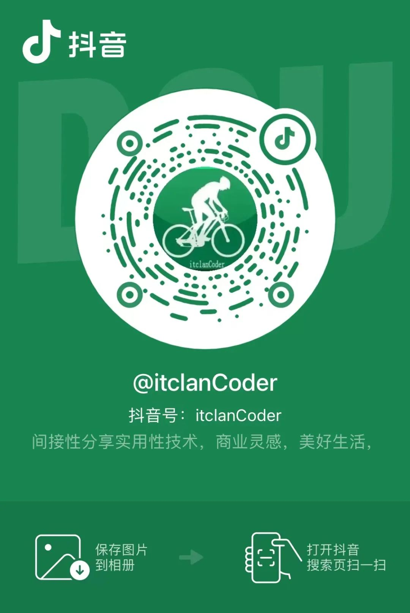
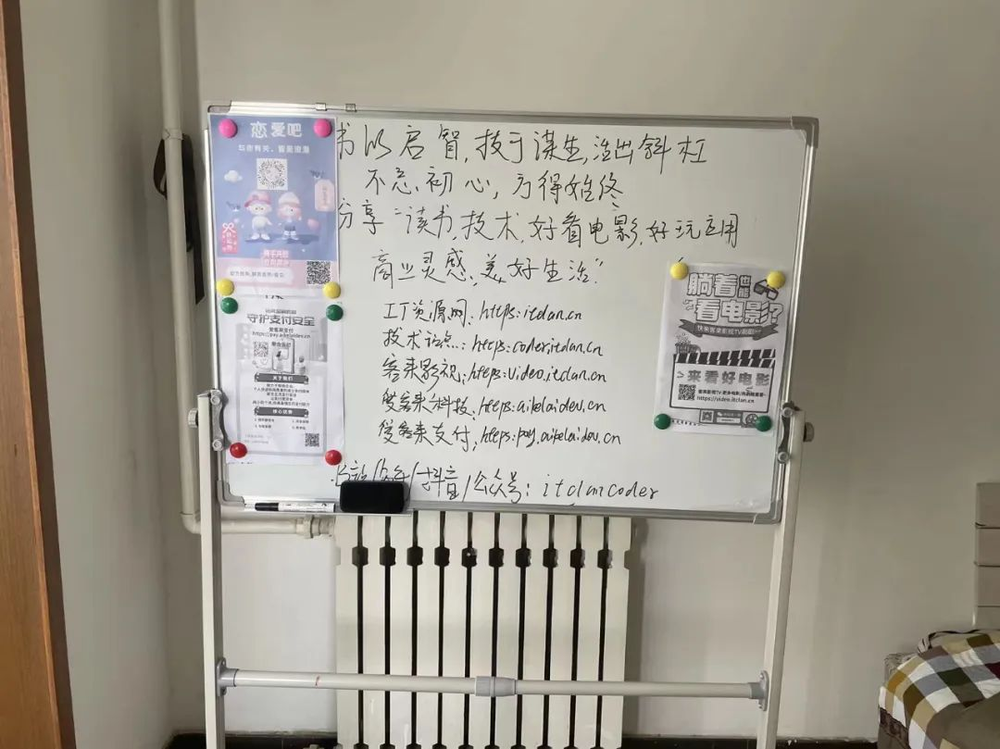

## 2022已过半，上半年回顾

不知不觉，2022已过半，**感叹时光的消逝，岁月无痕，我们终究每日不是匆匆忙忙，就是慌慌张张**

梳理一下上半年点滴，革命尚未成功，下半年仍需多努力

## 公司常态化运营

赶在2021年的岁末，成立了一家属于自己的公司，从公司注册，到开户，财务管理等自己亲力亲为

总得来说，过程还算顺利，并无太多阻碍

   

自己每天更多的也是去思考怎么才能开发更多离RMB更近的应用

毕竟，先要谋生存，然后在谋发展

除了尽可能的开源节流，降本增效，把更多时间精力投入到有意义，价值的事情上

利用自己的技术尽可能最大化的去变现，于是建了几个网站

* [IT资源网](itclan.cn)
* [爱客来科技](https://aikelaidev.cn)
* [爱客来支付](https://pay.aikelaidev.cn)
* [盲盒交友](https://mh.aikelaidev.cn)
* [客来影视TV](https://video.itclan.cn)
* [精品影视](https://tv.itclan.cn)
* [点赞应用](https://dianzan.itclan.cn)
* [客群基地](https://kequn.itclan.cn/app/index.php?i=2&c=entry&do=index&m=dc_sqjd&state=index&rand=68drdo&spread=0#/)
* [发卡商城](https://faka.itclan.cn)

和做了一些小程序应用
* 暖暖聊天恋爱话术
* 高情商聊天对话
* 暖暖聊天表情包
* 玩红牌等

也佛系的运营下自己小商店(itclanShop)

录了一些视频，有技术的，也有非技术的，也有生活的，总之记录的都是生活里的美好

* [关于script标签中type的使用](https://mp.weixin.qq.com/s/-RZm1O_F0BuhR37_az364w)

* [vuejs中如何使用mixin-局部混入/全局混入](https://mp.weixin.qq.com/s/tj4GJlA2PtTz1lb6mzKEiA)

* [唐山女子被打人事件-给我们什么警示-远离暴力,黑暗恶势力必须严惩](https://mp.weixin.qq.com/s/rU6kq6Rr4trjG5jKlk2_PA)

* [如何看待深圳宾利姐叫板劳斯莱斯事件呢](https://mp.weixin.qq.com/s/l1P8Yhk3bB0d4jotjRaTXw)

* [当遇到诈骗之后,我们应该怎么办?](https://mp.weixin.qq.com/s/djiM7JegJlcEvf2O6khOog)

......

如果你没有可直接或间接变现的内容，产品，一个完整得闭合回路

其实，注册与不注册公司并没有多大区别，意义，甚至它将是一种负担（毕竟每月都是有消耗的）

但如果放长远一点，把自己当作一个公司去运营，那么它就值得自己用心去做

因为你有着特殊的责任感与某种使命了的

生儿子易，养儿子难，离倒闭还有一天

但任何一家大公司也都是从小公司做起来的嘛

没有业务，那就尽可能的去拓展业务,没有条件,那就尽可能的去创造条件

谁还没梦想呢，万一你就是那个万中无一王呢,哈哈

曾经也想着，若能日入四五千，那就自己另起炉灶，与其给别人创造财富，在哪都是搬砖，打工,还不如给自己创造价值

  

然而，理想很丰满，现实是骨感的，总之还是要少吹牛皮，多读书，撸起袖子，加油干，就得了

发财的人永远都在闷声发财，是不张扬的

## 尽可能更多的去输出自己

从2022年开始，我开始在各大平台上露脸了的，尽管自知，长了一张不怎么帅气人见人爱的脸

但我仍愿意“卖力表演”，只希望多年后，回头在看看曾经的那个自己

把短暂的经历，所思，所感，以文字，视频的方式保留下来

心头涌上一句，我也曾年轻过，足以

不局限于文字，主要在抖音和视频号里，B站，知乎里更多是一些技术内容的输出

因为每个平台的调性是不一样的，抖音本身比较偏向范娱乐化，更多的是，消耗人们的饭后，闲暇时间

但是它的精准内容投放确实非常强大，抖音比你还更懂你

由兴趣内容驱动，千人千面，给你推荐

如果你想要自己的作品被平台系统识别，露脸只是基础，而持续性的生产优质内容才是关键

首先要更多的给平台创造有价值性内容，这个价值可以是给人带来“欢乐”，“情绪价值”，“知识科普”，“技术干货”等

反过来平台才会给你更多的流量，一个好的平台，是生产者与平台互利共赢双向的

为什么抖音比较火，要远超B站和其他平台，深受大妈，大小老百姓喜爱呢

一方面，对于内容的生产者有利可图，但凡人多的地方，必然会有交易，有表演者，也要有相对应的观众。

当我们浏览任何一信息，平台都会综合我们自己的行为，比如：停留时间，点赞，评论，关注等，进行打标签，统计，从而定制的给你精准推送

其实现在，任何人都可以多多的去展示自己，输出生活，表达态度，只要躬身入局，那么就会有意外，惊喜

抖音上粉丝不多，可以说少得可怜，但我依旧乐此不疲，95%都是陌生人

  

很多用户都是从抖音上，顺着网线找到我，然后进行交易的

所谓万万粉也不及几个精准粉，就是如此

我觉得，我们生处在这和平的好时代，是何其幸运，想想都2022年了，地球村的某处仍有战争，硝烟炮火，相比他们，我们是幸福的

有的人总抱怨我们的党和国家，喜欢以小示大，我觉得这是有偏见的，任何人都有缺点，国家也是

我觉得，有段话讲得很好，“如果你不觉得你的祖国不好，你就去建设它，如果你觉得政府不好，你就去考公务员去做官，如果你觉得人民没素质，那么从自己开始做一个高素质的公民，如果你觉得同胞愚昧无知

那么就从你开始学习并影响身边人而不是一味的谩骂，抱怨，诋毁，逃离所谓，横眉冷对千夫指，俯首甘为孺子牛

你若发光，身边便不黑暗，只要是向上走，不必听自暴自弃者的话，能做事的做事，能发声的发声，你就是那唯一的光，保持人间清醒就好”

所以，在平时生活当中，一定要远离那种消极，愤世嫉俗，各种PUA你的人

这种·pua·可以是他人不良的情绪，生活观，价值观等等

总之，若遇见，我觉得，避而远之即可

所以，我朋友圈里，基本上是看不到消极情绪的，尽管朋友圈常年处于关闭状态，其他人，其他事，与我何干

毕竟自己在别人那里，也没有那么重要，能常联系的人，一只手都能数得过来

只有我想看谁，就去看谁，偶尔，反手就是一个赞，三连击

每个人都有着自己的生活习惯，成年的世界，大家都挺忙的

你以自己喜欢舒适的方式去过就可以了

你，我，他都是独一无二的个体，没必要邯郸学步，保持特立独行，我觉得就挺好

就像那句“你说我是错的，那你最好证明你是对的”

可以给出建设性意见，但不要颐指气使，我自己就挺不喜欢好为人师的

更多的时候应该自我教育，所谓未经他人苦，莫劝他人善，就是如此

## 保持敬畏,多结善缘

自己除了做技术开发，还会运营闲鱼，和转转，期间总会遇到一些有意思的人

 

 

买卖虽小，即使不成，但仁义在，交个朋友也挺好，自己更多可能多的去满足对方

甚至，有陌生的网友，通过我的技术博客(https://coder.itclan.cn/)，或网站找到我，当遇到某些问题时，我依旧愿意远程的去帮助对方

难道，不买你的东西，不给你点赞，评论，三连击就是路人甲乙么

虽然有的人喜欢吃瓜，但就不喜欢三连击动作，难道就要进行道德绑架么，这显然是不对的

我一直都觉得，一路上，所遇之人，所见之事，无论美好还是糟糕，皆是一道靓丽的风景

遇坑爬坑，愈挫愈勇，就好

上帝给你关了一扇门，同时，也会给你打开一扇窗，始终保持敬畏，多结善缘是没错的

随着00后进入职场，社会，我发现现在的小孩子真是厉害，真是后生可谓，各种搞钱路子，思维，确实令你肃然起敬

以前人们总说90后是垮掉的一代，扶不起来的阿斗,然而你细看周围，发现，95%左右一线开发都是90后，都是年轻人，慢慢出现新旧更替，挑大梁了的

而对于00新千年后的小孩，它们真的非常活跃，不拘泥于现有的成就，各种搞钱路子，总能给你带来不一样的视觉和启发

一代比一代强,新鲜的血液,朝着更广阔的土地,推动着社会的发展，不是没有道理的

有些人，不一定很懂技术，但是他知道这种东西能搞钱，只要正经合法合规，那么就值得尝试去做

有人靠闲鱼，流量主等日入小几千，有人靠运营独立产品日进斗金，有人靠自身才华，技术，摇身一变，在知识付费的领域里，弄得风声水起

我们所见厉害之人，必有厉害之处

我觉得，始终保持欣赏，多去挖掘对方的优点，多学习下，将对方优秀的能力尽可能最大化迁移到自身上，为我所用，就可以了

## 上半年尚未成功,下半年仍需多尽力

很多事情，之所以令人烦恼，焦虑，一定程度上是未能满足自己，达到预期望值

陈列出烦恼，解决焦虑，就可以了

比如：没有女朋友就大胆的出去交往，多社交

如果没有被吸引，单身的日子，尽管多提升自己就可以了

看看最近东方甄选的董宇辉老师，腹有诗书气自华，谈吐交流皆是智慧

在没有被网友知道之前，所有的曾经，过去，尽是暗淡无光，曲折蜿蜒，但终究还是挺过来了

如今，在聚光灯下，依旧能保持自我，不失谦逊，可谓是人间清醒

从他身上,让我们学到,读书与不读书之间的差距,举手投足,谈吐皆是一道光

谈得了人文历史,又识得人间烟火

尽管我们成为了不了他,也不可复制,但也警醒我们自己,平时还是要多点书,平时的言行举止,都藏着自己读过的书

没有对比，就没有伤害，不可否认，我们人与人之间是存在差距的，就像清华，北大也不是你说努力，靠拼命，说能考上，就能考上的

承认自己智商被碾压，不如人，也并没有什么

有人连续三年，年年考进北大，有人日复数年，死磕到底，也难圆北大梦

这里我没有嘲讽，也没有鄙视之意，但凡为梦想而努力，都是值得令人尊敬的

时间是最宝贵的，我觉得每个人都有着自己擅长的领域，了解自己，在自己的能力细分领域中找到一个支点

借助现有的平台，持续深耕，好风凭借力,是能上青云的

我最近读到一本自己觉得还可以的书《精要主义》

终归来说，就是“把时间和精力投入在有意义价值的事情上”

精要主义所推崇的，不是如何完成更多的事情，而是如何做好对的事情

它也不是提倡为了少做而少做，而是主张只做必做之事，尽可能做出最明智的时间和精力投资，从而达到个人贡献峰值

有时，得停下来问问自己：“我现在做的这些事情值得我投入时间和精力吗？

不要一味的追求加法，而是努力做减法

学会区分差异——过滤筛选所有选项，并从中择优先级，有选择性的去做或不做

这就像，我坚持做了一件事情很久，付出与收获完全不对称，而这个东西又很难去变现

有些自己所看好的东西，可能自己觉得很有钱景，有人愿意买单，但往往事与愿违，而有些不起眼的，反而备受追捧，深受喜爱

有些东西，是反人性的

很显然，对于未来，我们永远都是未知数

对于事后诸葛亮，马后炮,对酒当歌，人生几何，都是纸上谈兵

对于2022年下半年，依旧破釜沉舟，坚持技术学习，努力做好每一次分享，多多的去探索和做一些离RMB更近一点东西

不为悦人，只为悦己

 

革命尚未成功，仍需多尽力.

最后，也希望你，我在这个物欲横流的时代，百般皆下苦，维有奋斗是甜.乾坤未定，你我皆黑马，加油！

<footer-FooterLink :isShareLink="true" :isDaShang="true" />