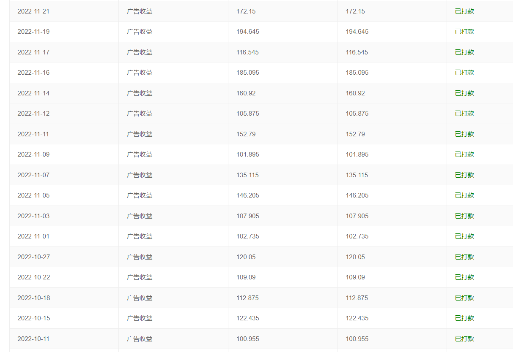
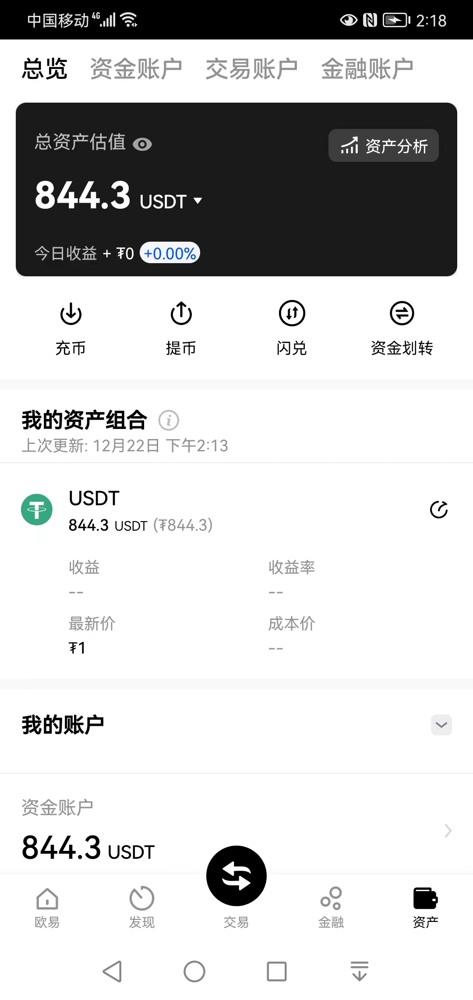
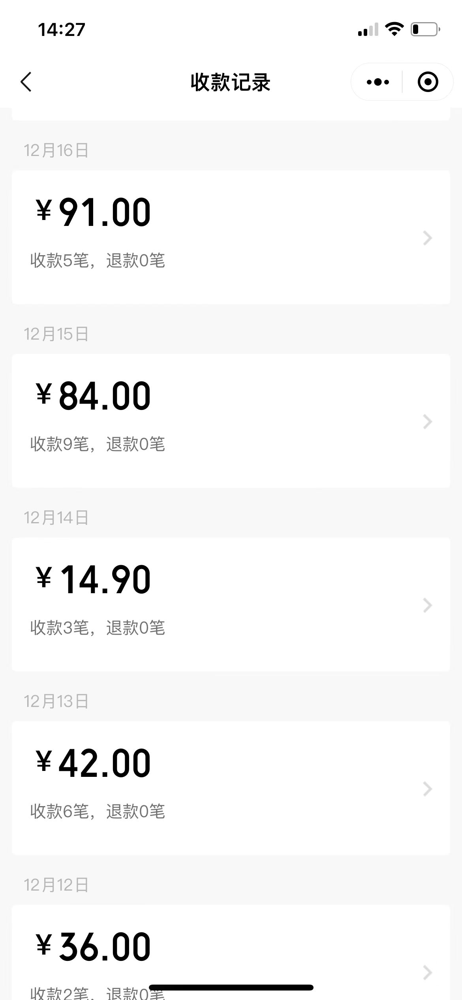
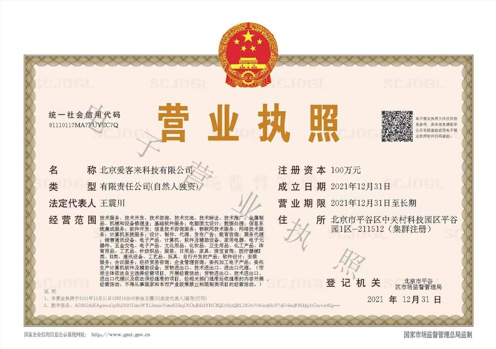
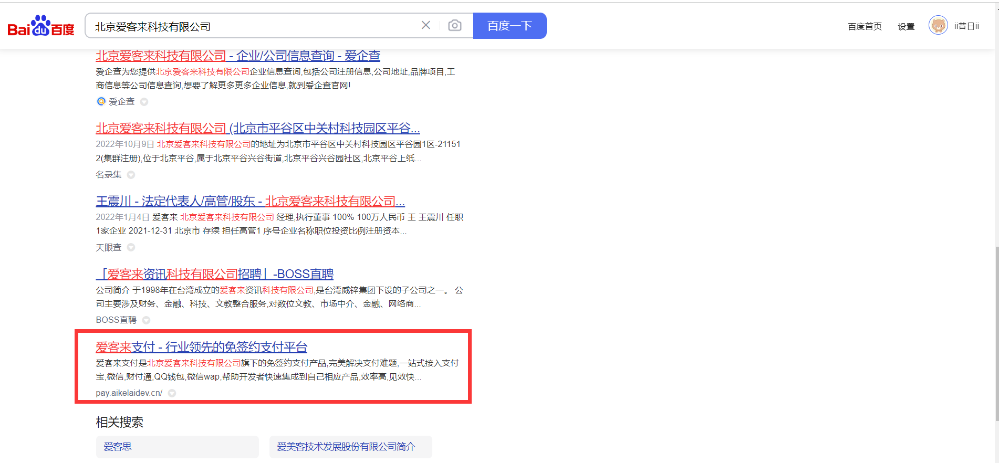
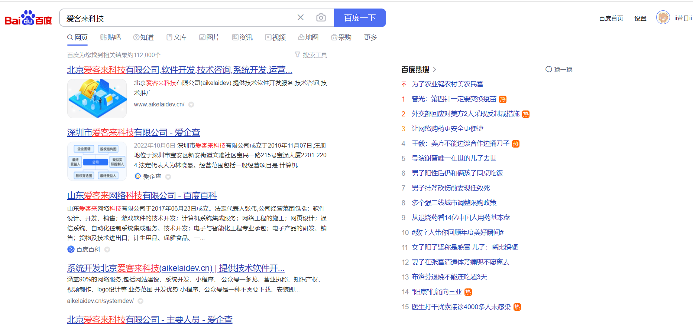
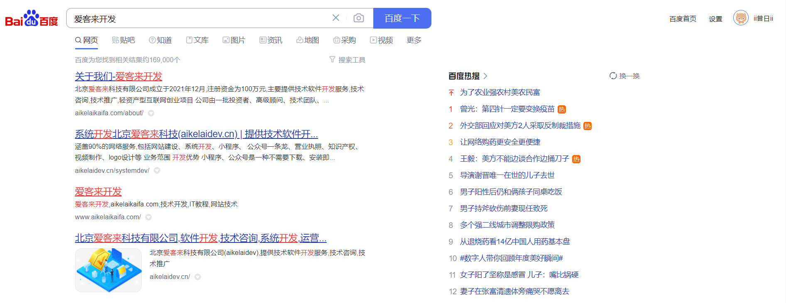

## 2022-忙碌的一年

## 快速导航

<TOC />

## 前言

花有重开日,人无再少年.每当这个时候,回头驻足,不是感慨万千,就是惜时如金,一年悄无声息的从指尖划过,星海横流,岁月如碑.那些被偷走的时光,发生了大大小小的事

无论是平淡无奇,还是历久难忘,有惊喜,有遗憾,终将都会隐入尘烟。大到国家,小到独立的个体。柴米油盐酱醋茶皆是人间烟火与故事,无论每天是喜是悲,时间都会推着我们前进

如果用一个字表达一下自己即将逝去的2022,那就是"忙",如果用几个字概括下,那就是"找方向,抓重点,多搞钱",万事排后,搞钱至上

相比以往,从前,多了几份坚韧,不骄不躁,心存敬畏,因为相信,所以看见。

##  找方向,抓重点,多搞钱

今年是非常关键的一年,也是难熬的一年,青春那么短,疫情就占三年。大家或多或少都能切身感受得到,工作没以前那么容易了,钱也没那么好挣了

曾今香饽饽的互联网也逃不过时代趋势的冲刷,风口过后,看谁在裸泳,从腾讯说自己只是一家普通的公司,到整个腾讯新闻都可以砍掉,你员工都快活不下去了,周末还有时间休闲打球,华为要把活下去作为主要纲领,把寒气传递给每个人,整个互联网行业都在降本增效,艰难过冬

[1]. 活下去,比什么都重要,不要谈情怀和理想,画饼充饥
[2]. 不要讲故事,要讲究实现
[3], 抓紧时间搞钱,哪里有钱就在哪里多赚一点

尽管大环境在怎么不好,也不至于影响到独立的个体,但雪崩之下,没有一片雪花是无辜的,就像最近放开的政策,不要五十步笑百步。无知与弱小不是生存的障碍,傲慢才是

如果有心,你会发现,很多同学,今年,莫名其妙突然的被毕业,这不论你是清北毕业,还是海归的,那些边缘不挣钱的业务最终都会被优化掉,即使挣钱的业务,也会大刀阔斧,尽可能最大化的让软件智能化,在无人化的情况下,也能二十四小时不间断的工作。

曾今,那些盲目扩张,砸钱,砸人,画个饼,写几页ppt就能拿到融资的日子,已经一去不复返。

工作这几年,深知互联网这行业的优胜劣汰,不得不承认,软件的尽头是智能化,知识付费的尽头是卖课,互联网的尽头是广告,电商的尽头是直播带货...

改变个人收入结构:不依赖工作收入,多渠道,多方式的增加场外睡后挣钱能力

于是每天只关心的几件事情

[1]. 银行卡上有没有进账,进账了多少
[2]. 我今天完成了多少事情,哪些已完成,哪些未完成,重要能搞钱的事情先做,次要不紧急的事情往后排
[3]. 除了当下这些,我还能做哪些事情,是可以增加收入的(包括隐性(间接)和显性(直接)的)

**当每天把心思花在如何搞钱,如何提升自己身上,你会发现,哪有什么精神内耗,哪有什么焦虑的**,这时候,任何事情都是影响不了自己的,其他人,其他事,跟自己又有什么关系的呢

当自己看到账上每一分每一秒,时时刻刻都在进账,它不会因为你停止工作,而就停止进账,反而,没有进账,才会令自己感到不安,我想,没有什么比这个更兴奋的,而那些曾熬过的夜,沉浸的时光,一切都是值得的

   

   

   

   

   

我们终日不是匆匆忙忙,就是慌慌张张,为得是这碎银几两,但它却总能把我们拿捏得死死的

今年做了很多个网站和小程序应用,场外变现收入这两大部分贡献最大

* [IT资源网](https://itclan.cn)
* [爱客来科技](https://aikelaidev.cn)
* [爱客来支付](https://pay.aikelaidev.cn)
* [客来影视TV](https://video.itclan.cn)
* [精品影视](https://tv.itclan.cn)
* [客群基地](https://kequn.itclan.cn/app/index.php?i=2&c=entry&do=index&m=dc_sqjd&state=index&rand=68drdo&spread=0#/)
* [发卡商城](https://faka.itclan.cn)
* [爱客来开发](https://aikelaikaifa.com)
* [人人领读](https://renrenlingdu.com)
* [IT资源导航](https://nav.itclan.cn)
* [客来游戏](https://game.itclan.cn)
* [缩短网址](https://short.itclan.cn)
* [前端资源导航](https://frontend.itclan.cn)
...

和做了一些小程序应用

* 暖暖聊天恋爱话术
* 高情商聊天对话
* 暖暖聊天表情包
* 玩红牌
* 最佳星座配对
* 静神木鱼
* wifi共享密码
* 卡密生成器
...

基本上做的小程序,也都已经开通了流量主,苍蝇再小,但也是肉

总归来说:收入=网站+小程序+广告收入+自媒体收入(视频号+抖音号/西瓜视频+公众号)+其他(技术咨询,应用搭建)

往后的方向,更多的也是做网站,小程序应用,拥抱各种互联网能变现的方式,不给自己设限,但凡离钱近的可变现的都值得自己去折腾

## 任何时候都需要有ABZ计划

今年是有遇到一些糟糕的事情的,上半年遭遇一次诈骗,人生第一次在警察局里做笔录,备案,有些钱出去容易,想要在追回来,那是真难,最后,也都是不了了之

至此往后,都会保持各个财务账号的独立,分开管理,也就是鸡蛋不能放在同一篮子里,在任何时候都需要这样,也要保持数据备份的好习惯

下半年,公司对公基本账户,因为频繁进账,遭遇被冻结销户,微信商户号遭永久封禁，网站被入侵,24小时,不间断的被攻击,小程序被下架等

没有了对公基本账户,但因自己爱折腾,在拥有一个基本账户的同时,又开了一个企业支付宝的一般账户,能够非常快速的对接现有的业务,保证不被中断.

针对网站的恶意攻击,也促使自己学习了一些网络安防知识技能,应对网站的突变事故,可以在第一时间知道如何的去处理,运维真的是一件不简单的事情

从自己经历过的一些事情和事故当中,也让自己意识到`A`,`B`,`Z`计划的重要性

`A`: 现有的生存条件以及生存能力，这是维持现在生活乃至更好生活的保障

`B`: `A`计划的替代方案,如果需要改变目标或实现途径，就需要把重心转移到`B`计划上来

`Z`: 除了`AB`之外的,最后一条兜底计划

这就像,网站服务器被黑了,那么找出漏洞,加固,在不行就执行B计划,换服务器,还不行,就换域名,用最低的成本寻找可替代方案的

其实,在职场当中,更应该如此的,在这个充满不确定性的时代,有时,是需要身在曹营,心在汉的。

## 选择比努力更重要

十年前刚上大学,十年的十年前还在上小学,如今,已是而立之年,严重低估了时间的善变与消逝,才轻易让原本浓烈的东西翻了篇,一不留神,即将进入奔四的年纪

人越长大,越不喜欢热闹,这是真实存在的,我自己是比较喜欢独处的,但这并不意味着不合群,只是不喜欢叨唠,无效社交与精神内耗,个人崇尚简单

生活里的琐碎,吐出来的矫情,吞下去的沧嗓子,百般滋味涌上心头,话到嘴边却不值得一提,仿佛,词穷不是沉默，而是一言难尽,那些人际关系也变得异常脆弱,看得云清风淡。一句,你若安好,便是晴天。足以。

有时,那种压力不单单是来自职场,也来自家庭,社会,看着父母一天一天的变老

在该有的年纪,缺乏该有的成就,可以接受自己平凡,但拒绝自己碌碌无为,心中那种愤懑,瞬间气打不一处来。然并卵..

解决焦虑最好的方式就是直面焦虑,解决问题的最好方式就是直面问题。

都说成年人的崩溃,是从缺钱开始的,如今,拥有一份好的工作,仍然是不够的,即使在大厂,但依旧暗淡无光,最终的目的就是变得要有钱

如果说,在25-30岁的年纪是找一个好的公司,不断摸索,扎实技术,沉淀自我,那么30岁后的自己,就是找到一个属于自己的方向,做自己想做的事,并且致富要趁早

善用手里拥有的变现技术,结合脑子里不断冒钱的想法,外加持之以恒可落地的执行力,我想在不久的将来,会实现弯道超车,自己所期盼的也会一一实现

如果给自己定一个年入100个w的目标,那么每天需要日进账`2739元/天`,如果是年入500个w,那么每天需要日进账`13698元/天`,以此类推

只需要不断的去接近它就可以了的,将任务目标进行拆解,并多渠道,多方式,聚沙成塔就可以了的

2022一整年,都是在折腾的,当然，技术文章写得少了,离钱近的应用变多了的,一些零零散散的技术记录放在了自己的[itclanCoder](https://coder.itclan.cn)博客上

公众号`itclanCoder`粉丝数,也即将破万粉,微信视频号也具备了商业化变现,西瓜视频,抖音号也具备参与中视频伙伴变现计划

相比分享技术,我更喜欢去分享一些自己技术代码之外的东西,有时,是自己看到的一本好书,或是一部好电影

随着年龄的增长,越长大,越能切身感受到,选择方向要比努力更重要,就像同样是做自媒体,有人做公众号能日涨粉丝过千,有人却原地踏步,几年都不过百

一定要相信,所有的结果都是有原因的,追本溯源,有时,并不是内容不够好,而是本身的内容受众人群就有限,在一个错误的方向上,不断的发力,最终只会日渐疲惫,渐行渐远

在这个内卷的时代,真的是这样,要么你卷别人,要么就被人卷,三代人,总要有一代人,要实现逆风翻盘,有一段话,我觉得讲得实在

“爷爷不努力,爸爸就活的很艰难,爸爸不努力,你就活的苦逼;你自己不努力,你儿子又要重头开始”,血脉精神的传承就像是一场接力赛

有时,你会发现,家境越是好的家庭,它越是重视教育的,都说父母是最好的老师,言传身教,除了基因会遗传,习性和品质,观念也都是会影响的

如果爸爸得过且过的混日子,那么儿子的人生就会被拖累,物质匮乏,精神紧张。

每一代的家庭中,只要出现一个拖油瓶,至少会让一个家庭的发展速度慢5-10年,碰到那种超级拖油瓶,有可能会拖累一辈子,让本不富裕的家庭变得雪上加霜

所以一个家庭总得要有一个敢于破局的颠覆者,否则永远会活在贫穷与痛苦的宁潭中不能自拔,互相抱怨,伤害,怨天尤人,变得永无宁日

所以,抓紧时间搞经济建设,就够了,那些所谓的社会地位,气质,看山,看海,看世界,都是可以用RMB堆出来的

## 关于搞钱产品的一点看法

虽说互联网日薄西山,但只要有网民,那永远就不会衰落,只不过是换了个马甲,偷换个概念继续收割,只是载体和形式在不断在与时俱进,变化

但凡离钱近可变现的东西都值得自己坚持做,一个好的可变现的产品固然重要,但好的策略就是锦上添花

这个产品,可以是一个网站,一个小程序,或App等,也可以是可变现的自媒体账号

一个产品能够赚钱,那很好,但不是每个产品或平台都有这个变现的超能力,只要复制这个策略就行了

建立第一个成功的模型,是非常重要的,赚小钱,靠勤,赚大钱,就是对这个成功模型不断的复制化

[1]. 成功的模型,并不需要一次性赚到太多的钱,而是一个可复制的模型就可以了的

[2]. 不一定需要依靠自己想到这个成功的模型,如果你能够借别人的经验和智慧想到,同样也是一种成功

[3]. 尽量是已有前车之鉴,而不要自己全新思考的机会,否则自己做的就是一个伪需求

这个世界,并不需要太多的创新,一抄,二改,三创新,就是最快的方式。连马斯克都要抄微信,我们普通人就更不用说了的

搞钱没有捷径可走,我觉得,千万不要被"今天买房",明天买车的致富经洗脑",生活由简入奢是比较容易的,但反过来却是很难,饱暖思淫欲就是头顶上达摩克斯剑,踏踏实实走好每一步,保持人间清醒,那些外在的东西,硬件产品,最终都是会一一实现的

相比掌握,钱生钱,利滚利,持续生财的模式,工具,才是最无比珍贵的,**真正的奢侈品是自己的资产所产生收益对自己额外的一种奖励**

## 一些不足与改进

一个好的产品,从调研,设计,开发,运营,推广,中间每一个环节都是重要的,有时,运气也很重要,有些东西,越是推广,反而越是做不起来

而摆烂的东西,反而出其的增长很快,还是要对市场保持敬畏

在新的一年我觉得要多分一些时间精力去推广,主要通过以下两种方式

[1]. 自身自媒体账号的营销宣传

[2]. Google广告(google广告的精准用户推广是真的很强)

[3]. 其他(百度,抖音等)

在未来几年内,都会围绕这几个关键词去做:情感,虚拟资料,副业,情商,两性,读书

而且只做年轻人的生意

这几个关键词,其实,每一个都值得去探索,深挖,就像情感类的,暖暖聊天恋爱,高情商聊天对话,这块市场需求是非常庞大的

而自己主要建设搭建的流量渠道,主要通过以下两种

[1]. 文字,音频

[2]. 短视频

我只需要不断打磨自己,反复打磨内容,和优化,提高转化率,剩下的就是交给软件程序,工具就可以了的

## 关于未来的一些期盼与规划

时间真的是超级快,不知不觉公司已经成立一周年了的

    

坚持写公众号的第6个年头,持续写了6年的年终总结,记录了每一年里的心路历程与变化

还好,没有放弃,已经把记录当成一种习惯,与时间自我的对话，无愧于心 不畏于行。

1人1公司,没有倒闭,有稳定的客户群体,现金流,虽然没有达到自己的预期,但至少活了下来,而且能自给自足

        

        

        

回头在看年初里的一些计划,都是啪啪打脸的,计划想象往往很美好,但不得不认清现实,放弃幻想

其实,只要把当下过好,那么过去串起来的每一天都会使未来变得更好。我们真的没有办法预测未来,对于惊喜和意外不知道哪个先到

唯有过好当下,就可以。就像曾今的大佬(司徒正美)不知不觉已经离开两年多了的,疫情反反复复,能持续这么久,最终躺平,优胜劣汰,逃不过自然法则,各拼免疫力

无论这一年怎样,至少挺过来了,之前看到人民日报有一段话,深深被鼓励到了的

"如果你觉得自己还不够强大,就暂时把自己藏起来,不断的去学习,去经历,提升阅历和能力都是铺垫,在无人问津的地方,夜以继日的历练,无问西东.

然后,在万众瞩目的地方出现,自己要做的事情,实现的想法,就安安静静的去做,把想法,付诸于行动,不用到处宣扬自己的想法值不值得,也不用逢人就讲

事实证明,时间就是最好的检验

一个真正的强者不是不流泪的人,而是含着眼泪继续奔跑,每天你所做的事情，也许暂时性的看不到什么结果，也未必能如愿，不必高估，也不必灰心，位低，不卑躬，位高，不膨胀。总有一些时光是沉寂的，种一棵树最好的时间是在十年前，其次是现在。

终日平淡无奇，没有波澜壮阔，不是没有成长，那是在扎根

人生沟沟壑壑,身在低谷,不抱怨,不放弃,那么往后余生都是向上的路

有时,挫折也是一种成长,就让暴风雨来得更猛烈些吧，历经磨难,才能顶峰相见，就像2022卡塔尔世界杯阿根廷夺冠之路,初战爆冷,犹如晴天霹雳,然而往后的每一场比赛都当做决赛去拼,当大家极致的渴望得到一件东西的时候,那么就会想方设法,拼尽全力去争取

全世界都希望梅西夺冠,卫冕球王，最终胜利的天平,好的运气都会倾斜那些努力,不抛弃,不放弃的人,因为相信,所以看见

最后,也希望你,我,不畏将来,往后余日,日富一日,日渐精进，守得云开见月明,加油！

<footer-FooterLink :isShareLink="false" :isDaShang="true" />

