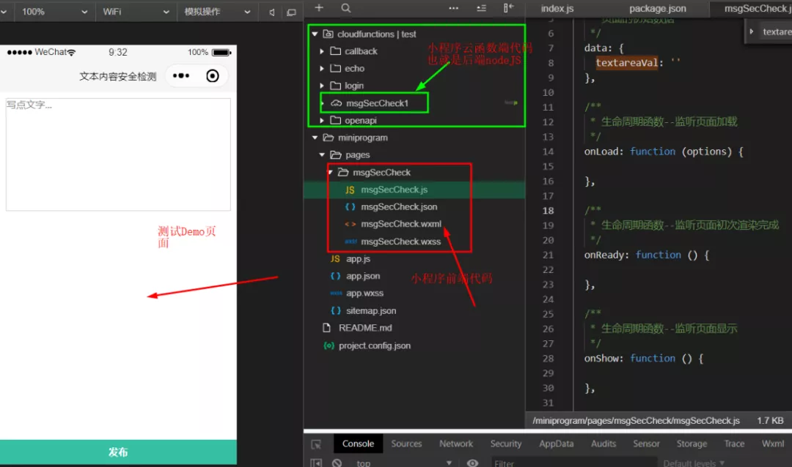
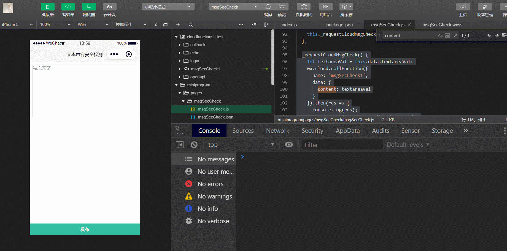

## 小程序-云开发-如何对敏感词进行过滤即内容安全的检测(上)

## 快速导航

<TOC />

## 前言

内容安全检测，是每一个小程序主都面临的“头疼”问题，轻则短暂性不可访问，重则永久封号，甚至关小黑屋。本文将为您详细说明，如何在小程序中对一段文本进行合法内容检测，以判断是否含有违法违规内容。
本文重点为你讲述：

- 内容安全检测常见应用场景及解决办法
- 学会使用小程序·云开发的云函数+结合`request-promise`第三方库实现内容请求校验
- 掌握如何在小程序端请求云函数（有别于传统的`wx.request`的方式(类似 AJax)）
- 在云开发的云函数端,利用第三方 https 请求库(request,request-promise),获取 Access_token,以及向微信官方提供的内容检测接口发请求进行校验
- 云函数端与小程序端错误码的处理

## 背景

无论是小程序还是自行开发的一些类似社交,带有用户自行产生内容的软件应用,例如:即时通讯,社群,论坛,音视频直播等,对于接入内容安全的检测是非常有必要的。

对于小程序而言,这一点在审核上是非常严格的,净化言行,做一个知法守法的人很重要...

<div align="center">
 
</div>
接入内容安全检测,规避输入一些违法违规低俗等内容,避免辛辛苦苦开发出来的应用。

被恶意上传反动言论或上传一些违规内容(文字/图片/视频等),导致小程序或应用被下架,或遭永久禁封,或个人及公司被公安机关打电话,约喝茶等,这样的话,就得不偿失了的

## 应用场景

- 检测小程序用户个人文字资料是否违规
- 针对特点词汇（如过于商业以及营销之类的词）可以进行过滤或禁止输入
- 在内容发布之前自动检测用户发表的信息（包括评论、留言等）是否违规

## 解决办法

围绕如何处理内容安全检测问题，一般有 3 种方法：

- **方案 1**:引入第三方接口对内容进行校验(例如:百度 AI 内容审核平台,网易云盾等)

  - **优势**: 前端同学只需按照官方提供的第三方接口文档,进行校验即可,无需后台介入,功能强大,覆盖范围广
  - **劣势**: 接口调用的频次有限制,收费

- **方案 2**: 公司后台小伙伴自行开发文本,图片,音视频等内容审核接口
  - **优势**: 后台小伙伴自己造轮子,根据自己的业务需求以及用户属性,自定义内容审核机制
  - **劣势**: 开发周期长,成本大,难以覆盖全面
- **方案 3**: 小程序服务端提供的 API 进行校验
  - **优势**: 简单,高效
  - **劣势**: 想不出来,因为相比前两种方案,对于不依赖后端接口的开发者来说,简直是雪中送炭

**在微信小程序生态下，官方提供了 2 种路径帮助用户解决内容检测问题，即**

- 使用服务器开发模式，通过 HTTPS 调用
- 使用小程序·云开发，通过云函数或云调用来实现。

服务器开发模式，相信大家都相对比较熟悉，在此就不再赘述。接下来为大家重点介绍，如何通过小程序·云开发的云函数实现内容安全检测。

## 通过云开发的云函数+request-promise 第三方库实现内容请求校验

### Step 1: 在小程序端先布局：完成静态页面

`pages`文件夹下的文件都是属于小程序前端代码,每个文件夹目录代表的就是一个模块,一个页面

小程序前端 wxml 代码示例

```html
<view class="container">
  <textarea
    class="content"
    placeholder="写点文字..."
    bindinput="onInput"
    auto-focus
    bindfocus="onFocus"
    bindblur="onBlur"
  >
  </textarea>
</view>

<view class="footer">
  <button class="send-btn" size="default" bind:tap="send">发布</button>
</view>
```

小程序前端 wxss 代码示例

```css
/* pages/msgSecCheck/msgSecCheck.wxss */
.container {
    padding: 20rpx;
}

.content {
    width: 100%;
    height: 360rpx;
    box-sizing: border-box;
    font-size: 32rpx;
    border: 1px solid #ccc;
}

.footer {
    width: 100%;
    height: 80rpx;
    line-height: 80rpx;
    position: fixed;
    bottom: 0;
    box-sizing: border-box;
    background: #34bfa3;
}

.send-btn {
    width: 100% !important;
    color: #fff;
    font-size: 32rpx;
}

button {
    width: 100%;
    background: #34bfa3;
    border-radius: 0rpx;
}

button::after {
    border-radius: 0rpx !important;
}
```

经过 wxml 与 wxss 的编写后,UI 最终长成这样

<div align="center">

</div>

### Step 2: 完成小程序端业务逻辑的处理

小程序端逻辑 JS 代码示例

```js
// pages/msgSecCheck/msgSecCheck.js
Page({
  /**
   * 页面的初始数据
   */
  data: {
    textareaVal: '', // 页面中需要显示的数据,初始化定义在data下面
  },
  /**
   * 生命周期函数--监听页面加载
   */ onLoad: function(options) {}, // 监听表单时,数据有变化时
  onInput(event) {
    let textVal = event.detail.value;
    this.setData({
      textareaVal: textVal,
    });
  }, // 聚焦焦点时

  onFocus() {
    console.log('聚焦焦点时');
  }, // 失去焦点时

  onBlur(event) {
    console.log('失去焦点时'); // 前端可进行手动的弱校验,也可以在失去焦点时发送请求进行文本的校验,但是每次失去焦点就请求一次,这样是消耗云资源的,在发布时候与失去焦点做校验两者都可以
  }, // 发布

  send() {
    console.log('触发发布按钮');
    wx.cloud
      .callFunction({
        // 请求msgSecCheck1云函数
        name: 'msgSecCheck1',
        data: {
          content: this.data.textareaVal, // 需要向云函数msgSecCheck1传入的值
        },
      })
      .then((res) => {
        // 成功时的响应返回结果
        console.log(res);
      })
      .catch((err) => {
        // 失败时,返回的结果
        console.error(err);
      });
  },
});
```

### Step 3 ：服务端逻辑处理

在小程序云函数端创建云函数`msgSecCheck1`,这个名字你可以自定义,与小程序前端请求的名字保持一致就可以了的

<div align="center">

</div>

选中云函数,右键并打开命令行终端安装`request`,`request-promise`，因为`request-promise`依赖于`request`,两个都要安装,最后一键上传部署就可以了的

```js
npm install request
npm install request-promise

```

如果遇到在小程序端请求云函数时,遇到类似下面的错误,找不到什么 xxx 模块之类的 先看错误码,然后在官方文档中找到该错误码代表的含义

<div align="center">

</div>

一看错误,没有找到模块,在云函数的目录下的 package.json 中查看是否有安装错误中提示的包的,要是没有的话,就安装一下就可以了的,同时记得每次更改后都要上传部署一下,也可以选择云函数中文件的增量上传

**接下来是将是本文的重点内容**

### Step4: 通过云函数+request-promise 实现内容安全检测

对于小程序开发,其实与 web 端开发也是类似,给元素绑定事件,然后获取元素,只是小程序端没有 DOM,BOM 的那一套东西,它是数据驱动视图的,吸收了 Angular,Vue,React 的各个框架的优点,形成了自己的一套规范。

如果有这方面开发经验的小伙伴来说,平缓过度到小程序开发当中来,你会发现总会有惊人的相似,用的语言都是 JavaScript,但是与 web 开发还是多少有很多差异的,这里就不拓展了。

废话不多说,直接上代码

小程序前端逻辑代码

```js
// 点击发送按钮,对输入的文本内容进行校验
 send() {
    wx.cloud.callFunction({
      name: 'msgSecCheck1', // 云函数的名称
      data: { // 需要向云函数传递过去的数据
        content: this.data.textareaVal // 具体要检测的内容
      }
    }).then(res => { // 成功时,做什么事情
      console.log(res);
      // 检测到文本成功时,做一些业务

    }).catch(err => { // 失败时,做什么事情
      // 失败时,也就是违规做一些用户提示,或者禁止下一步操作等之类的业务逻辑操作

      console.error(err);
    })
  }

```

上面的代码还可以在优化一下,就是将请求云函数的代码封装成一个函数。

如下所示,不封装也是没事的,只是我习惯性封装一下,如果其他地方也用到该云函数,那么直接调用，避免写重复的代码。

下面是将请求云函数的部分核心代码

```js
// 发布
  send() {
    // 请求msgSecCheck1云函数,对文本内容进行校验
    this._requestCloudMsgCheck();
  },

  _requestCloudMsgCheck() {
    let textareaVal = this.data.textareaVal;
    wx.cloud.callFunction({
      name: 'msgSecCheck1',
      data: {
        content: textareaVal // 这里可以使用官方文档测试用例,特3456书yuuo莞6543李zxcz蒜7782法fgnv级
      }
    }).then(res => {
      console.log(res);
      // 检测到文本成功时,做一些业务
    }).catch(err => {
      // 失败时,也就是违规做一些用户提示,或者禁止下一步操作等之类的业务逻辑操作
      console.error(err);
    })
  }

```

至于是在失去焦点事件时发送请求还是在点击发送按钮时发送请求,两种方式都可以。
您也可以自定义文本校验,而我个人觉得在小程序端,失去焦点时,可以自定义做一些常规敏感词的弱校验,而在点击发送按钮时,做强校验

如果是放在失去焦点时就立马请求,这样请求次数会增多,而放在点击发送按钮时进行校验,一定程度上可以减少小程序端频繁请求。

接下来就是处理云函数端,使用`request-promise`请求请求微信内容安全接口的示例代码

```js
/*
 *  Description: 利用第三方库request-promise请求微信内容安全接口
 *
 * 相关文档链接:
 * 微信文本内容安全接口文档https://developers.weixin.qq.com/miniprogram/dev/api-backend/open-api/sec-check/security.msgSecCheck.html
 * access_token获取调用凭证文档
https://developers.weixin.qq.com/miniprogram/dev/api-backend/open-api/access-token/auth.getAccessToken.html
 *
 * request-promise使用文档: https://github.com/request/request-promise
 *
 */

const APPID = 'wx21baa58c6180c2eb'; // 注意是你自己小程序的appid
const APPSECRET = ''; // 你自己小程序的appsecret
// 安全校验接口
const msgCheckURL = `https://api.weixin.qq.com/wxa/msg_sec_check?access_token=`;
// 向下面的这个地止发送请求,携带appid和appsecret参数,获取token认证
const tokenURL = `https://api.weixin.qq.com/cgi-bin/token?grant_type=client_credential&appid=${APPID}&secret=${APPSECRET}`;
// 云函数入口文件
const cloud = require('wx-server-sdk');

cloud.init();

// 引入request-promise
const rp = require('request-promise');

// 云函数入口函数
exports.main = async (event, context) => {
  try {
    let tokenResponse = await rp(tokenURL); // 获取token值,因为返回的结果是字符串,需要用JSON.parse转化为json对象
    let getAccessToken = JSON.parse(tokenResponse).access_token; // 请求微信内容安全接口,post请求,返回最终的校验结果
    let checkResponse = await rp({
      method: 'POST',
      url: `${msgCheckURL}${getAccessToken}`,
      body: {
        content: event.content, // 这里的event.content是小程序端传过来的值,content是要向内容接口校验的内容
      },
      json: true,
    });
    return checkResponse;
  } catch (err) {
    console.error(err);
  }
};
```

当你在小程序端输入文本,发送请求时,查看控制台下的结果时,功能是没有问题的。

您可以根据官方文档中提供的测试用例,将下方的测试用例文本,进行测试,看具体的返回结果的。

```
特3456书yuuo莞6543李zxcz蒜7782法fgnv级
完2347全dfji试3726测asad感3847知qwez到
```

<div align="center">


</div>
云函数请求成功,看看错误信息的反馈,对于熟悉该错误码的人清楚该文本违规了,但是反馈不是很明显,即使当下自己很清楚,然而,在过几个月在回来看代码,你或许都不知道是啥意思。

### Step 5 ：错误码的正确处理方式

<div align="center">

</div>

对于处理错误码,返回具体的合适信息,对于调试代码,排查问题,也是非常重要  。
这些错误码具体的含义,在官方文档里都有对应的解释,不用去记,去查文档就行。

在面试中,有很多面试官喜欢问 http 相关状态码的问题,状态码有很多,也真的记不住,但是常见的错误 http 状态码还是要知道的,我觉得,具体知道怎么处理,怎么查文档就可以了。

真正考验背后目的是,对于根据后端返回的状态码,判断接口哪里出了问题,定位是前端问题还是后端问题,这是一个非常常见的问题。

如果你说你不知道,没有处理过,对于候选人,那肯定是没有信服力的,无论是成功状态还是失败状态,都是应该有对应的用户提示。

## 完整文本安全校验示例代码

```js
/*
 *
 * 相关文档链接:
 * 微信文本内容安全接口文档https://developers.weixin.qq.com/miniprogram/dev/api-backend/open-api/sec-check/security.msgSecCheck.html
 * access_token获取调用凭证文档
https://developers.weixin.qq.com/miniprogram/dev/api-backend/open-api/access-token/auth.getAccessToken.html
 *
 * request-promise使用文档: https://github.com/request/request-promise
 *
 */

const APPID = 'wx21baa58c6180c2eb';
const APPSECRET = '';

const msgCheckURL = `https://api.weixin.qq.com/wxa/msg_sec_check?access_token=`;
// 向下面的这个地止发送请求,携带appid和appsecret参数,获取token认证
const tokenURL = `https://api.weixin.qq.com/cgi-bin/token?grant_type=client_credential&appid=${APPID}&secret=${APPSECRET}`;
// 云函数入口文件
const cloud = require('wx-server-sdk');

cloud.init();

// 引入request-promise
const rp = require('request-promise');

// 云函数入口函数
exports.main = async (event, context) => {
  try {
    let tokenResponse = await rp(tokenURL); // 获取token值,因为返回的结果是字符串,需要用JSON.parse转化为json对象
    let getAccessToken = JSON.parse(tokenResponse).access_token; // 请求微信内容安全接口,post请求,返回最终的校验结果
    let checkResponse = await rp({
      method: 'POST',
      url: `${msgCheckURL}${getAccessToken}`,
      body: {
        content: event.content, // 这里的event.content是小程序端传过来的值,content是要向内容接口校验的内容
      },
      json: true,
    }); // 有必要根据错误码,确定内容是否违规

    if (checkResponse.errcode == 87014) {
      return {
        code: 500,
        msg: '内容含有违法违规内容',
        data: checkResponse,
      };
    } else {
      return {
        code: 200,
        msg: '内容OK',
        data: checkResponse,
      };
    }
  } catch (err) {
    if (err.errcode == 87014) {
      return {
        code: 500,
        msg: '内容含有违法违规内容',
        data: err,
      };
    } else {
      return {
        code: 502,
        msg: '调用msgCheckURL接口异常',
        data: err,
      };
    }
  }
};
```

在云函数端,经过添加错误码的判断之后,在来看看小程序端发送的请求,返回的结果。

<div align="center">

</div>

至此,我们在小程序端可以根据这个返回的错误码或成功码,进行一些业务逻辑处理的,比如给一些用户提示,在数据插入数据库之前就做一些判断操作,只有内容合规时,才插入数据库,进入下一步的业务逻辑处理

```js
_requestCloudMsgCheck() {
    let textareaVal = this.data.textareaVal;
    wx.cloud.callFunction({
      name: 'msgSecCheck1',
      data: {
        content: textareaVal
      }
    }).then(res => {
      console.log(res);
      const errcode = res.result.data.errcode;
      // 检测到文本错误时,做一些业务
      if (87014 === errcode) {
         wx.showToast({ // 当内容违规时,做一些用户提示
           title: '您输入的文本内容含有敏感内容,请重新输入',
         })
      }else {
         // 成功时做其他业务操作
      }
    }).catch(err => {
      // 失败时,也就是违规做一些用户提示,或者禁止下一步操作等之类的业务逻辑操作
      console.error(err);
    })
  }

```

<div align="center">

</div>

注意在云函数(后)端处理错误码与小程序端都是要进行处理的,两者不要混淆了的,小程序端最终的一些业务逻辑判断,是根据后端接口返回的状态,最终决定要做什么操作的。
至此,通过 request-promise 库就完成了文本内容校验的问题。

这个`request`,`request-promise`库非常实用,功能也非常强大,类似这种库,常见什么 got,axios 等之类的,都是支持 promise 风格的 处理方式大同小异,大家可以去 npm 或 github 上阅读相关使用文档的

## 结语

在小程序中有多种解决方案,推荐使用小程序端请求云开发云函数的方式,无论是不使用云函数方式,自己有后端服务,获取 access_token 都应该是从后端返回给前端的。

而小程序的秘钥 AppSecret 是不应该放在小程序端的,那样不安全的,无论是服务器开发模式还是小程序·云开发模式,都绕不过后台请求微信提供的内容安全接口,然后在返回给小程序端  。

其实在小程序·云开发中,还提供了一种更简便的方法,那就是云调用,它是小程序·云开发提供的在云函数中调用微信开放接口的能力,只需简单的进行配置一下就可以了。

限于篇幅所致,放在下一节介绍

## 相关链接

- [微信内容安全](https://developers.weixin.qq.com/miniprogram/dev/api-backend/open-api/sec-check/security.msgSecCheck.html)
- [云调用](https://developers.weixin.qq.com/miniprogram/dev/wxcloud/basis/capabilities.html#%E4%BA%91%E5%87%BD%E6%95%B0)
- [百度文本审核](https://ai.baidu.com/tech/textcensoring)
- [网易云盾](https://dun.163.com/product/text-detection)

<footer-FooterLink :isShareLink="true" :isDaShang="true" />
<footer-FeedBack />