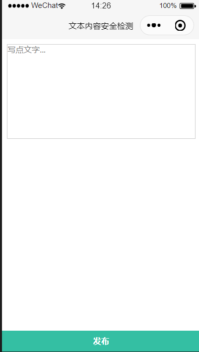
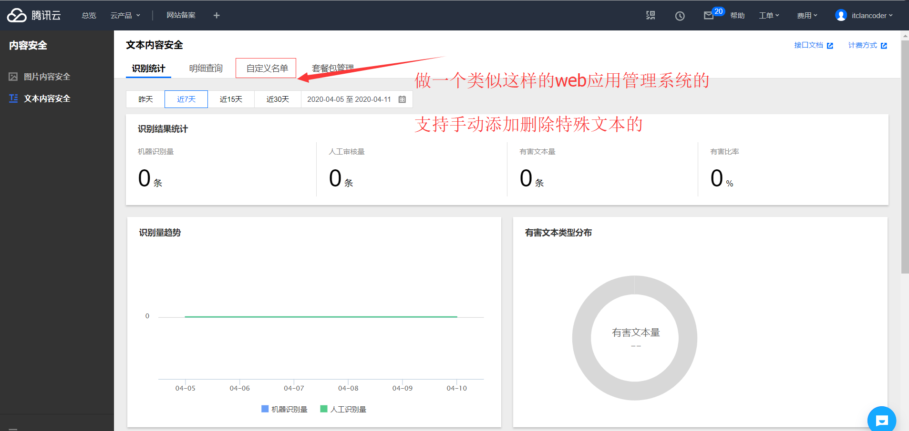

## 小程序-云开发-如何对敏感词进行过滤即内容安全的检测(下)

## 快速导航

<TOC />

## 前言

您将在本文中学习到通过云调用的方式对一段文本进行检测是否含有违规内容。

- 云函数中进行简单的配置一下,就可以实现文本内容的校验。
- 小程序端进行文本内容的弱校验,减少 API 的请求。
- 如何将涉及违规的文本内容用\*号代替,进行过滤处理。
- 云函数调用方式的优点解析(推荐使用)。

本文重点在于

- 学会如何在小程序云开发中的云调用进行配置,实现文本内容的校验。
- 小程序端在什么时机进行弱校验,为什么有必要这么做。
- 遇到违规文本内容如何用特殊字符替代。

在前面一文中通过在小程序端请求云函数`msgSecCheck1`,通过`request`,`request-promise`请求微信提供的内容安全接口以及获取`access_token`,实现了对小程序端输入文本内容安全的检测。

如果您之前有动手实践过的话,您依然发现,这个过程仍然很复杂,分别要请求两个接口,还要拼接字段,还要手动的去查找小程序的 APPID,以及 APPSECRET 秘钥。

在如今的云开发中,通过云调用的方式,在云函数端,只需要简单的配置一下就可以。下面就来看一下是如何简单地实现。

## 在云函数端创建云函数

小程序端的代码几乎不用怎么变,这里为了区别上一节代码,在云函数端重新创建一个 msgSecCheck2 的云函数

小程序端 wxml

```html
<!--pages/msgSecCheck/msgSecCheck.wxml-->
<view class="container">
  <textarea
    class="content"
    placeholder="写点文字..."
    bindinput="onInput"
    auto-focus
    bindfocus="onFocus"
    bindblur="onBlur"
  >
  </textarea>
</view>

<view class="footer">
  <button class="send-btn" size="default" bind:tap="send">发布</button>
</view>
```

小程序端 wxss

```css
/* pages/msgSecCheck/msgSecCheck.wxss */
.container {
    padding: 20rpx;
}

.content {
    width: 100%;
    height: 360rpx;
    box-sizing: border-box;
    font-size: 32rpx;
    border: 1px solid #ccc;
}

.footer {
    width: 100%;
    height: 80rpx;
    line-height: 80rpx;
    position: fixed;
    bottom: 0;
    box-sizing: border-box;
    background: #34bfa3;
}

.send-btn {
    width: 100% !important;
    color: #fff;
    font-size: 32rpx;
}

button {
    width: 100%;
    background: #34bfa3;
    border-radius: 0rpx;
}

button::after {
    border-radius: 0rpx !important;
}
```

最终呈现的 UI 如下所示

<div align="center">
 
</div>

小程序端的 JS 逻辑代码

```js
// pages/msgSecCheck/msgSecCheck.js
Page({
  /**
   * 页面的初始数据
   */
  data: {
    textareaVal: '',
  }, // 监听表单时,数据有变化时
  onInput(event) {
    let textVal = event.detail.value;
    this.setData({
      textareaVal: textVal,
    });
  }, // 聚焦点时

  onFocus() {
    console.log('聚焦点时');
  }, // 失去焦点时

  onBlur(event) {
    console.log('失去焦点时'); // 前端可进行手动的弱校验,也可以在失去焦点时发送请求进行文本的校验,但是每次失去焦点就请求一次,这样是消耗云请求的,其实在发布时候与失去焦点做校验两者都可以
  }, // 发布

  send() {
    // 请求msgSecChec2云函数,对文本内容进行校验
    this._requestCloudMsgCheck();
  },

  _requestCloudMsgCheck() {
    let textareaVal = this.data.textareaVal;
    wx.cloud
      .callFunction({
        name: 'msgSecCheck2', // 只是把这个云函数名替换了一下的,其他并没有什么变化
        data: {
          content: textareaVal,
        },
      })
      .then((res) => {
        console.log(res);
      })
      .catch((err) => {
        // 失败时,也就是违规做一些用户提示,或者禁止下一步操作等之类的业务逻辑操作
        console.error(err);
      });
  },
});
```

在小程序云函数端`msgSecCheck2`目录下创建`config.json`文件,这个文件名称是固定的,添加如下配置即可,若是其他接口支持云函数的,也是如法炮制

```js
{
  "permissions": {
    "openapi": [
      "security.msgSecCheck"
    ]
  }
}

```

在主入口`index.js`文件中,按照官方文档,填写下面几行代码就可以了。

```js
// 云函数入口文件
const cloud = require('wx-server-sdk');

cloud.init();

// 云函数入口函数
exports.main = async (event, context) => {
  try {
    const result = await cloud.openapi.security.msgSecCheck({
      content: event.content, // 小程序端传过来的值,content字段接收
    });
    return result;
  } catch (err) {
    return err;
  }
};
```

你会发现在小程序端检测一段文本是否违规,就这么几行云函数代码,就完成了这个文本内容校验功能。

其实这个`openapi.security.msgSecCheck`已经集成到`wx-server-sdk`当中了的,对外您只需提供要传入检测的文本就可以了。

最终会返回一个成功与失败的结果,当然跟上节一样,仍需要对错误码进行处理的,无论是在云函数端还是小程序端,代码如下所示

```js
// 云函数入口文件
const cloud = require('wx-server-sdk');

cloud.init();

// 云函数入口函数
exports.main = async (event, context) => {
  try {
    const result = await cloud.openapi.security.msgSecCheck({
      content: event.content,
    });

    if (result.errCode === 87014) {
      return {
        code: 500,
        msg: '内容含有违法违规内容',
        data: result,
      };
    } else {
      return {
        code: 200,
        msg: '内容ok',
        data: result,
      };
    }
  } catch (err) {
    // 错误处理
    if (err.errCode === 87014) {
      return {
        code: 500,
        msg: '内容含有违法违规内容',
        data: err,
      };
    }
    return {
      code: 502,
      msg: '调用msgSecCheck接口异常',
      data: err,
    };
  }
};
```

当您在小程序端进行测试,输入一段违规的文本进行测试,如下所示,将会返回违规的状态码与信息提示

<div align="center">
 
</div>
当您输入符合规则的文本时,便会返回成功时的状态码,以及对应合规的信息提示。
<div align="center">
 
</div>
至此,通过云调用小程序提供的内置安全接口,非常简单容易的实现文本内容安全的校验

## 在小程序端对文本内容进行校验

频繁的请求云函数接口,一定程度上会有损用户体验,造成小程序的卡顿等之类的情况，对于一些常规敏感词,在小程序端是可以手动地进行自定义校验的,有如下两种处理方式

- **违规内容**
  _ 强制用户不能输入,发布,或者评论等
  _ 针对敏感词汇,用\*号进行替代
  <div align="center">
   
  </div>

那这个究竟是怎么实现的呢?

事件的触发应该是在失去焦点的时候,就进行常规自定义文本内容校验

```js
/**
 *
 * 您也是可以单独将自定义的违规词汇放到一个utils文件,单独js文件当中,通过export的方式导出来,在想要使用的地方引入进去也是可以的
 */
const g_reg = /好贱|操|杀|贱|傻|疯|炮|奸|猪|笨|屁|麻痹|滚犊子|婊/gm

// 手动对敏感词检测
  _hasSensitiveWords(str) {
    if (str == '' || str == 'undefined') return false;
    if (g_reg.test(str)) { // 如果检测有违规,就返回true
      return true;
    }
  }

// 失去焦点时
  onBlur(event) {
    console.log("失去焦点时");
    // 前端可进行手动的弱校验,也可以在失去焦点时发送请求进行文本的校验,但是每次失去焦点就请求一次,这样是消耗云资源的,其实在发布时候与失去焦点做校验两者都可以
    const textVal = event.detail.value;
    if (this._hasSensitiveWords(textVal)) {
      wx.showToast({
        title: '含有敏感词,敏感词将会用*号处理',
      })
      this.setData({
        hasSensitiveWords: textVal.replace(g_reg, "***")
      })
      console.log(this.data.textareaVal);
    } else {
      this.setData({
        hasSensitiveWords: textVal
      })
      console.log(this.data.textareaVal);
    }

  }
```

以下是完整的示例代码

```js
/**
 *
 * 你也是可以单独将自定义的文本放到一个js文件当中,通过export的方式导出来,在想要使用的地方引入进去也是可以的
 */
const g_reg = /操|杀|贱|傻|疯|炮|奸|猪|笨|屁|麻痹|滚犊子|婊/gm;

// pages/msgSecCheck/msgSecCheck.js
Page({
  /**
   * 页面的初始数据
   */
  data: {
    textareaVal: '',
    hasSensitiveWords: '',
  }, // 监听表单时,数据有变化时
  onInput(event) {
    let textVal = event.detail.value;
    this.setData({
      textareaVal: textVal,
    });
  }, // 聚焦焦点时

  onFocus() {
    console.log('聚焦焦点时');
  }, // 失去焦点时

  onBlur(event) {
    console.log('失去焦点时'); // 前端可进行手动的弱校验,也可以在失去焦点时发送请求进行文本的校验,但是每次失去焦点就请求一次,这样是消耗云资源的,其实在发布时候与失去焦点做校验两者都可以
    const textVal = event.detail.value;
    if (this._hasSensitiveWords(textVal)) {
      wx.showToast({
        title: '含有敏感词,敏感词将会用***号处理',
      });
      this.setData({
        hasSensitiveWords: textVal.replace(g_reg, '***'),
      });
      console.log(this.data.textareaVal);
    } else {
      this.setData({
        hasSensitiveWords: textVal,
      });
      console.log(this.data.textareaVal);
    }
  }, // 发布

  send() {
    // 请求msgSecCheck1云函数,对文本内容进行校验
    this._requestCloudMsgCheck();
  },

  _requestCloudMsgCheck() {
    let textareaVal = this.data.textareaVal;
    wx.cloud
      .callFunction({
        name: 'msgSecCheck2',
        data: {
          content: textareaVal,
        },
      })
      .then((res) => {
        console.log(res);
      })
      .catch((err) => {
        // 失败时,也就是违规做一些用户提示,或者禁止下一步操作等之类的业务逻辑操作
        console.error(err);
      });
  }, // 手动对敏感词检测

  _hasSensitiveWords(str) {
    if (str == '' || str == 'undefined') return false;
    if (g_reg.test(str)) {
      // 如果检测有违规,就返回true
      return true;
    }
  },
});
```

而`wxml`只是新增加了一个字段`hasSensitiveWords`而已,这里只是用于学习演示

<div align="center">
 
</div> 
上面代码中显示的是,但凡遇到违规之类的词,就用*处理,如果您想要出现多少个违规词,就具体用多少个特殊符号处理，但是我个人觉得没有必要。因为对于敏感违规内容,要么你不让用户输入,要么就用几个特殊符号代替就可以了的
 
如果出现N多个违规词,就要出现N多个特殊符号,这显然是很浪费资源,占用公共空间。怎么处理呢？

**一、我们可以在插入数据库之前,通过前端弱校验以及接口的强校验,对内容进行检测,若内容合规,就插入数据库,不合规,就不让走下一步。**

对于违规词的手动收集,也是可以单独的弄一个接口的,在小程序端哪里需要检验的,哪里触发事件,就在哪里发起请求就可以的。

**二、对于涉及到复杂的页面,若很多个模块涉及到用户自发表内容,可以弄一个前端弱校验敏感接口,一方面是方便运营人员,手动进行添加特殊敏感词汇,另一方面是不用频繁动代码。**

如果使用了接口,那么就增加了 API 的请求,体验流畅性就会降低,因为请求接口,是需要时间的  。

如果把违规词收集写死放在小程序端,这种方式是不会请求 API 的,两种方式各有利弊 适合自己的业务才是最好的

不过在大型的项目里,若软件应用要求比较高,一般都是支持运营人员手动可以添加和删除敏感词汇的,类似下面这样,形成一个闭环。

<div align="center">
 
</div>

## 云调用的优点

通过上面云调用方式,在云函数中进行简单的配置一下,就可以完成在小程序端文本内容的安全校验,是不是觉得超级方便,简单呢?
云调用是云开发提供的基于云函数使用小程序开放接口的能力，目前已经覆盖以下几个使用场景：

- 服务端调用
- 开放数据调用
- 消息推送

具体详细介绍,您可以前往小程序官方文档阅读。

云调用需要在云函数中通过 `wx-server-sdk`使用。在云函数中使用云调用调用服务端接口无需换取`access_token`，只要是在从小程序端触发的云函数中发起的云调用都会经过微信自动鉴权。

您会发现通过云调用的方式,实现同样一个功能,不需要知道 APPID,以及`APPSECRET`秘钥,也不需要获取`access_token`,这样简直太方便了,没有几行代码。

其实复杂的内部工作,都已经集成到 wx-server-sdk 当中了的,您只需要根据云开发官方内置的接口,传入所需要检测的字段,它就会给您返回一个结果。

这就是云开发魅力所在,当然前一种方式,`https`的方式,获取`access_Token`之类的,也是要会的,如果后台用的不是云开发模式,有自己的后端服务,那么就要走 https 那一套流程了

## 结语

本文主要介绍了在小程序云开发中,使用云调用的方式实现了对文本内容安全的校验,涉及到在云函数端创建一个`config.json`文件进行配置一下,在主入口`index.js`中写几行云函数 JS 代码,就可以完成一个文本内容安全校验功能。

在小程序端进行敏感文本的弱校验,具体的时机是在失去焦点的时候,就进行文本的内容的弱校验；

当遇到敏感词汇时,进行特殊符号处理,最后就是感受到了云开发带来的方便。

<footer-FooterLink :isShareLink="true" :isDaShang="true" />
<footer-FeedBack />