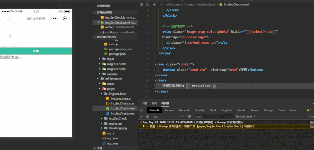

## 小程序-云开发-多图片内容安全检测

## 全文导图


## 快速导航

- [小程序-云开发-多图片内容安全检测](#小程序-云开发-多图片内容安全检测)
- [全文导图](#全文导图)
- [快速导航](#快速导航)
- [前言](#前言)
- [先看一下示例效果](#先看一下示例效果)
- [完成 UI 展示](#完成-ui-展示)
- [应用场景](#应用场景)
- [解决图片安全的方式](#解决图片安全的方式)
- [云调用方式](#云调用方式)
- [常见问题](#常见问题)
  - [如何解决多图上传覆盖的问题](#如何解决多图上传覆盖的问题)
- [结语](#结语)

* [结语](#结语)

## 前言

相比于文本的安全检测,图片的安全检测要稍微略复杂一些,当您读完本篇,将 get 到

- 图片安全检测的应用场景
- 解决图片的安全方式
- 使用云开发中云调用方式对图片进行检测
- 如何对上传图片大小进行限制
- 如何解决多图上传覆盖问题

如有收获,不忘三连击(给赞,留言,分享~

## 先看一下示例效果

当用户上传敏感违规图片时,禁止用户上传发布,并且做出相对应的用户友好提示


如果您想体验,可微信扫下方小程序码,进入发布页面体验


## 完成 UI 展示

对于`wxml`与`wxss`,大家可以自行任意修改,本文重点在于图片安全的校验

```html
<view class="image-list">
  <!-- 显示图片 -->
  <block wx:for="{{images}}" wx:key="*this"
    ><view class="image-wrap">
      <image
        class="image"
        src="{{item}}"
        mode="aspectFill"
        bind:tap="onPreviewImage"
        data-imgsrc="{{item}}"
      ></image
      ><i
        class="iconfont icon-shanchu"
        bind:tap="onDelImage"
        data-index="{{index}}"
      ></i
    ></view>
  </block>
  <!-- 选择图片 -->
  <view
    class="image-wrap selectphoto"
    hidden="{{!selectPhoto}}"
    bind:tap="onChooseImage"
  >
    <i class="iconfont icon-add"></i>
  </view>
</view>
<view class="footer">
  <button class="send-btn" bind:tap="send">发布</button>
</view>
```

对应的`wxss` 代码

```css
.footer {
  display: flex;
  align-items: center;
  width: 100%;
  box-sizing: border-box;
  background: #34bfa3;
}

.send-btn {
  width: 100%;
  color: #fff;
  font-size: 32rpx;
  background: #34bfa3;
}

button {
  border-radius: 0rpx;
}

button::after {
  border-radius: 0rpx !important;
}

/* 图片样式 */
.image-list {
  display: flex;
  flex-wrap: wrap;
  margin-top: 20rpx;
}

.image-wrap {
  width: 220rpx;
  height: 220rpx;
  margin-right: 10rpx;
  margin-bottom: 10rpx;
  position: relative;
  overflow: hidden;
  text-align: center;
}

.image {
  width: 100%;
  height: 100%;
}

.icon-shanchu {
  position: absolute;
  top: 0;
  right: 0;
  width: 40rpx;
  height: 40rpx;
  background-color: #000;
  opacity: 0.4;
  color: #fff;
  text-align: center;
  line-height: 40rpx;
  font-size: 38rpx;
  font-weight: bolder;
}

.selectphoto {
  border: 2rpx dashed #cbd1d7;
  position: relative;
}

.icon-add {
  position: absolute;
  top: 50%;
  left: 50%;
  transform: translate(-50%, -50%);
  color: #cbd1d7;
  font-size: 60rpx;
}
```

最终呈现的 UI,如下所示


对应的`JS`代码

```js
/*
 * 涉及到的API:wx.chooseImage 从本地相册选择图片或使用相机拍照
 *(https://developers.weixin.qq.com/miniprogram/dev/api/media/image/wx.chooseImage.html)
 *
 *
 */
// 最大上传图片数量
const MAX_IMG_NUM = 9;

const db = wx.cloud.database(); // 初始化云数据库
Page({
  /**
   * 页面的初始数据
   */
  data: {
    images: [], // 把上传的图片存放在一个数组对象里面
    selectPhoto: true, // 添加+icon元素是否显示
  },

  /**
   * 生命周期函数--监听页面加载
   */
  onLoad: function(options) {},

  // 选择图片
  onChooseImage() {
    // 还能再选几张图片,初始值设置最大的数量-当前的图片的长度
    let max = MAX_IMG_NUM - this.data.images.length;
    wx.chooseImage({
      count: max, // count表示最多可以选择的图片张数
      sizeType: ['original', 'compressed'], // 所选的图片的尺寸
      sourceType: ['album', 'camera'], // 选择图片的来源
      success: (res) => {
        // 接口调用成功的回调函数console.log(res)
        this.setData({
          // tempFilePath可以作为img标签的src属性显示图片,下面是将后添加的图片与之前的图片给追加起来
          images: this.data.images.concat(res.tempFilePaths),
        });
        // 还能再选几张图片
        max = MAX_IMG_NUM - this.data.images.length;
        this.setData({
          selectPhoto: max <= 0 ? false : true, // 当超过9张时,加号隐藏
        });
      },
    });
  },

  // 点击右上方删除图标,删除图片操作
  onDelImage(event) {
    const index = event.target.dataset.index;
    // 点击删除当前图片,用splice方法,删除一张,从数组中移除一个
    this.data.images.splice(index, 1);
    this.setData({
      images: this.data.images,
    });
    // 当添加的图片达到设置最大的数量时,添加按钮隐藏,不让新添加图片
    if (this.data.images.length == MAX_IMG_NUM - 1) {
      this.setData({
        selectPhoto: true,
      });
    }
  },
});
```

最终实现的前端 UI 效果如下所是:


您现在看到的效果,没有任何云函数代码,只是前端的纯静态展示,对于一些涉嫌敏感图片,是有必要进行做过滤处理的

## 应用场景

通常,在校验一张图片是否含有违法违规内容相比于文本安全的校验,同样重要,有如下应用

- 图片智能鉴黄：涉及拍照的工具类应用(如美拍，识图类应用)用户拍照上传检测；电商类商品上架图片检测；媒体类用户文章里的图片检测等

- 敏感人脸识别：用户头像；媒体类用户文章里的图片检测；社交类用户上传的图片检测等,凡是有用户自发生产内容的都应当提前做检测

## 解决图片安全的方式

在小程序开发中,提供了**两种方式**

- HTTPS 调用
- 云调用

HTTPS 调用的请求接口地止

```
https://api.weixin.qq.com/wxa/img_sec_check?access_token=ACCESS_TOKEN
```

检测图片审核,根据官方文档得知,需要两个必传的参数:分别是:`access_token(接口调用凭证)`,`media(要检测的图片文件)`

对于`HTTPS`调用方式,愿意折腾的小伙伴可以参考[文本内容安全检测(上篇)](https://mp.weixin.qq.com/s/nCBAjFIkq92x2LAioskSgw)的处理方式,处理大同小异,本篇主要以云开发的云调用为主

## 云调用方式

在`cloudfunctions`目录文件夹下创建云函数`imgSecCheck`(名字任意,但最好见名知意)


并在该目录下创建`config.json`,配置参数如下所示

```js
{
  "permissions": {
    "openapi": [
      "security.imgSecCheck"
    ]
  }
}
```

配置完后,在主入口`index.js`中,如下所示,通过`security.imgSecCheck`接口,并传入`media`对象

```js
// 云函数入口文件
const cloud = require('wx-server-sdk');
cloud.init({
  env: cloud.DYNAMIC_CURRENT_ENV,
});

// 云函数入口函数
exports.main = async (event, context) => {
  const wxContext = cloud.getWXContext();
  try {
    const result = await cloud.openapi.security.imgSecCheck({
      media: {
        contentType: 'image/png',
        value: Buffer.from(event.img), // 这里必须要将小程序端传过来的进行Buffer转化,否则就会报错,接口异常
      },
    });

    if (result && result.errCode.toString() === '87014') {
      return { code: 500, msg: '内容含有违法违规内容', data: result };
    } else {
      return { code: 200, msg: '内容ok', data: result };
    }
  } catch (err) {
    // 错误处理
    if (err.errCode.toString() === '87014') {
      return { code: 500, msg: '内容含有违法违规内容', data: err };
    }
    return { code: 502, msg: '调用imgSecCheck接口异常', data: err };
  }
};
```

您会发现在云函数端,就这么几行代码,就完成了图片安全校验
而在小程序端,代码如下所示

```js
// miniprogram/pages/imgSecCheck/imgSecCheck.js
// 最大上传图片数量
const MAX_IMG_NUM = 9;

const db = wx.cloud.database(); // 云数据库初始化
Page({
  /**
   * 页面的初始数据
   */
  data: {
    images: [],
    selectPhoto: true, // 添加图片元素是否显示
  },

  /**
   * 生命周期函数--监听页面加载
   */
  onLoad: function(options) {},
  // 选择图片
  onChooseImage() {
    // const that = this; // 如果下面用了箭头函数,那么这行代码是不需要的,直接用this就可以了的
    // 还能再选几张图片,初始值设置最大的数量-当前的图片的长度
    let max = MAX_IMG_NUM - this.data.images.length;
    wx.chooseImage({
      count: max,
      sizeType: ['original', 'compressed'],
      sourceType: ['album', 'camera'],
      success: (res) => {
        // 这里若不是箭头函数,那么下面的this.setData的this要换成that上面的临时变量,作用域的问题,不清楚的,可以看下this指向相关的知识
        console.log(res);
        // tempFilePath可以作为img标签的src属性显示图片
        const tempFiles = res.tempFiles;
        this.setData({
          images: this.data.images.concat(res.tempFilePaths),
        });
        // 在选择图片时,对本地临时存储的图片,这个时候,进行图片的校验,当然你放在最后点击发布时,进行校验也是可以的,只不过是一个前置校验和后置校验的问题,我个人倾向于在选择图片时就进行校验的,选择一些照片时,就应该在选择时阶段做安全判断的, 小程序端请求云函数方式// 图片转化buffer后，调用云函数
        console.log(tempFiles);
        tempFiles.forEach((items) => {
          console.log(items);
          // 图片转化buffer后，调用云函数
          wx.getFileSystemManager().readFile({
            filePath: items.path,
            success: (res) => {
              console.log(res);
              wx.cloud
                .callFunction({
                  // 请求imgSecCheck云函数
                  name: 'imgSecCheck',
                  data: {
                    img: res.data, // 传入要检测的值
                  },
                })
                .then((res) => {
                  console.log(res);
                  let { errCode } = res.result.data;
                  switch (errCode) {
                    case 87014:
                      this.setData({
                        resultText: '内容含有违法违规内容',
                      });
                      break;
                    case 0:
                      this.setData({
                        resultText: '内容OK',
                      });
                      break;
                    default:
                      break;
                  }
                })
                .catch((err) => {
                  console.error(err);
                });
            },
            fail: (err) => {
              console.error(err);
            },
          });
        });

        // 还能再选几张图片
        max = MAX_IMG_NUM - this.data.images.length;
        this.setData({
          selectPhoto: max <= 0 ? false : true, // 当超过9张时,加号隐藏
        });
      },
    });
  },

  // 删除图片操作
  onDelImage(event) {
    const index = event.target.dataset.index;
    // 点击删除当前图片,用splice方法,删除一张,从数组中移除一个
    this.data.images.splice(index, 1);
    this.setData({
      images: this.data.images,
    });
    // 当添加的图片达到设置最大的数量时,添加按钮隐藏,不让新添加图片
    if (this.data.images.length == MAX_IMG_NUM - 1) {
      this.setData({
        selectPhoto: true,
      });
    }
  },
});
```

示例效果如下所示:

至此,关于图片安全检测就已经完成了,您只需要根据检测的结果,做一些友好的用户提示,或者做一些自己的业务逻辑判断即可

## 常见问题

- ### 如何对上传的图片大小进行限制

有时候,您需要对用户上传图片的大小进行限制,限制用户任意上传超大图片,那怎么处理呢,在微信小程序里面,主要借助的是 `wx.chooseImage` 这个接口成功返回后临时路径的 `res.tempFiles` 中的 `size`大小判断即可进行处理

具体实例代码如下所示

```js
// 选择图片
onChooseImage() {
  // 还能再选几张图片,初始值设置最大的数量-当前的图片的长度
  let max = MAX_IMG_NUM - this.data.images.length;
  wx.chooseImage({
    count: max,
    sizeType: ['original', 'compressed'],
    sourceType: ['album', 'camera'],
    success: (res) => {
      console.log(res)
      const tempFiles = res.tempFiles;
      this.setData({
        images: this.data.images.concat(res.tempFilePaths) // tempFilePath可以作为img标签的src属性显示图片
      })
      // 在选择图片时,对本地临时存储的图片,这个时候,进行图片的校验,当然你放在最后点击发布时,进行校验也是可以的,只不过是一个前置校验和后置校验的问题,我个人倾向于在选择图片时就进行校验的,选择一些照片时,就应该在选择时阶段做安全判断的, 小程序端请求云函数方式// 图片转化buffer后，调用云函数
      console.log(tempFiles);
      tempFiles.forEach(items => {
        if (items && items.size > 1 * (1024 * 1024)) { // 限制图片的大小
          wx.showToast({
            icon: 'none',
            title: '上传的图片超过1M,禁止用户上传',
            duration: 4000
          })
          // 超过1M的图片,禁止用户上传
        }
        console.log(items);
        // 图片转化buffer后，调用云函数
        wx.getFileSystemManager().readFile({
          filePath: items.path,
          success: res => {
                console.log(res);
                  wx.cloud.callFunction({   // 请求调用云函数imgSecCheck
                  name: 'imgSecCheck',
                  data: {
                    img: res.data
                  }
          })
          .then(res => {
              console.log(res);
              let { errCode } = res.result.data;
              switch(errCode) {
                case 87014:
                  this.setData({
                    resultText: '内容含有违法违规内容'
                  })
                  break;
                case 0:
                  this.setData({
                    resultText: '内容OK'
                  })
                  break;
                default:
                  break;
              }
          })
          .catch(err => {
              console.error(err);
          })
          },
          fail: err => {
            console.error(err);
          }
        })
      })

      // 还能再选几张图片
      max = MAX_IMG_NUM - this.data.images.length
      this.setData({
        selectPhoto: max <= 0 ? false : true // 当超过9张时,加号隐藏
      })
    },
  })
},
```

实例效果如下所示:


::: tip 注意:
使用微信官方的图片内容安全接口进行校验,限制图片大小限制:1M,否则的话就会报错,如下所示
:::


也就是说,**对于超过 1M 大小的违规图片,微信官方提供的这个图片安全接口是无法进行校验的**。

这个根据自己的业务而定,小程序端对用户上传图片的大小是进行了限制的。如果您觉得微信官方提供的图片安全接口满足不了自己的业务需求,那么可以选择一些其他的图片内容安全校验接口。

图片安全校验是非常有必要的,用户一旦上传非法图片,一旦通过网络进行传播,产生了社会影响,平台将会被追究责任,我们要吸取前车之鉴带给我的教训

### 如何解决多图上传覆盖的问题

对于上传图片来说,这个`wx.cloud.uploadFileAPI`接口只能上传一张图片,但是很多时候,是需要上传多张图片到云存储当中的,当点击发布的时候,我们是希望将多张图片都上传到云存储当中。

这个 API 虽然只能每次上传一张,但您可以循环遍历多张图片,然后一张一张上传。

在`cloudPath`上传文件的参数当中,它的值:需要注意:文件的名称。

那如何保证上传的图片不被覆盖呢？其实文件不重名的情况下就不会被覆盖，而在选择图片的时候,不应该上传,因为用户可能有删除等操作,如果直接上传的话会造成资源的浪费，应该在点发布按钮的时候,才执行上传操作,文件不重名覆盖的示例代码如下所示

```js
let promiseArr = [];
let fileIds = []; // 将图片的fileId存放到一个数组中
let imgLength = this.data.images.length;
// 图片上传,循环遍历
for (let i = 0; i < imgLength; i++) {
  let p = new Promise((resolve, reject) => {
    let item = this.data.images[i];
    // 文件扩展名
    let suffix = /\.\w+$/.exec(item)[0]; // 取文件后拓展名
    wx.cloud.uploadFile({
      // 利用官方提供的上传接口
      cloudPath: 'blog/' + Date.now() + '-' + Math.random() * 1000000 + suffix, // 云存储路径,您也可以使用es6中的模板字符串进行拼接的
      filePath: item, // 要上传文件资源的路径
      success: (res) => {
        console.log(res);
        console.log(res.fileID);
        fileIds = fileIds.concat(res.fileID); // 将新上传的与之前上传的给拼接起来
        resolve();
      },
      fail: (err) => {
        console.error(err);
        reject();
      },
    });
  });
  promiseArr.push(p);
}
// 存入到云数据库,其中这个Promise.all(),等待里面所有的任务都执行之后,在去执行后面的任务,也就是等待上传所有的图片上传完后,才能把相对应的数据存到数据库当中,具体与promise相关问题,可自行查漏
Promise.all(promiseArr)
  .then((res) => {
    db.collection('blog')
      .add({
        // 查找blog集合,将img,时间等数据添加到这个集合当中
        data: {
          img: fileIds,
          createTime: db.serverDate(), // 服务端的时间
        },
      })
      .then((res) => {
        console.log(res);
        this._hideToastTip();
        this._successTip();
      });
  })
  .catch((err) => {
    // 发布失败console.error(err);
  });
```

上面通过利用当前时间+随机数的方式进行了一个区分,规避了上传文件同名的问题：

因为这个上传接口,一次性只能上传一张图片,所以需要循环遍历图片,然后一张张的上传。

**一个是上传到云存储中**,**另一个是添加到云数据库集合当中**,要分别注意下这两个操作,云数据库中的图片是从云存储中拿到的,然后再添加到云数据库当中去的。

示例效果如下所示:


将上传的图片存储到云数据库中


::: warning 警告:
添加数据到云数据库中,需要手动创建集合,不然是无法上传不到云数据库当中的,会报错
:::

至此,关于敏感图片的检测,以及多图片的上传到这里就已经完成了！

如下是完整的小程序端逻辑示例代码

```js
// miniprogram/pages/imgSecCheck/imgSecCheck.js
// 最大上传图片数量
const MAX_IMG_NUM = 9;
const db = wx.cloud.database();
Page({
  /**
   * 页面的初始数据
   */
  data: {
    images: [],
    selectPhoto: true, // 添加图片元素是否显示
  },

  /**
   * 生命周期函数--监听页面加载
   */
  onLoad: function(options) {},

  // 选择图片
  onChooseImage() {
    // 还能再选几张图片,初始值设置最大的数量-当前的图片的长度
    let max = MAX_IMG_NUM - this.data.images.length;
    wx.chooseImage({
      count: max,
      sizeType: ['original', 'compressed'],
      sourceType: ['album', 'camera'],
      success: (res) => {
        console.log(res);
        const tempFiles = res.tempFiles;
        this.setData({
          images: this.data.images.concat(res.tempFilePaths), // tempFilePath可以作为img标签的src属性显示图片
        });
        // 在选择图片时,对本地临时存储的图片,这个时候,进行图片的校验,当然你放在最后点击发布时,进行校验也是可以的,只不过是一个前置校验和后置校验的问题,我个人倾向于在选择图片时就进行校验的,选择一些照片时,就应该在选择时阶段做安全判断的, 小程序端请求云函数方式
        // 图片转化buffer后，调用云函数
        console.log(tempFiles);
        tempFiles.forEach((items) => {
          if (items && items.size > 1 * (1024 * 1024)) {
            wx.showToast({
              icon: 'none',
              title: '上传的图片超过1M,禁止用户上传',
              duration: 4000,
            });
            // 超过1M的图片,禁止上传
          }
          console.log(items);
          // 图片转化buffer后，调用云函数
          wx.getFileSystemManager().readFile({
            filePath: items.path,
            success: (res) => {
              console.log(res);
              this._checkImgSafe(res.data); // 检测图片安全校验
            },
            fail: (err) => {
              console.error(err);
            },
          });
        });

        // 还能再选几张图片
        max = MAX_IMG_NUM - this.data.images.length;
        this.setData({
          selectPhoto: max <= 0 ? false : true, // 当超过9张时,加号隐藏
        });
      },
    });
  },

  // 删除图片
  onDelImage(event) {
    const index = event.target.dataset.index;
    // 点击删除当前图片,用splice方法,删除一张,从数组中移除一个
    this.data.images.splice(index, 1);
    this.setData({
      images: this.data.images,
    });
    // 当添加的图片达到设置最大的数量时,添加按钮隐藏,不让新添加图片
    if (this.data.images.length == MAX_IMG_NUM - 1) {
      this.setData({
        selectPhoto: true,
      });
    }
  },

  // 点击发布按钮,将图片上传到云数据库当中
  send() {
    const images = this.data.images.length;
    if (images) {
      this._showToastTip();
      let promiseArr = [];
      let fileIds = [];
      let imgLength = this.data.images.length;
      // 图片上传
      for (let i = 0; i < imgLength; i++) {
        let p = new Promise((resolve, reject) => {
          let item = this.data.images[i];
          // 文件扩展名
          let suffix = /\.\w+$/.exec(item)[0]; // 取文件后拓展名
          wx.cloud.uploadFile({
            // 上传图片至云存储,循环遍历,一张张的上传
            cloudPath:
              'blog/' + Date.now() + '-' + Math.random() * 1000000 + suffix,
            filePath: item,
            success: (res) => {
              console.log(res);
              console.log(res.fileID);
              fileIds = fileIds.concat(res.fileID);
              resolve();
            },
            fail: (err) => {
              console.error(err);
              reject();
            },
          });
        });
        promiseArr.push(p);
      }
      // 存入到云数据库
      Promise.all(promiseArr)
        .then((res) => {
          db.collection('blog')
            .add({
              // 查找blog集合,将数据添加到这个集合当中
              data: {
                img: fileIds,
                createTime: db.serverDate(), // 服务端的时间
              },
            })
            .then((res) => {
              console.log(res);
              this._hideToastTip();
              this._successTip();
            });
        })
        .catch((err) => {
          // 发布失败
          console.error(err);
        });
    } else {
      wx.showToast({
        icon: 'none',
        title: '没有选择任何图片,发布不了',
      });
    }
  },

  // 校验图片的安全
  _checkImgSafe(data) {
    wx.cloud
      .callFunction({
        name: 'imgSecCheck',
        data: {
          img: data,
        },
      })
      .then((res) => {
        console.log(res);
        let { errCode } = res.result.data;
        switch (errCode) {
          case 87014:
            this.setData({
              resultText: '内容含有违法违规内容',
            });
            break;
          case 0:
            this.setData({
              resultText: '内容OK',
            });
            break;
          default:
            break;
        }
      })
      .catch((err) => {
        console.error(err);
      });
  },

  _showToastTip() {
    wx.showToast({
      icon: 'none',
      title: '发布中...',
    });
  },

  _hideToastTip() {
    wx.hideLoading();
  },

  _successTip() {
    wx.showToast({
      icon: 'none',
      title: '发布成功',
    });
  },
});
```

完整的示例`wxml`,如下所示：

```html
<view class="image-list">
  <!-- 显示图片 -->
  <block wx:for="{{images}}" wx:key="*this">
    <view class="image-wrap"
      ><image
        class="image"
        src="{{item}}"
        mode="aspectFill"
        bind:tap="onPreviewImage"
        data-imgsrc="{{item}}"
      ></image
      ><i
        class="iconfont icon-shanchu"
        bind:tap="onDelImage"
        data-index="{{index}}"
      ></i>
    </view>
  </block>
  <!-- 选择图片 -->
  <view
    class="image-wrap selectphoto"
    hidden="{{!selectPhoto}}"
    bind:tap="onChooseImage"
    ><i class="iconfont icon-add"></i
  ></view>
</view>
<view class="footer">
  <button class="send-btn" bind:tap="send">发布</button>
</view>
<view>
  检测结果显示: {{ resultText }}
</view>
```

云函数端的代码

```js
// 云函数入口文件
const cloud = require('wx-server-sdk');
cloud.init({
  env: cloud.DYNAMIC_CURRENT_ENV,
});

// 云函数入口函数
exports.main = async (event, context) => {
  const wxContext = cloud.getWXContext();
  try {
    const result = await cloud.openapi.security.imgSecCheck({
      media: {
        contentType: 'image/png',
        value: Buffer.from(event.img), // 这里必须要将小程序端传过来的进行Buffer转化,否则就会报错,接口异常
      },
    });

    if (result && result.errCode.toString() === '87014') {
      return { code: 500, msg: '内容含有违法违规内容', data: result };
    } else {
      return { code: 200, msg: '内容ok', data: result };
    }
  } catch (err) {
    // 错误处理
    if (err.errCode.toString() === '87014') {
      return { code: 500, msg: '内容含有违法违规内容', data: err };
    }
    return { code: 502, msg: '调用imgSecCheck接口异常', data: err };
  }
};
```

您可以根据自己的业务逻辑需要,一旦检测到图片违规时,禁用按钮状态,或者给一些用户提示,都是可以的；在发布之前或者点击发布时,进行图片内容安全的校验都可以,一旦发现图片有违规时,就禁止继续后面的操作。

## 结语

本文主要通过借助官方提供的图片：`security.imgSecCheck`

接口,实现了对图片安全的校验,实现起来,是相当方便的,对于基础性的校验,利用官方提供的这个接口,已经够用了的,但是如果想要更加严格的检测,可以引入一些第三方的内容安全强强校验,确保内容的安全。

实现了如何对上传的图片大小进行限制,以及解决同名图片上传覆盖的问题。
如果小可爱们有对文本内容安全校验以及图片安全校验仍然有什么问题,可以在下方留言,一起探讨

<footer-FooterLink :isShareLink="true" :isDaShang="true" />
<footer-FeedBack />